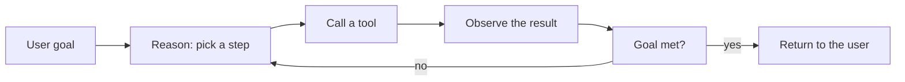
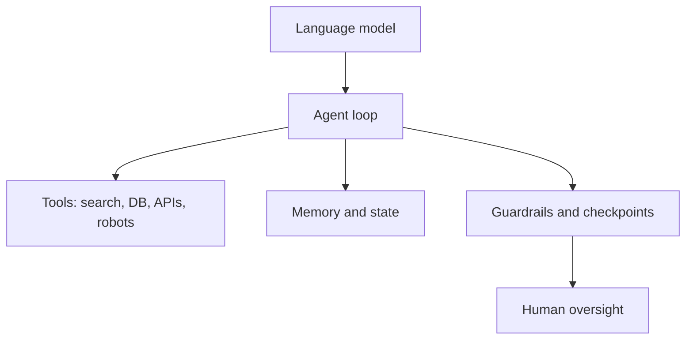

import Quiz from '@site/src/components/Educational/Quiz';

# What Is an AI Agent?

> **Status:** complete
>
> **Related chapters:** Builds on this book's introduction; feeds into Chapter 2 — How Language Models Work and Part II — Agent Architectures.

## Why This Matters

A chatbot answers; an agent acts. That single difference is the whole book.
When a program can call a tool, keep state, and loop toward a goal on its own,
the software stops being a demo and becomes a worker. Every later chapter —
frameworks, skills, deployment, the business case — is built on understanding
what that loop is and where it breaks.

## Learning Objectives

After this chapter you will be able to:

- Define an AI agent and distinguish it from a chatbot.
- Trace the agent loop: observe, reason, act, repeat.
- Explain the role of tools, memory, and human oversight.
- Describe what changes when an agent runs autonomously for a long time.

## Core Concepts

| Concept | Definition |
| ------- | ---------- |
| Agent | Software that acts in a loop toward a goal, using tools and feedback. |
| Chatbot | Software that answers a question, then stops. |
| Tool call | An agent asking an external function to do something and returning the result. |
| Memory | State the agent keeps across steps — context, history, and stored data. |
| Guardrail | A check that keeps an agent inside safe, expected behavior. |
| Autonomy | How long an agent runs without a human stepping in. |

## Technical Explanation

### The agent loop

An agent is a loop:

```
observe -> reason -> act -> observe again ...
```

The model generates a *thought* (what to do next), calls a *tool* (act), receives
the *result* (observe), and repeats. The loop is what turns a language model into
a worker: a single answer can be wrong, but a loop can detect the error, retry,
and recover.

### Chatbot vs. agent

| | Chatbot | Agent |
| --- | --- | --- |
| Ends with | An answer | A completed task |
| Uses tools | Rarely | Always, that is the point |
| Keeps state | Conversation only | Task state, tools, long-term memory |
| Runs | One turn | Minutes to days |
| Needs oversight | Minimal | Deliberate, at checkpoints |

The boundary is fuzzy, but the test is simple: **did the program change the world
and keep going until the goal was met?**

### Tools and memory

Tools are the agent's hands — a search, a database query, a file write, a robot
command. A tool call is just a structured request: "run function X with these
arguments." The result comes back into context, and the agent decides next.

Memory is what lets the loop work over long horizons. Short-term memory is the
context window; long-term memory is state you store and retrieve — conversation
history, task progress, learned facts. An agent without memory repeats itself;
an agent with bad memory acts on stale facts.

### The autonomy spectrum

Autonomy is a dial, not a switch:

- **Assisted** — the agent proposes, a human approves each action.
- **Supervised** — the agent acts, a human reviews at checkpoints.
- **Autonomous** — the agent runs to completion with exceptions only.

Real deployments sit somewhere in the middle. The art is choosing where to put
the human checkpoints: too few and mistakes compound; too many and you have
built an expensive chatbot.

## Real-World Examples

:::info Real system
Support agents that read a ticket, search the knowledge base, draft a reply, and
send it — with a human approving anything that refunds money or deletes data.
The loop runs for minutes, the checkpoints are at the irreversible actions.
:::

:::note Mini case study
A "digital worker" that watches an inbox for order emails, parses the order,
updates the database, and sends a confirmation. The first version was a script
with fixed rules; the agent version handles the messy cases the rules missed —
and asks a human when it is genuinely unsure.
:::

## Architecture Diagrams

### The agent loop



### Where the agent sits



## Code Examples

```python
# The smallest agent: a loop that can call one tool and retry.
import json

def tool_add(a, b):
    """A trivial tool the agent can call."""
    return {"result": a + b}

TOOLS = {"add": tool_add}

def ask_llm(prompt):
    """Stand-in for a model call; returns a JSON action like
    {"tool": "add", "args": [2, 3]} or {"done": true}."""
    return llm_api.respond(prompt)   # real calls live in Chapters 2-3

def run_agent(goal, max_steps=5):
    messages = [{"role": "user", "content": goal}]
    for _ in range(max_steps):        # bound the loop for safety
        action = json.loads(ask_llm(messages))
        if "done" in action:
            return action["done"]
        name, args = action["tool"], action["args"]
        result = TOOLS[name](*args)   # act
        messages.append({"role": "user", "content": f"tool result: {result}"})
    return "Max steps reached"

print(run_agent("Add 2 and 3"))
```

**What each piece does:** the loop sends the goal, the model picks an action,
the agent calls the tool, and the result goes back into context. The
`max_steps` bound is the guardrail — autonomous software always needs a limit.

:::tip Where this runs
Any Python environment. Swap `llm_api.respond` for a real model call
(Chapter 2) and `tool_add` for real tools (Part III) and this is a production
skeleton.
:::

## Common Mistakes

| Mistake | Why it happens | How to avoid it |
| ------- | -------------- | --------------- |
| No loop bound | Agents can run forever, spending money | Always cap steps and budget |
| Trusting the model's first answer | It may act without verifying | Give the loop the result of the tool, and let it retry |
| Forgetting memory | The agent repeats itself | Persist state between steps |
| No human checkpoints | Irreversible actions happen unapproved | Guard anything expensive, destructive, or public |

## Summary

An AI agent is software that acts in a loop: observe, reason, act, repeat —
with tools to change the world, memory to stay grounded, and guardrails to stay
safe. The difference between a chatbot and an agent is not the model; it is the
loop around it, and the engineering that keeps that loop reliable.

**Key takeaways**

- An agent is a loop, not a single answer.
- Tools give agents hands; memory gives them continuity.
- Autonomy is a dial: choose where the human checkpoints go.
- Bounded loops, real tool results, and persisted state are the difference between a demo and a worker.

## Exercises

1. **Easy — Spot the agent.** For three products you use (a search bar, a code
   assistant, an email filter), decide whether each is a chatbot or an agent,
   and justify it with the "did it change the world and keep going?" test.
2. **Medium — Trace the loop.** Describe the agent loop for "book a flight and
   email me the confirmation": list the tools, the checkpoints, and where a
   human should approve.
3. **Challenge — Run the skeleton.** Replace `llm_api.respond` with a small
   hand-written planner (rules, no LLM) and `tool_add` with two real tools.
   Add a "done" condition and watch the loop terminate.

Check your understanding:

<Quiz
  question="What is the key difference between a chatbot and an agent?"
  options={[
    'Agents are always larger models',
    'Agents act in a loop toward a goal, using tools and feedback',
    'Chatbots cannot understand questions',
    'Agents never make mistakes',
  ]}
  correctAnswerIndex={1}
/>

## Further Reading

- Anthropic, *Building effective agents* (engineering guide) — the clearest
  framing of the agent loop. [anthropic.com/research/building-effective-agents](https://www.anthropic.com/research/building-effective-agents)
- Lilian Weng, *LLM Powered Autonomous Agents* (blog) — the classic survey of
  the pattern. [lilianweng.github.io/posts/2023-06-23-agent](https://lilianweng.github.io/posts/2023-06-23-agent/)
