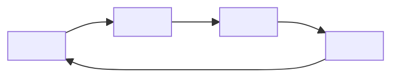
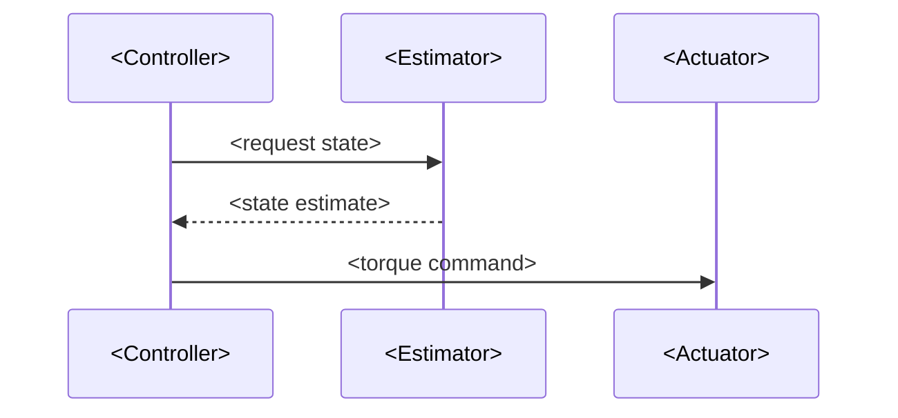

<!-- ==================================================================
     HOW TO USE THIS TEMPLATE
     ------------------------------------------------------------------
     1. Copy this file into the part folder the chapter belongs to, e.g.
          docs/part2-sensing/05-my-chapter.mdx
     2. Rename with the NN- prefix that sets its position in the part
        (01, 02, ... matching the other chapters).
     3. Fill in every placeholder between <angle brackets>, then delete
        this comment block and all section guidance comments.
     4. Keep the frontmatter: `sidebar_position` should equal NN.
     ================================================================== -->

# <Chapter Title>

> **Status:** <draft | in progress | complete>
>
> **Related chapters:** <e.g. Builds on Chapter 5 — Sensors and Actuators; feeds into Chapter 14 — Reinforcement Learning>

## Why This Matters

<One or two paragraphs. Motivate before you explain: the problem space, why
someone building a humanoid robot should care, what this chapter unlocks.
Anchor it in the book's goal of building an intelligent machine.>

## Learning Objectives

After this chapter you will be able to:

- <Objective 1 — an observable outcome starting with an action verb: build, explain, tune, compare.>
- <Objective 2.>
- <Objective 3.>
- <Objective 4 (optional).>

## Core Concepts

<Introduce every term the chapter relies on, in plain English, before the deep
dive. Keep definitions to one line each.>

| Concept | Definition |
| ------- | ---------- |
| <Term> | <One-line, plain-English definition.> |
| <Term> | <One-line definition.> |
| <Term> | <One-line definition.> |

## Technical Explanation

<The body of the chapter. Explain from first principles, build on earlier
chapters, and keep the math explicit but practical. Use `###` subsections
freely — each renders in the in-page table of contents.>

### <Subsection 1>

<Prose, equations ($...$ for inline, $$...$$ for display), tables, and lists.>

### <Subsection 2>

<Prose. Reference real hardware, papers, or code where it clarifies.>

## Real-World Examples

:::info Real system
<How a real humanoid or research system illustrates this chapter's ideas —
a named platform (e.g. Atlas, Optimus, Unitree G1), a benchmark, or a
published result — with the key takeaway.>
:::

:::note Mini case study
<A concrete, citable scenario in 3–4 bullets: what was built, what happened,
what to learn from it.>
:::

## Architecture Diagrams

<Mermaid renders automatically — `markdown.mermaid` is enabled in
`docusaurus.config.ts`. Prefer `flowchart` for data-flow pipelines,
`sequenceDiagram` for message flows between processes, and `stateDiagram-v2`
for modes. Replace the example below with a diagram specific to this chapter.>



<More diagram types to copy when needed:>



## Code Examples

<Minimal, runnable code. Annotate the important lines. Python is the default;
use ROS 2 or Isaac Lab wherever the chapter is about the software stack.>

```python
# <One-line comment on what this snippet does>
import numpy as np

# <code ...>
# <code ...>
```

:::tip Where this runs
<Point to the exact environment — e.g. "Run in Isaac Lab on a Unitree G1 URDF",
or "Terminal: `ros2 run <pkg> <node>`".>
:::

## Common Mistakes

<Collect the failures beginners hit, the root cause, and the concrete fix.>

| Mistake | Why it happens | How to avoid it |
| ------- | -------------- | --------------- |
| <Mistake 1> | <Root cause> | <Concrete guardrail or fix> |
| <Mistake 2> | <Root cause> | <Concrete guardrail or fix> |

## Summary

<Three or four sentences recapping what the chapter covered and where it leads next.>

**Key takeaways**

- <Takeaway 1.>
- <Takeaway 2.>
- <Takeaway 3.>

## Exercises

<Order from accessible to challenging. Mark difficulty so readers can pace
themselves. Refer exercises back to specific sections where helpful.>

1. **Easy — <short title>** — <Task statement.>
2. **Medium — <short title>** — <Task statement.> *Hint: <nudge toward the relevant section or technique.>*
3. **Challenge — <short title>** — <Open-ended task that connects the chapter to a real or simulated platform.>

## Further Reading

<Annotated links so readers can go deeper. Prefer primary sources.>

- <Author(s)> <Title>. <Venue / Year>. <URL> — <one line on why it's worth reading.>
- <Author(s)> <Title>. <Venue / Year>. <URL> — <one line on why it's worth reading.>
