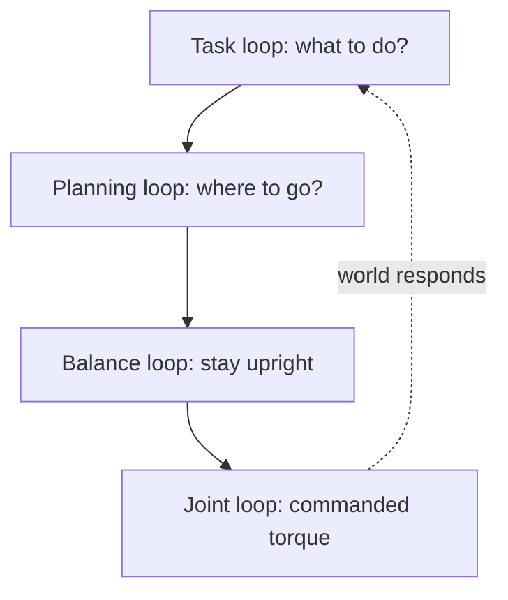
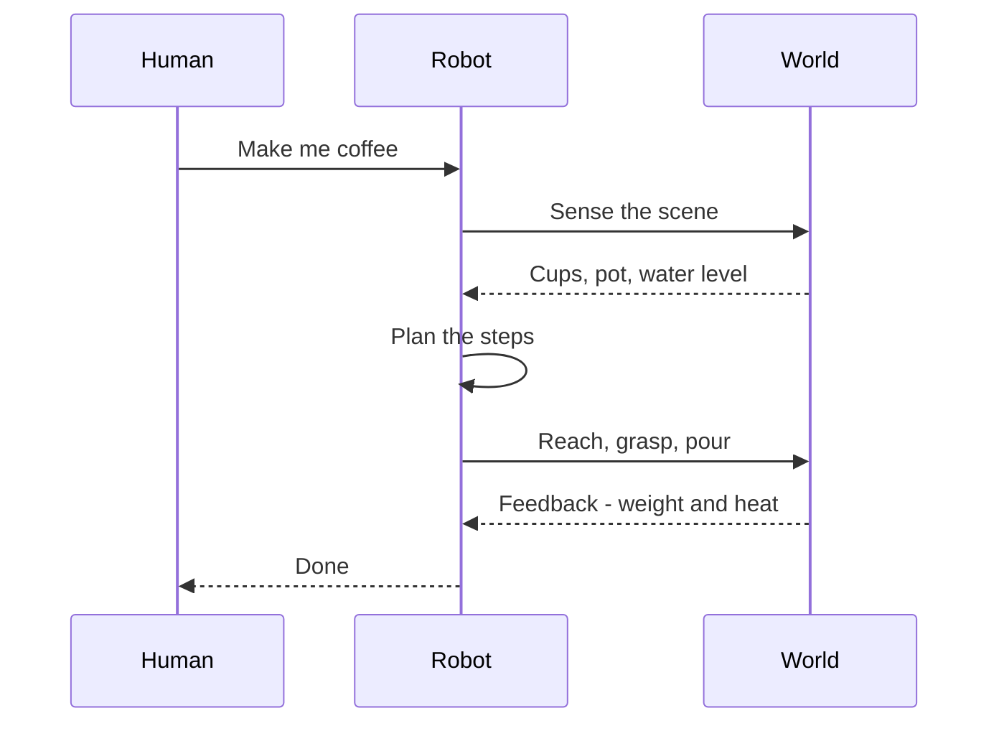

# What Is Physical AI?

> **Status:** complete. First chapter of *Physical AI and Humanoid Robotics: Building Intelligent Machines*.
>
> **Related chapters:** Follows the [Introduction](/docs/intro); leads into Chapter 2 — *Robotics Foundations*.

## Why This Matters

Most of the AI you have met as a software engineer lives in a jar. A chatbot, an
image generator, a code assistant — they think, but they have no hands. They
operate on symbols and pixels, and when they make a mistake, the worst that
happens is that you click retry.

Physical AI is what happens when intelligence leaves the jar and moves into a
body. Now the same "thought" has to survive contact with gravity, friction, and
the fact that the world does not pause while you decide. A chess grandmaster who
has never thrown a ball, and an athlete who has never studied the board, are
both incomplete. Physical AI is about training them together.

If you come from software, this chapter reframes what you already know.
Everything you have learned about models, data, and inference still applies.
But beneath it there is a new layer — the body, and the physics it cannot opt
out of. That layer is what makes physical AI harder than digital AI, and why it
is one of the most interesting problems in computing today.

## Learning Objectives

After this chapter you will be able to:

- Define physical AI and distinguish it from conventional (digital) AI.
- Explain why embodiment imposes new constraints: contact, energy, latency, and safety.
- Trace the perception–action loop and explain why it must close in real time.
- Situate humanoids on the spectrum of physical AI systems.
- Identify the historical threads — control theory, machine learning, and simulation — that converge in today's humanoids.

## Core Concepts

| Concept | Definition |
| ------- | ---------- |
| Embodiment | Being present in a physical body that is subject to physics — gravity, friction, contact, energy. |
| Physical AI | AI that senses, decides, and acts in the physical world through a body. |
| Digital AI | AI that operates on symbols, pixels, and tokens only — no body, no direct contact with physics. |
| Perception | Turning raw sensor data into useful understanding of the world and of the robot itself. |
| Action | Generating motor commands that change the world. |
| Perception–action loop | The cycle of sense → decide → act → sense again that every embodied system runs. |
| Closed loop | Acting on feedback from the world, rather than executing a fixed plan blindly. |
| Sim-to-real | Training a model in simulation, then transferring the behavior to real hardware. |
| Humanoid | A robot shaped roughly like a person — two arms, two legs, bipedal stance. |

## Technical Explanation

### What "physical AI" really means

The term bundles three abilities that digital AI treats as separate disciplines:

- **Perception** — reading the world through sensors: cameras, microphones,
  force sensors, joint encoders, inertial measurement units.
- **Cognition** — making sense of what was perceived and choosing what to do
  next: recognizing a mug, planning the reach, deciding the grip force.
- **Action** — committing to the world through actuators: motors, hydraulics,
  grippers, legs.

None of these is new on its own. Computer vision already perceives; language
models already reason; motor control already moves. What *physical* adds is that
all three must run **in one body, in real time, under physics**. The loop between
them is not optional — it is the system.

### Digital AI vs. physical AI

A useful way to hold the two apart is the map-and-territory distinction. Digital
AI works on a **map** — a model of the world built from text, images, or data.
Physical AI has to live in the **territory**: the world itself, where roads
change, floors are wet, and the same task never repeats exactly.

| Dimension | Digital AI | Physical AI |
| --------- | ---------- | ----------- |
| Manipulates | Symbols, pixels, tokens | Atoms, forces, bodies |
| Home | Cloud, data centers, a laptop | A robot in the world |
| When it's wrong | Retry instantly, costs pennies | An object falls; a person could be hurt; energy is wasted |
| Time to decide | Can deliberate for minutes | Milliseconds (balance) to seconds (planning) |
| Data | Collected and labeled offline | Inherently interactive: sensor + action streams |
| Failure mode | A bad output | A physical consequence |
| Tested by | Benchmarks and evals | The world, continuously |

The deeper point is **consequences**. When a language model makes a mistake, the
cost is a retry. When a robot misjudges a step, gravity does the grading — and
gravity does not offer a hint button. This is why physical AI cannot ship the way
software ships. You cannot "deploy and monitor" a body the way you deploy an API.

### Why robots need intelligence

A robot can be programmed without intelligence. Industrial arms have done the
same weld, the same pick, the same place for decades — precisely, tirelessly,
and **blind**. Hard-coded trajectories work beautifully wherever the world is
predictable.

The problem is that we do not need robots where the world is predictable; we
have machines for that already. We need them in places that change: a factory
aisle where a pallet was moved, a kitchen with a new cup, a sidewalk with a
stray dog. In those places, the robot cannot know in advance what it will meet.
It must **perceive** the situation, **decide** among the actions that make
sense, and **adapt** as the world responds. That adaptation is intelligence in
its most concrete form: the gap between the plan and the world, closed by a
feedback loop.

### The perception–action loop

Every intelligent robot is running one cycle, over and over:

```
Sense → Understand → Decide → Act → (the world changes) → Sense …
```

Call it the perception–action loop. It has three important properties:

1. **It is closed.** The result of an action comes back as new perception. A
   robot that does not close the loop is acting on faith — like driving a car
   with your eyes closed and only opening them at the destination.
2. **It runs at different speeds.** Keeping a biped upright needs decisions at
   hundreds of cycles per second. Choosing where to walk next happens a few
   times per second. Deciding what task to do happens even more rarely. A real
   system has several loops nested inside one another.
3. **It is what digital AI lacks.** A model that only predicts does not close the
   loop. It can tell you what a cup is, but it cannot pick it up and adjust the
   grip when the cup is heavier than expected.

### The spectrum of physical AI

Not every physical AI system is a humanoid. The field is a spectrum, and each
step up adds capability at the price of difficulty:

- **Industrial arms** — few degrees of freedom, fixed workplace, extreme
  repeatability, no perception required.
- **Collaborative arms** — add force sensing and simple perception so they can
  work next to people.
- **Mobile robots** — navigation, mapping, obstacle avoidance.
- **Quadrupeds** — rough terrain, dynamic balance, no fall recovery needed.
- **Humanoids** — the most general body we know how to build: reach anything a
  person can reach, use the tools we already made, walk where we walk.

A humanoid is not better at any single task — an industrial arm will always
out-repeat it. The argument for the humanoid is **generality**: one body, built
for the world we already built, able to learn many tasks instead of being
rebuilt for each one.

### A brief history and the current convergence

Physical AI did not appear from nothing. Four long-running threads finally
converged:

- **Control theory** gave us the math of bodies: kinematics, dynamics, feedback,
  and stability. It is precise but brittle — a controller needs a model, and the
  model must be right.
- **Machine learning** gave us perception and, later, learned policies — systems
  that do not need to be told every rule.
- **Simulation** made it affordable to learn and test on millions of trials
  without breaking hardware. This is why a robot can now learn to walk in an
  afternoon in software.
- **Foundation models** — LLMs and vision-language models — gave robots a
  language-level understanding of the world, so that "pick up the blue cup" can
  finally reach the motors.

The humanoid robots you see in the news are where these four threads meet: a
body from control theory, a brain from machine learning, a training ground from
simulation, and a shared language from large models.

## Real-World Examples

The three companies below are the clearest current snapshots of where physical
AI stands. Treat the specific model names as a point in time — the principles
they demonstrate are what matter.

:::info Tesla Optimus

A car company decided to build a general-purpose humanoid with the same
philosophy as its vehicles: design the body and the AI in one loop, then
manufacture at scale. Optimus has gone through several generations — from the
first prototype that walked on stage in 2022, to a second generation with more
natural gait, to a third generation with highly dexterous hands — and Tesla has
stated its intention to deploy Optimus in its own factories first, and to sell
it to consumers later.

**What it shows:** the manufacturing play. When a company can make robots as
cheaply as cars, the economics of humanoids change.

:::

:::note Figure AI

Figure took a software-first path. Early robots did scripted demos; then the
company paired with an LLM partner and eventually built its own in-house
"vision-language-action" model, Helix, which lets the robot map natural-language
instructions to motor commands across two robots at once. Its robots have
trialled assembly tasks at a BMW plant, and later models claim near-total
autonomy on structured tasks.

**What it shows:** the intelligence play. The body is important, but the model
that closes the perception–action loop is the moat.

:::

:::note Boston Dynamics

The elder statesman. Boston Dynamics spent two decades solving the hardest part
first — the *body*. Its hydraulic Atlas did backflips and parkour that looked
impossible; its Spot robot is deployed commercially in industry. When the
hydraulic Atlas was retired in 2024, it was replaced by an all-electric Atlas
with fewer hydraulic constraints, trained with reinforcement learning and aimed
at real manufacturing work.

**What it shows:** the dynamics play. If the body cannot move, no amount of
intelligence helps — and world-class dynamics is a decade-long advantage.

:::

## Architecture Diagrams

### The perception–action loop

This single diagram is the skeleton of every system in this book. Keep it in
mind: every later chapter is filling in one of these boxes.


### Nested loops in a real system

A walking robot runs several loops at once, from fast and mechanical to slow and
deliberate. The fast loop must always stay closed — it is what keeps the robot
upright while the slow loop decides where to go.



### The perception–action loop, as a conversation

A sequence diagram reads the same loop as a dialogue between the human, the
robot, and the world.



## Code Examples

Even before any real robot code, the loop translates directly to a program. This
is the smallest physical-AI system that exists — and it is worth recognizing it
in everything that follows.

```python
# The perception-action loop, stripped to its minimum.
# Every physical-AI system is this, closed in real time.

def perceive(sensors):
    return sensors.read()      # camera frames, joint angles, forces

def decide(state, goal):
    return policy(state, goal) # a planner or a learned policy

def act(command):
    actuators.command(command) # motors, joints, grippers

while running:
    state   = perceive(sensors)   # 1. sense the world
    command = decide(state, goal) # 2. choose an action
    act(command)                  # 3. act — the world changes
```

:::tip Where this runs
Later chapters turn each of these three lines into a real subsystem — perception
(Chapters 5–8), control (Chapters 9–12), and learning (Chapters 13–18). For now,
notice that the *structure* never changes, only the contents of the boxes.
:::

## Common Mistakes

| Mistake | Why it happens | How to avoid it |
| ------- | -------------- | --------------- |
| Confusing a digital-AI demo with embodied competence | A video of a model "controlling" a robot looks convincing | Demand evidence that the perception–action loop closes in real time and in the real world |
| Assuming more intelligence fixes bad hardware | "If the brain is smart enough, the body doesn't matter" | Design the body and the mind together; a smart policy cannot move a weak actuator |
| Ignoring latency | In software, a slow response is a delay; in a robot, it is a fall | Reason about loop rates: what must close at kHz vs. Hz |
| Training on static data, expecting dynamic behavior | Models learn what the data distribution looked like, not what the world does next | Close the loop during training — use simulation, reinforcement learning, or interactive data |
| Judging a humanoid by a highlight reel | Marketing shows successes | Ask about failure rate, run time, and what happens on the rare case |

## Summary

Physical AI is AI that lives in a body: it perceives, thinks, and acts in the
physical world, under physics, in real time. The difference from digital AI is
not the model — it is the *loop*. A digital system produces an output; a physical
system produces a change in the world and then senses that change. That
closed, time-critical, consequence-bearing loop is what makes robots need
intelligence, what makes humanoids the most demanding expression of it, and
what ties every later chapter of this book together.

**Key takeaways**

- Physical AI = perception + cognition + action, running in one body, in real time.
- Digital AI works on a map; physical AI lives in the territory, where mistakes have physical consequences.
- Robots need intelligence exactly where the world is unpredictable — that gap is closed by the perception–action loop.
- The field is a spectrum from industrial arms to humanoids; the humanoid wins on generality, not on any single task.
- Today's humanoids are the convergence of control theory, machine learning, simulation, and foundation models.

## Exercises

1. **Easy — one-sentence definition.** Write a single sentence that distinguishes
   physical AI from a large language model, in terms any software engineer would
   understand. Then check your sentence against the definition of the
   perception–action loop.
2. **Easy — the closed loop.** Choose a trivial task you do every day (making
   tea, unlocking a door). Write down the sense → understand → decide → act
   steps for each action. Now remove one step (for example, *stop sensing after
   the first step*) and describe what goes wrong.
3. **Medium — read a demo critically.** Take any recent humanoid robot demo from
   Tesla, Figure, or Boston Dynamics. List three things the robot demonstrably
   does, and three things the video does *not* tell you (failure rate, run time,
   supervision, environmental control).
4. **Challenge — where the map breaks.** Consider a delivery robot with a map of
   a warehouse. Enumerate five real-world changes that make the map wrong (a
   moved pallet, a closed door, …). For each, explain which part of the
   perception–action loop is needed to recover, and what the robot should do
   when it cannot recover.

## Further Reading

- Boston Dynamics, *Atlas* (company site and videos) — the reference point for
  what a physically capable body looks like. [bostondynamics.com/atlas](https://bostondynamics.com/atlas)
- Figure AI, *Helix: A Vision-Language-Action Model for Generalist Humanoid
  Control* (2025) — a readable primary source for the "intelligence play".
  [figure.ai/news/helix](https://www.figure.ai/news/helix)
- NVIDIA, *Isaac GR00T* — documentation on training humanoid foundation models
  in simulation, foreshadowing Chapters 21–22. [developer.nvidia.com/isaac/gr00t](https://developer.nvidia.com/isaac/gr00t)
- Kevin Lynch and Frank Park, *Modern Robotics: Mechanics, Planning, and
  Control* (Cambridge) — the authoritative textbook for the "body" half of
  physical AI.
- Robin Murphy, *Introduction to AI Robotics* (MIT Press) — a classic treatment
  of the perception–action cycle and its history.
