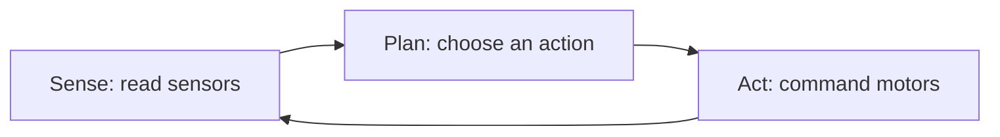
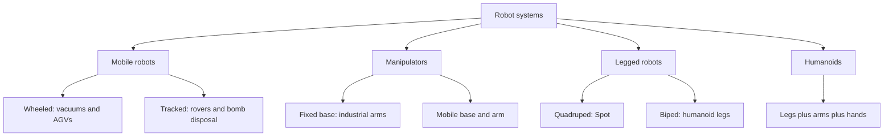

import Quiz from '@site/src/components/Educational/Quiz';

# Robotics Foundations

> **Status:** complete
>
> **Related chapters:** Builds on Chapter 1 — What Is Physical AI; feeds into Chapter 4 — Humanoid Robot Architecture and Chapter 9 — Kinematics and Dynamics.

## Why This Matters

A robot is the first thing you have built that lives in the same world you do. A web server handles requests; a robot has to handle gravity, friction, and the fact that its sensors lie. Every robot — a warehouse arm, a vacuum cleaner, a walking humanoid — is a body moving through space, and the rules of that game are the rules of robotics.

This chapter is the vocabulary and mental model the rest of the book assumes. When later chapters talk about a humanoid's 40 degrees of freedom, or a policy that plans in configuration space, or a controller that closes the loop, they are building on ideas you will meet here: what a robot is, how we count its possibilities, how we describe its motion, and how it decides what to do next.

## Learning Objectives

After this chapter you will be able to:

- Define a robot and enumerate its core subsystems.
- Explain degrees of freedom and configuration space, and count the DoF of a simple mechanism.
- Distinguish forward from inverse kinematics and when to use each.
- Trace the sense–plan–act loop and identify where each of the book's later parts plugs into it.
- Classify robot systems along a taxonomy from industrial arms to humanoids.

## Core Concepts

| Concept | Definition |
| ------- | ---------- |
| Robot | A machine that senses the world, computes decisions, and acts on the world through physical motion. |
| Degree of freedom (DoF) | One independent axis along which a joint can move. |
| Configuration | A complete specification of a robot's joint positions — one snapshot of "where everything is." |
| Configuration space | The set of all possible configurations; the space a robot "lives in" when it moves. |
| Joint | The movable connection between two links (a hinge, a slider, a ball). |
| Link | The rigid body between two joints. |
| End-effector | The tool at the end of a kinematic chain — a gripper, hand, or foot. |
| Forward kinematics | Computing the end-effector pose from the joint angles. |
| Inverse kinematics | Computing the joint angles that place the end-effector at a desired pose. |
| Workspace | The region of space the end-effector can physically reach. |
| Sense–plan–act | The perception, decision, and action cycle every robot runs. |

## Technical Explanation

### What is a robot?

The word robot means "forced labor" (from the Czech *robota*), and it still captures the essence: a robot is a machine that does physical work in the world on its own. Three subsystems do that work:

- **Sensing** — the robot reads its body and the world (encoders, cameras, force sensors).
- **Computing** — a brain turns those readings into a decision (a microcontroller up to a GPU cluster).
- **Acting** — motors and actuators push against the world to move links and limbs.

Remove any one and the machine is something else: a camera is not a robot, a calculator is not a robot, and a motor alone is not a robot. It is the loop among the three — sense, compute, act — that makes a robot, and it is the same loop in a \$50 toy and a \$200,000 humanoid.

### Degrees of freedom and configuration space

A **degree of freedom** is one independent axis of motion. A door hinge has one DoF; a wrist that pitches, yaws, and rolls has three. Count them carefully: a joint with multiple axes of motion (like a ball joint) is usually built from two or three one-axis joints stacked together, because a physical motor is very good at one axis at a time.

The **configuration** of a robot is the complete list of all its joint positions at one instant, written as a vector

$$q = (q_1, q_2, \dots, q_n)$$

where $n$ is the number of degrees of freedom and each $q_i$ is an angle or a distance. A 6-DoF industrial arm has a 6-dimensional configuration; a 50-DoF humanoid lives in a 50-dimensional space.

The **configuration space** (or C-space) is the set of all possible configurations the robot can reach. It is the robot's true "map of possibilities," and planning a motion is really the problem of finding a path through configuration space from one configuration to another — which is why later chapters spend so much effort describing it.

### Joints, links, and end-effectors

A robot's body is a **kinematic chain**: a sequence of rigid **links** connected by movable **joints**. The common joint types are:

- **Revolute** — rotates about an axis (a hinge; most robot joints).
- **Prismatic** — slides along an axis (a linear actuator).
- **Spherical** — rotates about a point in three axes (often built from three revolute joints).

The chain starts at a **base** (fixed to the floor, or floating in the air on a legged robot) and ends at the **end-effector** — the gripper, hand, or foot that actually touches the world. Most of what looks like "robot skill" is really the robot controlling the end-effector while the rest of the body supports it.

### Forward and inverse kinematics

Kinematics is the study of motion without forces — geometry, not physics. There are two directions:

**Forward kinematics** (FK) answers: "Given the joint angles, where is my hand?" The answer is a chain of transforms — rotate by joint 1, translate along link 1, rotate by joint 2, and so on — and it is unique and easy to compute. Every robot controller does FK continuously just to know where its own body is.

**Inverse kinematics** (IK) answers the harder question: "Given where I want my hand, what joint angles achieve it?" Unlike FK, IK may have zero, one, or many solutions, and solving it usually requires iterative numerical search. Think of it as the difference between "stretch your arm out" (easy to know where your hand ends up) and "place your hand on that shelf" (requires solving for the shoulder and elbow angles — and your own body tries many options before it settles).

A useful intuition: FK is a function $f(q) = p$ that you can evaluate instantly; IK is *inverting* that function, which is not generally closed-form.

### Workspace, redundancy, and task space

The **workspace** is every position the end-effector can reach. It is a volume in space — roughly a hollow sphere for an arm, more complex for a humanoid. Designers care about it because a robot is useless outside its workspace.

**Redundancy** means having more degrees of freedom than the task needs. A 7-DoF arm moving a 6-DoF task (position plus orientation) has one redundant DoF, so it can reach the same pose in many different elbow configurations. Redundancy buys flexibility and obstacle avoidance, at the cost of harder planning.

Relatedly, robots work in two spaces: **joint space** (the $q$ vector) is where motors act, and **task space** (Cartesian positions and orientations) is where the end-effector works. Every control problem is a translation between the two — which is exactly what FK and IK do.

### The sense–plan–act loop

Every intelligent robot runs a cycle:

1. **Sense** — collect measurements from sensors (a camera frame, a distance reading, a joint angle).
2. **Plan** — choose a goal and a way to reach it (a path, a torque, a policy output).
3. **Act** — execute the plan through the actuators (turn a wheel, command a motor).

Then the world has changed, and the loop runs again — usually dozens to thousands of times per second. The loop is the book's spine: Part II covers sensing, Part III covers actuation and control, Part IV covers planning and learning, and Part V covers the software that glues the loop together.

A purely reactive robot skips explicit planning (the obstacle-avoiding vacuum just turns when something is near). A deliberative robot plans first, then acts. Most real robots blend the two: a fast reactive loop keeps balance while a slower planner decides where to walk.

### A taxonomy of robot systems

Not all robots are humanoids, and the differences matter because each class faces different constraints:

- **Mobile robots** — wheels or tracks; they navigate, they don't manipulate. Easy to keep stable, hard to traverse uneven ground. Example: robot vacuums, warehouse AGVs, rovers.
- **Manipulators** — fixed-base arms; they manipulate, they don't navigate. Precise and fast, but the base is bolted down. Example: industrial welding arms.
- **Legged robots** — quadrupeds and bipeds; they navigate rough terrain by stepping. Locomotion is the hard problem. Example: Spot, and every humanoid's legs.
- **Humanoids** — the union: legged locomotion plus two dexterous arms, built to fit human environments. They are the most capable and the hardest to control — which is why the rest of this book exists.

The taxonomy is not a ranking. A humanoid is worse than a forklift at moving pallets and worse than an arm at welding — its bet is *generality*, and the rest of the book is about making generality real.

## Real-World Examples

:::info Real system
Boston Dynamics' Spot is a quadruped that navigates construction sites and industrial plants, where wheels fail but stairs and rubble are routine. Its value comes from *locomotion* — the legs — while perception and autonomy arrive as software. Spot shows the taxonomy in action: a legged platform optimized for one job (moving over terrain), not for everything.
:::

:::note Mini case study
A classic teaching exercise is the **two-link planar arm**: a shoulder and an elbow, two revolute joints, reaching in a plane. It is the smallest robot with a real kinematics problem — FK takes one formula, IK has two solutions (elbow-up and elbow-down). Thousands of students have written the same `forward_kinematics` function you will write below. Understand the two-link arm fully and you understand every more complex robot, because they are just longer chains of the same idea.
:::

## Architecture Diagrams

### The sense–plan–act loop



### A taxonomy of robot systems



## Code Examples

### Forward kinematics of a two-link arm

```python
import numpy as np

def forward_kinematics(theta1, theta2, l1=1.0, l2=0.8):
    """End-effector (x, y) of a 2-link planar arm.

    theta1: shoulder angle in radians
    theta2: elbow angle in radians
    l1, l2: link lengths
    """
    x = l1 * np.cos(theta1) + l2 * np.cos(theta1 + theta2)
    y = l1 * np.sin(theta1) + l2 * np.sin(theta1 + theta2)
    return np.array([x, y])

# Reach out: shoulder at 45 degrees, elbow bent 30 degrees
ee = forward_kinematics(np.deg2rad(45), np.deg2rad(30))
print(f"End-effector at x={ee[0]:.3f} m, y={ee[1]:.3f} m")

# Move only the elbow and watch the hand move too
ee2 = forward_kinematics(np.deg2rad(45), np.deg2rad(60))
print(f"Elbow at 60 deg: x={ee2[0]:.3f} m, y={ee2[1]:.3f} m")
```

**What each piece does:** each line is one joint of the chain — the shoulder rotation moves the whole arm, the elbow rotation moves only the forearm, and adding the two terms puts the hand at the sum. That single geometric fact, chained through 40 joints, is how every robot finds its own body.

:::tip Where this runs
Any Python environment with NumPy. To feel it move, plot the hand position over a sweep of elbow angles — the arc you trace is the workspace of this arm from the "Workspace, redundancy, and task space" section.
:::

## Common Mistakes

| Mistake | Why it happens | How to avoid it |
| ------- | -------------- | --------------- |
| Confusing forward and inverse kinematics | Both involve "angles and positions" | Anchor it: FK is given joints, find hand; IK is given hand, find joints |
| Counting a ball joint as one DoF | It visibly rotates in many directions | A multi-axis joint is several stacked 1-DoF joints; count each axis |
| Thinking the configuration is the hand position | The hand is what you can see | The configuration is *all* joint angles; the hand position is just one result of FK |
| Assuming IK has exactly one answer | FK is unique, so IK feels similar | IK can have many, one, or zero solutions; search iteratively and pick by cost |
| Writing sense–plan–act as a one-shot script | Sequential code feels natural | Real robots loop forever; structure code as a loop that re-senses every cycle |

## Summary

A robot is a sense–compute–act loop embodied in a kinematic chain of links and joints, and robotics is the discipline of describing and controlling that body. Degrees of freedom and configuration space give us a vocabulary for a robot's possibilities; forward and inverse kinematics translate between joint angles and the world; and the sense–plan–act loop frames where every part of the software stack lives. The humanoid — legs, arms, hands, and all — is just the most ambitious chain yet, and every later chapter is a deeper treatment of one step in this loop.

**Key takeaways**

- A robot needs sensing, computing, and acting — the loop, not the parts, makes it a robot.
- Each independent axis of motion is one degree of freedom; the configuration is the vector of all joint values.
- FK is easy and unique; IK is hard and multi-valued — most of robot motion is negotiating between them.
- Workspace, redundancy, and task space shape what a robot can physically do.
- Mobile, manipulation, legged, and humanoid systems face different problems; humanoids bet on generality.

## Exercises

1. **Easy — Count the DoF.** Draw a simple revolute arm with a shoulder (2 axes) and an elbow (1 axis). How many degrees of freedom does it have, and what is the dimension of its configuration space?
2. **Medium — Sweep the workspace.** Extend the `forward_kinematics` example to sweep the elbow angle from 0 to 180 degrees, collect the end-effector positions, and describe the shape they trace. *Hint: this is the workspace of the arm — see "Workspace, redundancy, and task space."*
3. **Challenge — A reactive controller.** Build a miniature sense–plan–act loop: simulate a robot that reads a distance sensor and turns away when an obstacle is within a threshold, using the structure described in the chapter. Run it for 100 time steps and log every step at which the robot turned.

Check your understanding:

<Quiz
  question="Which of the following best describes inverse kinematics?"
  options={[
    'Computing the hand position from the joint angles',
    'Computing the joint angles that put the hand at a desired position',
    'Counting the degrees of freedom of a mechanism',
    'Planning a path through configuration space',
  ]}
  correctAnswerIndex={1}
/>

## Further Reading

- Kevin Lynch and Frank Park, *Modern Robotics: Mechanics, Planning, and Control* (Cambridge University Press, 2017) — the definitive, freely available textbook; Chapters 2 and 4 cover configuration space and forward kinematics. [modernrobotics.org](https://modernrobotics.org/)
- MIT OpenCourseWare, *Introduction to Robotics* — lecture notes and problem sets at exactly this chapter's level. [ocw.mit.edu](https://ocw.mit.edu/)
- ROS 2 documentation, *Concepts* — how the sense–plan–act loop is expressed as topics and nodes in real robot software. [docs.ros.org](https://docs.ros.org/en/rolling/Concepts.html)
