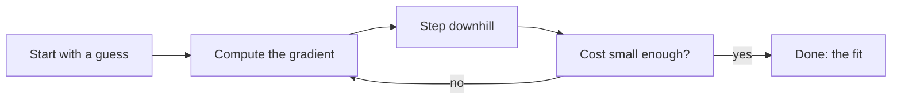
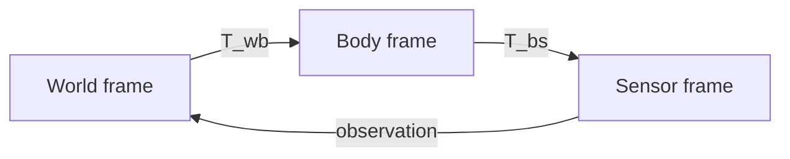

import Quiz from '@site/src/components/Educational/Quiz';

# The Math Toolkit for Embodied Machines

> **Status:** complete
>
> **Related chapters:** Builds on Chapter 1 — What Is Physical AI; feeds into Chapter 4 — Humanoid Architecture, Chapter 9 — Kinematics and Dynamics, and Chapter 14 — Reinforcement Learning.

## Why This Matters

A robot is a body moving in space, reading a noisy world, and choosing actions.
That sentence needs mathematics the way a bridge needs steel:

- **Geometry** answers "where is the robot, and which way is it facing?" — that is
  vectors and rotations.
- **Change** answers "how fast is it moving, and how should it move to improve?"
  — that is calculus and gradient descent.
- **Uncertainty** answers "what should the robot *believe*, given what it sensed?"
  — that is probability.

None of it is exotic. If you have written a `for` loop, you can build every idea
in this chapter on top of it. We keep the math concrete: every equation maps to
a line of Python, and every line of Python maps to something a real robot does.

## Learning Objectives

After this chapter you will be able to:

- Represent positions and rotations with vectors, matrices, and rotation matrices.
- Chain rigid-body motions together using homogeneous transforms.
- Use gradients and gradient descent to fit a model to data.
- Model noisy sensor measurements with Gaussians and Bayes' rule.

## Core Concepts

| Concept | Definition |
| ------- | ---------- |
| Vector | A magnitude and a direction — a position, velocity, or force. |
| Matrix | A rectangular array that transforms vectors (rotation, scaling, projection). |
| Rotation matrix | An orthogonal matrix that rotates a vector without stretching it. |
| Homogeneous transform | A 4×4 matrix that packs a rotation and a translation into one. |
| Gradient | The direction of steepest *increase* of a function. |
| Gradient descent | Stepping downhill in the gradient's opposite direction to minimize a cost. |
| Gaussian | The bell-curve distribution used to model noisy sensor readings. |
| Bayes' rule | Updating a belief when new evidence arrives. |

## Technical Explanation

### Vectors and matrices

A vector is just a list of numbers with a meaning. A position in 3D space is
$\vec{p} = (x, y, z)$; a velocity is another vector. The **dot product**
$\vec{a} \cdot \vec{b} = \sum_i a_i b_i$ measures how much two vectors point the
same way — zero means perpendicular, and it is the seed of every "how similar
are these two things?" computation in machine learning.

A **matrix** multiplies a vector to transform it. Rotating a 2D point by angle
$\theta$ is a single formula:

$$R(\theta) = \begin{bmatrix} \cos\theta & -\sin\theta \\ \sin\theta & \cos\theta \end{bmatrix}$$

so the rotated point is $\vec{p}\,' = R(\theta)\,\vec{p}$. In 3D we stack three
such rotations (about the $x$, $y$, and $z$ axes) into one $3 \times 3$ rotation
matrix. The order matters — rotating about $x$ then $y$ is *not* the same as
rotating about $y$ then $x$ — which is the first place beginners get bitten.

### Rigid-body transforms

A robot's hand is positioned *and* oriented. Both at once fit in one object, the
**homogeneous transform**:

$$T = \begin{bmatrix} R & \vec{t} \\ \mathbf{0}^\mathsf{T} & 1 \end{bmatrix}$$

a $4 \times 4$ matrix whose top-left block is a rotation $R$ and whose top-right
column is a translation $\vec{t}$. Multiplying a point by $T$ rotates *and*
moves it in one step. Chaining transforms is a single matrix multiply:

$$T_{\text{world} \leftarrow \text{hand}} = T_{\text{world} \leftarrow \text{arm}} \cdot T_{\text{arm} \leftarrow \text{hand}}$$

Read the subscripts carefully: transforms compose left to right in the direction
the arrows point. Getting this order backwards is the classic way to send a robot
arm through a table.

### Calculus: rates of change

The **derivative** measures how fast a function changes. The **gradient**
$\nabla J$ generalizes this to functions of many variables: it is a vector
pointing in the direction that increases $J$ fastest. In machine learning, $J$ is
a cost we want to make small, so we repeatedly step *against* the gradient.

### Optimization: gradient descent

Gradient descent is the workhorse that trains every model in this book:

$$\theta_{k+1} = \theta_k - \alpha \,\nabla J(\theta_k)$$

Here $\theta$ are the parameters (the numbers we are learning), $J$ is the cost,
and $\alpha$ is the **learning rate** — how big a step we take. Too small a step
and learning crawls; too large and it diverges. Every optimizer you meet later
(Adam, PPO's surrogate loss, diffusion denoising) is a smarter relative of this
one line.

### Probability: dealing with noise

No sensor is exact. A distance reading is the true distance plus random noise.
The standard model for that noise is the **Gaussian** (bell curve):

$$p(x) = \frac{1}{\sqrt{2\pi\sigma^2}} \exp\!\left(-\frac{(x-\mu)^2}{2\sigma^2}\right)$$

with mean $\mu$ (the true value, on average) and variance $\sigma^2$ (how spread
out the noise is). Two ideas follow:

- **Modeling noise** lets a robot weigh a shaky measurement against a prior
  belief instead of trusting it blindly.
- **Bayes' rule** tells a robot how to update a belief when evidence arrives:

$$P(A \mid B) = \frac{P(B \mid A)\,P(A)}{P(B)}$$

Read it as: "the probability of the cause $A$ given the evidence $B$ equals how
well $A$ explains $B$, weighted by how likely $A$ was to begin with." This one
formula is the engine behind the Kalman filters and particle filters in
Chapter 8.

### Why probabilistic thinking matters in robotics

Digital AI can treat a wrong answer as a retry. A robot cannot — its sensors are
noisy *and* the world is unpredictable *and* the consequences are physical. So
robots don't just compute a position; they compute a *distribution* over
positions. Everything downstream — planning, control, safety — is built on that
honesty about uncertainty.

## Real-World Examples

:::info Real system
A humanoid's state estimator fuses joint encoders (precise but slow to drift)
with an IMU (fast but noisy) using a Kalman filter. The filter is nothing but
Bayes' rule applied over and over: each measurement is a Gaussian, and the
estimate is their weighted combination. This is why a walking robot can stay
upright while its individual sensors lie to it every frame.
:::

:::note Mini case study
A delivery robot localizing itself in a warehouse with a **particle filter**.
It keeps a thousand guesses ("particles") about its position. Each lidar scan
is scored against each guess, low-scoring guesses are culled, and high-scoring
ones are copied — an online application of Bayes' rule that recovers from being
completely lost.
:::

## Architecture Diagrams

### Gradient descent, the loop



### Chaining coordinate frames



The robot never "sees" the world directly — it sees measurements expressed in
the sensor frame, which it chains back to the world frame through a product of
transforms. The whole perception stack in Part II is this diagram, scaled up.

## Code Examples

### Rotations and transforms in NumPy

```python
import numpy as np

def rotation_2d(theta):
    """Rotation matrix for angle theta (radians)."""
    c, s = np.cos(theta), np.sin(theta)
    return np.array([[c, -s], [s, c]])

def homogeneous(R, t):
    """Pack a 3x3 rotation R and translation t into a 4x4 transform."""
    T = np.eye(4)
    T[:3, :3] = R
    T[:3, 3] = t
    return T

# A point in the hand frame, expressed in the body frame
p_hand = np.array([0.1, 0.0, 0.2, 1.0])          # homogeneous point
T_body_hand = homogeneous(rotation_2d(0.5), [1.0, 0.0, 0.0])
p_body = T_body_hand @ p_hand                    # matrix multiply
print("point in body frame:", p_body[:3])
```

**What each piece does:** `rotation_2d` builds the $R(\theta)$ matrix from the
chapter, `homogeneous` wraps a rotation and translation into one 4×4 matrix, and
`T_body_hand @ p_hand` is the single matrix multiply that chains the frames.
The trailing `1.0` on the point is what makes a homogeneous point work.

### Gradient descent by hand

```python
# Fit a line y = m*x + b to data by minimizing mean squared error.
def cost(m, b, xs, ys):
    return np.mean((m * xs + b - ys) ** 2)

def gradient(m, b, xs, ys):
    dm = np.mean(2 * (m * xs + b - ys) * xs)
    db = np.mean(2 * (m * xs + b - ys))
    return dm, db

m, b = 0.0, 0.0                      # start with a guess
alpha = 0.1                          # learning rate
for _ in range(200):                 # gradient descent loop
    dm, db = gradient(m, b, xs, ys)
    m -= alpha * dm                  # step downhill
    b -= alpha * db
print(f"fit: y = {m:.2f} x + {b:.2f}")
```

**What each piece does:** the two `gradient` lines compute $\partial J/\partial m$
and $\partial J/\partial b$; the `-= alpha * ...` lines are exactly the update
rule $\theta \leftarrow \theta - \alpha \nabla J$. Swap the data `xs, ys` for
sensor readings and you are doing real calibration.

:::tip Where this runs
Run this in any Python environment with NumPy installed — it is the same math
that runs inside the Kalman filter of Chapter 8 and the optimizers of Chapter 14.
:::

## Common Mistakes

| Mistake | Why it happens | How to avoid it |
| ------- | -------------- | --------------- |
| Multiplying transforms in the wrong order | It is easy to reverse the frame subscripts | Read $T_{a \leftarrow b}$ as "into $a$ from $b$"; always label frames |
| Using a step size $\alpha$ that is too large | Gradient descent diverges silently | Start small and watch the cost curve; shrink $\alpha$ if it jumps |
| Trusting a sensor reading as exact | Sensors are noisy by design | Always pair a measurement with a noise model (a Gaussian) |
| Forgetting to normalize | Probabilities must sum to 1 | After any Bayes update, divide by the total — the normalization $P(B)$ |

## Summary

The mathematics of a robot reduces to three moves: represent where things are
with vectors and matrices, describe how they change with derivatives and
gradients, and admit what you do not know with probability. The transform
chains frames, gradient descent learns, and Bayes' rule fuses noisy evidence —
and every chapter from here uses at least one of the three.

**Key takeaways**

- Rotation matrices and homogeneous transforms turn geometry into matrix multiplication.
- Gradient descent, $\theta \leftarrow \theta - \alpha\nabla J$, is the engine of all learning.
- Gaussians model noise; Bayes' rule, $P(A \mid B) \propto P(B \mid A)P(A)$, is how robots update beliefs.
- Frame order, step size, and normalization are where beginners lose the most time.

## Exercises

1. **Easy — Rotate a point.** Write a function that rotates the point $(1, 0)$
   by $90°$ using a 2D rotation matrix and confirm it lands at $(0, 1)$.
2. **Medium — Chain two transforms.** Compose $T_{A \leftarrow B}$ and
   $T_{B \leftarrow C}$ into $T_{A \leftarrow C}$, then apply it to a point and
   verify the result matches applying the two transforms in sequence.
3. **Challenge — Fit sensor drift.** Collect a synthetic "sensor" series
   (true value + Gaussian noise) and use gradient descent to fit the drift
   model. Plot the cost dropping each iteration.

Check your understanding:

<Quiz
  question="Which operation combines a rotation and a translation into one object?"
  options={[
    'A rotation matrix',
    'A homogeneous transform',
    'A dot product',
    'A Gaussian',
  ]}
  correctAnswerIndex={1}
/>

## Further Reading

- 3Blue1Brown, *Essence of Linear Algebra* (video series) — the best intuition
  for vectors, matrices, and transforms. [youtube.com/playlist?list=PLZHQObOWTQDPD3MizzM2xVFitgF8hE_ab](https://www.youtube.com/playlist?list=PLZHQObOWTQDPD3MizzM2xVFitgF8hE_ab)
- Gilbert Strang, *Introduction to Linear Algebra* (Wellesley-Cambridge) — the standard reference.
- Kevin Lynch and Frank Park, *Modern Robotics* (Cambridge) — where these transforms become robot arms, Chapter 3 of this book's reading list.
