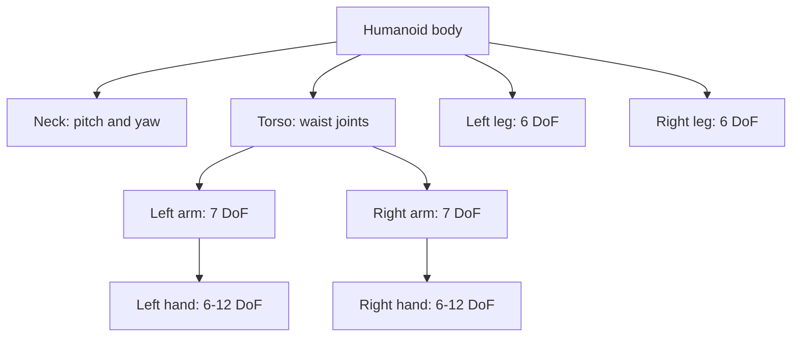
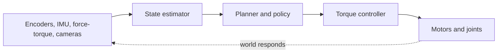

import Quiz from '@site/src/components/Educational/Quiz';

# Humanoid Robot Architecture

> **Status:** complete
>
> **Related chapters:** Builds on Chapter 2 — Robotics Foundations; feeds into Chapter 9 — Kinematics and Dynamics and Chapter 20 — Building the Robot Software Stack.

## Why This Matters

Before a humanoid can think, it has to *be* something. The architecture of the
body — how many joints, where the motors go, what sensors it carries, what
computer runs on board — decides what the robot can physically do, and every AI
chapter later in this book inherits those limits. A policy cannot walk with
legs that cannot balance; a vision model cannot grasp what hands cannot hold.

Reading this chapter, you will learn to look at a humanoid the way an engineer
does: not as a "robot," but as a set of numbers — degrees of freedom, joint
torques, compute, and power — each one a constraint that shapes the software.

## Learning Objectives

After this chapter you will be able to:

- Map the anatomy of a humanoid onto its degrees of freedom.
- Explain why actuators and sensors go where they do.
- Read a humanoid spec sheet: DoF, payload, battery, and compute.
- Compare reference platforms and their trade-offs.

## Core Concepts

| Concept | Definition |
| ------- | ---------- |
| Degree of freedom (DoF) | One independent axis of motion at a joint. |
| Actuator | The motor + transmission that produces torque at a joint. |
| Series elastic actuator | A motor with a spring in line, making it compliant and shock-tolerant. |
| Quasi-direct drive | A low-ratio transmission motor with high backdrivability. |
| Proprioceptive sensors | Sensors of the robot's own state: encoders, IMUs, force–torque. |
| Exteroceptive sensors | Sensors of the world: cameras, LiDAR, microphones. |
| Thermal budget | How much heat the body can dissipate while computing and moving. |

## Technical Explanation

### Degrees of freedom of a modern humanoid

A humanoid is a chain of joints arranged like a person. A typical distribution:

| Body part | Joints (approx.) |
| --------- | ---------------- |
| Each leg | 6 (hip ×3, knee ×1, ankle ×2) |
| Each arm | 7 (shoulder ×3, elbow ×1, wrist ×3) |
| Torso | 2–3 (waist pitch/yaw/roll) |
| Neck | 2–3 (pitch/yaw) |
| Each hand | 6–12 (per finger) |

That adds to roughly **40–60 degrees of freedom** depending on the hands — far
more than an industrial arm's 6. Every extra joint makes the kinematics,
dynamics, and learning harder, which is why hands are often the last part to be
made dexterous.

### Mechanical layout

The body is a tree of links rooted at the waist:

- **Legs** end in feet with force sensors; the knee and hip do most of the work.
- **Arms** hang from the shoulders and end in wrists and hands.
- **Torso** connects the two and carries the compute and battery.
- **Neck + head** carry the cameras and microphones — the sensors that face the
  world.

The arrangement matters because *mass at the ends of long links is expensive*:
it multiplies inertia and demands more torque from every joint behind it.

### Actuator placement: shoulder vs. knee

The two design extremes illustrate the trade-off:

- **At the shoulder**, the arm hangs and the actuator mostly fights gravity when
  reaching. Reach speed and range matter, so arms favor **light, fast,
  low-ratio** actuators (e.g., quasi-direct drive) that are backdrivable — safe
  around people.
- **At the knee**, the whole body weight bears down on a single joint during
  walking. The knee needs **peak torque and energy return**, so legs favor
  **high-torque** actuators (harmonic drives, or series-elastic for shock
  absorption).

A common simplification: shoulders want speed and compliance, knees and hips
want torque and efficiency. Getting the two backwards is how robots end up
either too weak to stand or too stiff to be safe.

### Sensor placement

- **Joint encoders** live inside every actuator — they report joint angles, the
  ground truth for control.
- **IMUs** sit in the torso and head — they report orientation and acceleration,
  essential for balance.
- **Force–torque sensors** sit in the feet and wrists — they report contact, the
  most important signal a legged robot has.
- **Cameras** ride in the head (and sometimes the hands) — the world-facing eyes.
- **LiDAR / depth** often supplement the head cameras for distance.

Sensors go where they produce the least ambiguous signal: contact at the
contact point, orientation at the center of mass, vision at the eyes.

### Onboard compute, power, and thermal budgets

Every humanoid carries a computer and a battery, and both are scarce:

- **Compute** must run perception, control, and (increasingly) a local model —
  all at control rates. Modern humanoids carry a desktop-class GPU/CPU on board
  (an NVIDIA-class SoC or similar), because sending everything to the cloud is
  too slow for balance.
- **Power** is the hardest constraint. A battery that lasts an hour of walking
  weighs a lot, and that weight costs torque. Energy density drives the design.
- **Thermal budget** is the quiet killer: motors and GPUs both generate heat,
  and a humanoid has little surface area to shed it. Sustained performance is
  bounded by cooling, not just by peak specs.

### Reference platforms compared

Specs move fast, so treat these as a snapshot, not a contract:

| Platform | Approx. DoF | Highlights | Design bet |
| -------- | ----------- | ---------- | ---------- |
| Unitree G1 | ~23–30 | Light, ~1.3 m, low cost | Affordable research humanoid |
| Unitree H1 | ~40–50 | 1.8 m, high-speed walking | Dynamic locomotion |
| Figure 02 | ~44+ (incl. 16-DoF hands) | Two arms, dexterous hands, factory trials | General-purpose manipulation |
| Tesla Optimus | ~28 body + 22-DoF hands | Mass-manufacturing ambition | Scale and cost |
| Boston Dynamics Atlas | ~28 | Electric, RL-trained gait | Dynamics and agility |

Each row is a different bet: some buy capability, some buy cost, some buy speed.
There is no "best" humanoid — only the right trade-off for a job.

### Design tension: weight, strength, autonomy

Every humanoid design pulls in three directions at once:

- **Weight** wants to be low (less inertia, less battery).
- **Strength** wants to be high (more torque, stiffer structure).
- **Autonomy** wants more compute and sensors — which add weight and heat.

The whole field is an exercise in managing that triangle. A robot that can lift
50 kg usually cannot run; a robot that runs an hour usually cannot carry much.
Understanding the triangle is why engineers read spec sheets instead of
marketing videos.

## Real-World Examples

:::info Real system
Tesla's Optimus uses high-torque actuators and highly dexterous hands (around 22
degrees of freedom in each), betting that manufacturing at car scale will make
capable bodies cheap enough to deploy broadly — first in factories, later more
generally.
:::

:::note Mini case study
Unitree's G1 achieves a sub-¥100k price point by accepting fewer degrees of
freedom and lighter materials than research giants like Atlas. The result is a
robot many labs can afford — the trade-off is peak agility. It demonstrates that
a humanoid's value is set by the *whole* system, not by the DoF count alone.
:::

## Architecture Diagrams

### Anatomy to degrees of freedom



### The sense-compute-act loop on board



This is the Chapter 1 loop running on real silicon — sensors feed a state
estimator, which feeds planning, which drives torque control, which moves the
actuators, which changes what the sensors see.

## Code Examples

### Reading a spec sheet as data

```python
# Represent a humanoid as data so you can compare platforms fairly.
platforms = {
    "Unitree G1":  {"dof": 23,  "height_m": 1.32, "payload_kg": 3,  "walk_hrs": 2},
    "Unitree H1":  {"dof": 45,  "height_m": 1.80, "payload_kg": 30, "walk_hrs": 1.5},
    "Figure 02":   {"dof": 44,  "height_m": 1.70, "payload_kg": 20, "walk_hrs": 5},
    "Tesla Optimus": {"dof": 50, "height_m": 1.73, "payload_kg": 20, "walk_hrs": 8},
}

def torque_demand(dof, payload, height):
    """Rough proxy: the heavier the body and the higher the center of mass,
    the more hip/knee torque you need to balance it."""
    return dof * payload * height / 100  # invented units, for comparison only

for name, spec in platforms.items():
    load = torque_demand(spec["dof"], spec["payload_kg"], spec["height_m"])
    print(f"{name:<14} DoF={spec['dof']:>3}  torque proxy={load:6.1f}")
```

**What each piece does:** the dictionary is a spec sheet in code; the function
turns specs into a single comparable number. The point is not the formula — it is
that engineering comparisons reduce to data you can read, sort, and reason about.

:::tip Where this runs
Any Python environment. In a real project this table lives in a config file that
the simulator (Chapter 21) reads to build the robot in MuJoCo or Isaac Sim.
:::

## Common Mistakes

| Mistake | Why it happens | How to avoid it |
| ------- | -------------- | --------------- |
| Judging a robot by its DoF count | More joints looks "more capable" | DoF is a cost, not a score; compare payload, torque, and energy |
| Putting high-torque motors everywhere | "Stronger is better" | Mass at the ends of limbs multiplies inertia; match the actuator to the joint's job |
| Ignoring the thermal budget | Peak specs look great on paper | Sustained operation is bounded by cooling, not by the headline number |
| Reading marketing footage as engineering | Highlight reels hide failures | Ask for run time, failure rate, and supervision, not just capability |

## Summary

A humanoid is a body of trade-offs: roughly 40–60 degrees of freedom arranged
like a person, actuated by motors chosen for each joint's job (speed at the
shoulder, torque at the knee), sensed where signals are cleanest, and bounded by
compute, power, and heat. Every AI method later in the book has to fit inside
this architecture.

**Key takeaways**

- DoF is a cost: each joint adds dynamics and learning burden.
- Actuator choice is per-joint — speed and compliance at the shoulder, torque at the knee.
- Sensors go where the signal is unambiguous: contact at the feet, orientation at the CoM, vision at the head.
- Power and thermal budgets often bind more than peak torque or compute.
- Read platforms as data (DoF, payload, runtime, cost) — not as marketing.

## Exercises

1. **Easy — Count the DoF.** Write down the DoF budget for the arms, legs, torso,
   neck, and hands of a hypothetical humanoid and total it.
2. **Medium — Spec-sheet audit.** Pick a real humanoid, find its official spec
   sheet, and list three numbers that would matter to an AI engineer and why.
3. **Challenge — Design a joint.** For one joint (knee or shoulder), specify the
   actuator, transmission, sensor, and thermal limit, and justify each choice.

Check your understanding:

<Quiz
  question="Why do humanoid knees generally need higher-torque actuators than shoulders?"
  options={[
    'The knee is lighter',
    'The whole body weight bears on the knee during walking',
    'Knees move faster than shoulders',
    'Knees have more degrees of freedom',
  ]}
  correctAnswerIndex={1}
/>

## Further Reading

- Unitree Robotics, *G1 / H1 product pages* — readable, current spec sheets.
  [unitree.com](https://www.unitree.com/)
- Boston Dynamics, *Atlas* (company site) — what peak dynamics looks like.
  [bostondynamics.com/atlas](https://bostondynamics.com/atlas)
- Kevin Lynch and Frank Park, *Modern Robotics* (Cambridge) — the kinematics and
  dynamics that turn this anatomy into equations, Chapters 4 and 6.
