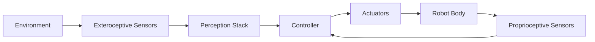

# Sensors and Actuators

> **Status:** draft
>
> **Related chapters:** Builds on Chapter 2 — Robotics Foundations; feeds into Chapter 2 — Robot Perception.

## Why This Matters

Robots interact with the world through two primary mechanisms: sensors, which gather data about the environment and the robot's own state, and actuators, which convert energy into physical motion. Understanding these components is critical for building a robot that can perceive its surroundings and execute controlled, precise movements.

## Learning Objectives

After this chapter you will be able to:

- Distinguish between proprioceptive and exteroceptive sensors.
- Explain the basic working principles of electric motors and hydraulic actuators.
- Identify appropriate sensors for different robotic tasks.
- Analyze the trade-offs between different actuation technologies.

## Core Concepts

| Concept | Definition |
| ------- | ---------- |
| Proprioception | Sensing the internal state of the robot (e.g., joint position, motor torque). |
| Exteroception | Sensing the external environment (e.g., LiDAR, cameras, microphones). |
| Actuator | A component that moves or controls a mechanism or system. |
| Encoder | A device that converts angular position of a joint into an analog or digital code. |

## Technical Explanation

### Proprioceptive Sensors

These sensors provide feedback about the robot's internal state. Key examples include encoders, IMUs (Inertial Measurement Units), and force/torque sensors.

### Exteroceptive Sensors

These sensors observe the world. Common types include cameras (RGB, depth, event-based), LiDAR, ultrasonic sensors, and microphones.

### Actuation Technologies

Most humanoid robots rely on electric motors (brushless DC motors are common) due to their efficiency and ease of control. Some high-performance systems use hydraulic or pneumatic actuators for high force-to-weight ratios.

## Real-World Examples

:::info Real system
The Boston Dynamics Atlas robot historically utilized sophisticated hydraulic actuation to achieve high-dynamic movements, showcasing the extreme power density of hydraulics.
:::

## Architecture Diagrams

## Summary

This chapter introduced the hardware interface of a robot. Sensors allow the robot to perceive its state and surroundings, while actuators allow it to interact with and move through that environment.

**Key takeaways**

- Sensors are categorized into proprioceptive and exteroceptive.
- Actuation choice depends on the trade-off between power, weight, and control precision.
- Proper calibration of sensors is essential for accurate feedback.

## Exercises

1. **Easy — Sensor Classification** — Categorize the following sensors as proprioceptive or exteroceptive: IMU, Camera, Joint Encoder, Force Sensor, LiDAR.
2. **Medium — Actuator Trade-offs** — Compare and contrast brushless DC motors and hydraulic actuators in terms of power density, complexity, and maintainability.
3. **Challenge — Sensor Selection** — Choose a sensor suite for a humanoid robot intended to navigate a complex indoor environment with both static and dynamic obstacles. Justify your choices.

## Further Reading

- *Siciliano and Khatib* — Springer Handbook of Robotics. — A foundational reference covering all aspects of robotics hardware and control.
