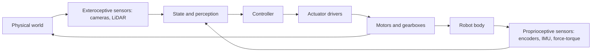
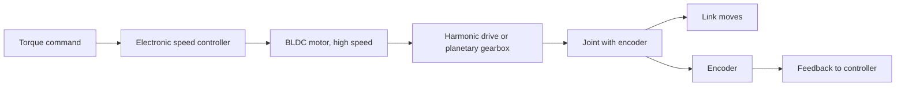

import Quiz from '@site/src/components/Educational/Quiz';

# Sensors and Actuators

> **Status:** complete
>
> **Related chapters:** Builds on Chapter 4 — Humanoid Robot Architecture; feeds into Chapter 6 — Robot Perception and Chapter 9 — Kinematics and Dynamics.

## Why This Matters

Every intelligent behavior a robot ever exhibits crosses the same two narrow bridges: sensors, which turn the physical world into numbers, and actuators, which turn numbers back into physical motion. No amount of clever software compensates for a sensor that lies or an actuator that cannot deliver torque when the robot is mid-stride. When a Unitree G1 walks across uneven gravel, its whole body is a negotiation between noisy measurements and torque limits — the hardware determines what the software is even allowed to try.

Think of it as the robot's nervous system and muscles. The brain (later chapters: perception, planning, learning) is useless without reliable eyes and ears, and equally useless without muscles that can actually produce the commanded forces. This chapter gives you the vocabulary and the physics to reason about that interface, so that when you design a system you choose the right component instead of guessing.

## Learning Objectives

After this chapter you will be able to:

- Classify sensors as proprioceptive (self) or exteroceptive (world).
- Explain how encoders, IMUs, and force–torque sensors work and what each measures.
- Compare actuator technologies — servo, BLDC, series-elastic, hydraulic — for different joints.
- Read a datasheet and pick sensors and actuators for a simple robot task.

## Core Concepts

| Concept | Definition |
| ------- | ---------- |
| Proprioception | Sensing the robot's own internal state — joint angles, body orientation, contact forces. |
| Exteroception | Sensing the external world — cameras, LiDAR, microphones, distance sensors. |
| Actuator | A component that converts energy (usually electrical) into mechanical motion or force. |
| Encoder | A sensor that reports the angular position of a joint, often with optical or magnetic parts. |
| IMU | Inertial Measurement Unit — accelerometers plus gyroscopes that measure linear acceleration and rotation rate. |
| Transmission | The gearbox between motor and joint that trades speed for torque. |
| Backlash | The small play in a gear train that causes lost motion when the direction reverses. |
| Force–torque sensor | A device that measures the forces and moments applied through it, typically in the wrist or foot. |
| Backdrivability | How easily an external force can push the actuator backward — important for safety and contact. |

## Technical Explanation

### The sensor–actuator contract

A robot is a loop: sensors observe, a controller decides, actuators act, and the world changes what the sensors observe. The sensor–actuator contract is the rate and format of this exchange. Control loops on a humanoid typically run at **500 Hz to 1 kHz** for joint control, which means every sensor reading and every torque command must fit into a few milliseconds of the compute budget.

Two properties dominate every sensor choice: **rate** (how often it updates) and **noise** (how far each reading deviates from the truth). An encoder updates at thousands of hertz with almost no noise; a camera updates at 30–90 Hz with heavy noise and latency. The actuator side is dominated by **torque** (how much force it can produce), **speed**, and **efficiency** (how much battery each newton of force costs). Almost every engineering decision in this chapter is a trade-off between these numbers.

### Proprioceptive sensors: encoders, IMUs, force–torque

**Encoders** measure joint angle. An optical encoder spins a patterned disc with a light source on one side and a detector on the other; as the disc rotates, the pattern interrupts the light to produce a pulse train, and counting pulses yields angle. The two flavors are:

- **Incremental encoders** report *changes* in angle. They are cheap and fast but lose absolute position at power-up — the robot must "home" itself first.
- **Absolute encoders** report the exact angle at any instant, even after power cycling. Humanoids prefer these for joints that must never lose their reference, such as the knee.

**IMUs** measure motion of the body, not the joints. A modern IMU packages a **3-axis accelerometer** (measures specific force, essentially acceleration plus gravity) and a **3-axis gyroscope** (measures angular velocity). Integrate the gyroscope to get orientation, and double-integrate the accelerometer to get position — but integration accumulates drift, which is why the next chapter's state-estimation topic exists. An IMU on the torso is the anchor for balance on robots like the Unitree H1.

**Force–torque sensors** measure the loads passing through them. They sit in the wrist (to feel what the hand holds) and in the feet (to feel ground contact). Most use strain gauges: tiny resistors that change resistance when the material they are bonded to deforms. When the robot's foot pushes into the ground, the strain gauges read the compression, and the sensor reports a 6-axis vector of forces and moments. Foot force sensors are the single most important signal for legged balance because they reveal the ground contact point — the thing the balance controller must keep inside the support polygon.

### Exteroceptive sensors: cameras, LiDAR, depth, microphones

**Cameras** capture rich semantic information at low cost but no direct depth. An RGB image tells you *what* is there (a person, a cup) but not *how far away* unless you do extra work. **Stereo cameras** pair two lenses with a known baseline and compute depth from the parallax difference, like human eyes. **Depth cameras** (structured light or time-of-flight, such as the Intel RealSense or Kinect) project patterns or light pulses and measure the return to get a per-pixel depth map directly.

**LiDAR** (Light Detection and Ranging) fires laser pulses and measures round-trip time to build a sparse 3D point cloud with centimeter accuracy over tens of meters. It is the sensor of choice for mapping and long-range obstacle avoidance — but it is heavy, power-hungry, and gives no semantic information (it cannot tell a wall from a person). Humanoids favor compact solid-state LiDAR over spinning units because the head must move quickly.

**Microphones** add a modality humans take for granted: hearing. They enable voice commands and, with an array of microphones, sound localization — useful for a robot that should turn toward whoever is speaking.

### Actuator types: servo, BLDC, series-elastic, hydraulic

The actuator is where energy becomes motion. The common types, in order of increasing complexity:

- **DC servo motors** are the workhorse of small robots. A brushed or brushless motor plus a gearbox plus an encoder forms a "servo" that can hold a commanded position. Cheap, simple, ubiquitous in hobby robots.
- **BLDC (brushless DC) motors** dominate serious humanoids. With no brushes to wear out, they are efficient, quiet, and can spin very fast — but they need an electronic speed controller and produce almost no torque at low speed, so they always pair with a **gear reduction** (see below).
- **Quasi-direct drive (QDD)** pairs a low-ratio gearbox with a powerful motor. The result is high torque *and* high backdrivability — the joint yields when pushed, which is exactly what you want in an arm that might contact a person. The arms of several modern humanoids use this.
- **Series-elastic actuators (SEA)** place a spring between the motor and the joint. The spring makes the joint compliant and shock-tolerant, and the spring's deflection doubles as a force measurement (Hooke's law, $F = k\Delta x$). They excel at absorbing impact — running, jumping — at the cost of bandwidth and complexity.
- **Hydraulic actuators** push fluid into cylinders to produce enormous force density. The hydraulic Boston Dynamics Atlas of the 2010s jumped and did backflips that electric robots could not match. The cost is a pump, hoses, and maintenance — which is why the electric Atlas replaced them and most new humanoids are fully electric.

A practical way to think about it: **arms favor speed and compliance** (QDD, sometimes SEA), **legs favor torque and energy return** (higher-ratio BLDC, or SEA for shock), and **high-agility research machines** historically used hydraulics.

### Gearboxes, transmission, and backlash

Motors spin fast and produce low torque; joints need slow speed and high torque. The **transmission** — usually a gearbox — performs the conversion. The price you pay for a big gear ratio is:

- **Backlash** — the slop between gear teeth that makes the joint feel loose and introduces a small dead zone. Harmonic drives, used in many humanoid joints, have near-zero backlash and are a key reason they are so common.
- **Added inertia and friction** — the gears themselves must be accelerated, and friction makes precise torque control harder.
- **Loss of backdrivability** — a high-ratio gearbox resists being pushed from the output side, which is bad for safety.

Every actuator design is therefore a negotiation: ratio up for torque, down for compliance. Understanding this tension is what lets you read a datasheet and predict whether a joint will feel "tight" or "soft."

### Reading datasheets and choosing components

A motor datasheet centers on a few numbers you will see everywhere:

- **Kv (velocity constant)** — RPM per volt. High Kv spins fast, low Kv produces more torque per amp.
- **Stall torque** — the maximum torque, produced when the motor cannot spin. Never run a motor at stall for long; it will overheat.
- **Continuous torque** — how much torque the motor can sustain indefinitely without thermal damage. This, not stall torque, is the number that matters for a walking robot that runs for an hour.
- **Gear ratio** — the multiplier on torque and divider on speed applied by the transmission.

For a sensor, the key numbers are **resolution** (encoder counts per revolution), **update rate** (Hz), **noise floor**, and **latency**. Choosing components is a "budget" exercise: estimate the peak and continuous torque each joint needs (from the masses and lengths of the links), pick an actuator that covers both, then add sensors that can resolve the smallest motions the controller must detect.

## Real-World Examples

:::info Real system
The Unitree G1 packs roughly 23 joints into a 35 kg body using quasi-direct-drive and harmonic-drive actuators driven by BLDC motors, paired with joint encoders, foot force sensors, a torso IMU, and head-mounted stereo cameras and LiDAR. The design bet is affordability and research access: enough sensors to run modern control and learning stacks, at a price labs can actually pay.
:::

:::note Mini case study
Boston Dynamics' electric Atlas, announced in 2024, replaced the hydraulic actuators of its predecessor with a fully electric actuation system. The hydraulic Atlas achieved gravity-defying backflips but needed a hydraulic power unit that dominated the robot's weight and maintenance. The electric Atlas targets the same agility with cleaner, more serviceable, more efficient hardware. The lesson: actuation technology is chosen against the whole system's constraints — power, weight, serviceability — not against a single agility metric.
:::

## Architecture Diagrams

### The sensor-actuator loop



### From command to motion through a transmission



## Code Examples

### Estimating actuator needs from a link model

```python
# Rough sizing: what continuous torque does a hip need to hold a leg?
import math

g = 9.81          # gravity, m/s^2
m_leg = 8.0       # leg mass, kg
com_dist = 0.25   # distance from hip to leg center of mass, m

# Torque to hold the leg horizontal against gravity (worst case):
hold_torque = m_leg * g * com_dist
print(f"hold torque: {hold_torque:.1f} N*m")

# Add a safety margin: motors rarely run at rated continuous torque safely.
design_torque = 1.5 * hold_torque
print(f"design torque: {design_torque:.1f} N*m")

# Pick a gear ratio: assume motor continuous torque is 1.2 N*m.
motor_torque = 1.2
ratio = design_torque / motor_torque
print(f"minimum gear ratio: {ratio:.1f}")
```

**What each piece does:** the geometry (mass and center-of-mass distance) converts to a torque demand; the safety margin accounts for impacts and speed variations; the final step translates that demand into a gear ratio you would compare against datasheets.

:::tip Where this runs
Any Python environment. In a real workflow this calculation feeds the URDF/Xacro model that MuJoCo or Isaac Sim (Part V) load to simulate the robot before you buy any hardware.
:::

## Common Mistakes

| Mistake | Why it happens | How to avoid it |
| ------- | -------------- | --------------- |
| Sizing motors by stall torque | Stall torque looks impressive and is easy to find | Use continuous torque; walking runs motors for hours, not instants |
| Buying the highest-resolution encoder | "More resolution is better" | Resolution beyond controller needs adds cost and wiring; match resolution to control rate |
| Ignoring backlash | Datasheets hide it | Prefer harmonic drives or low-backlash transmissions for joints that need precision |
| Forgetting sensor latency | Spec sheets emphasize rate, not delay | A camera's 30 ms pipeline latency matters more than its frame rate for balance control |
| Using an IMU alone for position | Double-integrated acceleration drifts fast | Fuse IMU with encoders and/or vision (next chapter) instead of trusting raw integration |

## Summary

Sensors and actuators are the robot's physical interface: proprioceptive sensors report the internal state, exteroceptive sensors report the world, and actuators — electric motors through gearboxes, series-elastic springs, or hydraulics — convert commands into motion. Choosing them is a budget exercise over torque, speed, weight, noise, and latency, and the right choice depends on the joint's job. This hardware layer feeds every perception and control algorithm in the rest of the book.

**Key takeaways**

- Proprioception is self-state (encoders, IMUs, force–torque); exteroception is world-state (cameras, LiDAR, depth, microphones).
- Force–torque sensors at the feet are the primary balance signal for legged robots.
- Actuators are chosen per joint: speed and compliance in the arms, torque in the legs.
- The gearbox is where torque, backlash, and backdrivability are traded.
- Size actuators by continuous torque, and size sensors by rate, noise, and latency.

## Exercises

1. **Easy — Sensor classification.** Classify each as proprioceptive or exteroceptive: joint encoder, foot force sensor, stereo camera, torso IMU, LiDAR, microphone. Explain one use of each on a humanoid.
2. **Medium — Gear-ratio math.** A motor provides 1.0 N*m continuous torque at 4000 RPM. A knee needs 80 N*m and the joint should move no faster than 4 rad/s. Compute the required gear ratio and check both torque and speed constraints. *Hint: 1 rev/s = 2π rad/s; revisit the gearbox subsection.*
3. **Challenge — Sensor suite design.** Specify a complete sensor suite for a humanoid that must navigate a cluttered warehouse, pick boxes from shelves, and avoid people. For each sensor, state the quantity it measures, its approximate rate, and one failure mode, then justify your choices against the budget ideas in this chapter.

Check your understanding:

<Quiz
  question="Which sensor provides the most direct signal about ground contact for a balancing humanoid?"
  options={[
    'The head-mounted camera',
    'The joint encoders',
    'The foot force-torque sensor',
    'The LiDAR unit',
  ]}
  correctAnswerIndex={2}
/>

## Further Reading

- Bruno Siciliano and Oussama Khatib (eds.), *Springer Handbook of Robotics*, Part on Sensors and Actuators — the authoritative engineering reference for every component in this chapter.
- Kevin Lynch and Frank Park, *Modern Robotics* (Cambridge University Press), Chapters 1–3 — a rigorous, accessible treatment of actuators and transmissions behind the hardware.
- Unitree Robotics, *G1 product page* — a real spec sheet to practice reading torque, DoF, and sensor numbers. [unitree.com](https://www.unitree.com/)
- Boston Dynamics, *Atlas* — the case study of electric actuation replacing hydraulics. [bostondynamics.com/atlas](https://bostondynamics.com/atlas)
