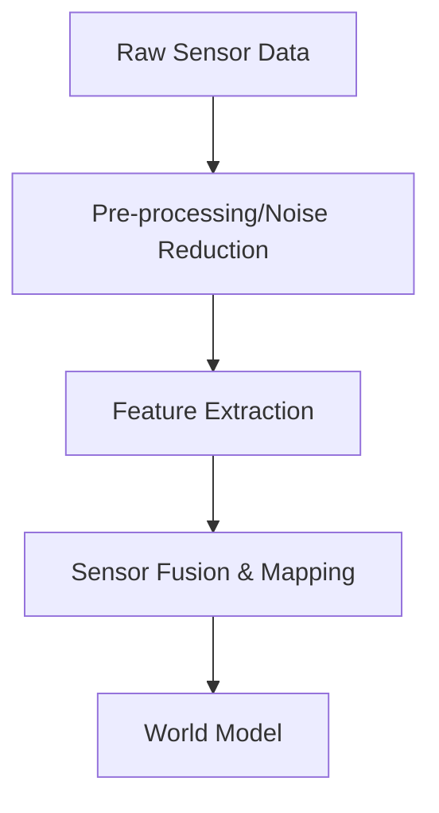

# Robot Perception

> **Status:** draft
>
> **Related chapters:** Builds on Chapter 1 — Sensors and Actuators; feeds into Chapter 4 — State Estimation.

## Why This Matters

Raw sensor data is noisy and incomplete. Perception is the process of synthesizing this data into a structured representation (a "world model") that the robot can use to make decisions, plan motions, and interact with the world safely.

## Learning Objectives

After this chapter you will be able to:

- Explain the data processing pipeline from raw sensor readings to world model.
- Implement basic filtering techniques for noisy sensor data.
- Describe the challenges of sensor fusion.
- Compare different paradigms for world representation (e.g., occupancy grids vs. semantic maps).

## Core Concepts

| Concept | Definition |
| ------- | ---------- |
| Sensor Fusion | Combining data from multiple sensors to reduce uncertainty and improve accuracy. |
| World Model | A structured representation of the environment, including objects, surfaces, and agents. |
| Filtering | Algorithms to remove noise and estimate the true value of a signal. |
| Occupancy Grid | A probabilistic representation of the environment as a grid of cells. |

## Technical Explanation

Perception involves transforming data streams from cameras, LiDAR, and IMUs into actionable information.

### Noise Reduction

Data from real sensors is always noisy. Common techniques for pre-processing include moving averages, median filters, and more advanced probabilistic filters like Kalman filters.

### Sensor Fusion

By combining different modalities (e.g., LiDAR for depth, Camera for semantics), a robot can overcome the limitations of any single sensor.

## Real-World Examples

:::note Mini case study
Robotic SLAM (Simultaneous Localization and Mapping) pipelines often use fusion of visual camera data and IMU readings to maintain localization accuracy in indoor environments where GPS is unavailable.
:::

## Architecture Diagrams

## Summary

Perception turns raw sensory input into structured knowledge. Effective perception requires handling sensor noise and intelligently fusing data from diverse sources to create a robust model of the environment.

**Key takeaways**

- Noise reduction is a vital first step.
- Sensor fusion provides redundancy and robustness.
- The choice of world representation (map type) depends on the task requirements.

## Exercises

1. **Easy — Filtering** — Implement a moving average filter on a noisy simulated distance sensor signal.
2. **Medium — Data Fusion** — Explain why fusing LiDAR and camera data is often superior to using either alone.
3. **Challenge — Mapping** — Build an occupancy grid from a series of 2D laser scans, assuming a known pose.

## Further Reading

- *Thrun, Burgard, Fox* — Probabilistic Robotics. — The authoritative text on probabilistic methods for perception and mapping.
