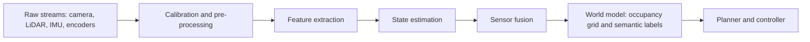
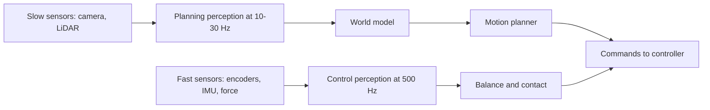

import Quiz from '@site/src/components/Educational/Quiz';

# Robot Perception

> **Status:** complete
>
> **Related chapters:** Builds on Chapter 5 — Sensors and Actuators; feeds into Chapter 7 — Computer Vision and Chapter 8 — State Estimation.

## Why This Matters

A sensor does not hand a robot the truth — it hands the robot a noisy, partial, and often contradictory stream of numbers. A camera delivers millions of pixels per frame with no depth; a LiDAR delivers depth with no meaning; an IMU drifts every second it runs. Perception is the discipline of combining these imperfect streams into a **world model**: a structured belief about where the robot is, what surrounds it, and what is moving. Without a good world model, a humanoid cannot plan a step, reach for a cup, or decide to stop before it hits a person.

The gap between raw data and understanding is where most robot systems actually fail. A Figure 02 in a factory can see a box clearly and still mis-grasp it because the perception pipeline reported the box's position in the wrong coordinate frame. This chapter is about building that pipeline correctly: calibrating sensors, aligning frames, filtering noise, and choosing the right representation for the job.

## Learning Objectives

After this chapter you will be able to:

- Describe the perception pipeline and the stages that turn data into a world model.
- Explain why calibration and coordinate frames matter, and where frame errors come from.
- Distinguish perception for control from perception for planning.
- Identify where filtering enters noisy robot perception and why.

## Core Concepts

| Concept | Definition |
| ------- | ---------- |
| World model | A structured representation of the environment: objects, surfaces, and agents with positions and identities. |
| Perception pipeline | The ordered stages — calibration, pre-processing, features, fusion — that convert raw data into understanding. |
| Coordinate frame | An origin and axis convention attached to a sensor, link, or the world; data is meaningless without its frame. |
| Extrinsic calibration | The transformation between a sensor's frame and the rest of the robot. |
| Sensor fusion | Combining multiple sensors to reduce uncertainty and cover each other's blind spots. |
| Occupancy grid | A discretized probabilistic map where each cell holds the chance it is occupied. |
| Latency | The delay between a physical event and the robot's awareness of it. |
| Semantic map | A world model labeled with meaning — "table," "door," "person" — not just geometry. |

## Technical Explanation

### What is robot perception?

Perception is the process that turns **measurements** (voltages, pixels, point clouds) into **meaning** (a cup at $(x, y, z)$, a person walking left, the ground is 20 cm below the right foot). It sits between the hardware of Chapter 5 and the decision-making of later chapters. Crucially, perception is not a single algorithm — it is a *pipeline* of algorithms, and the design of that pipeline is governed by the robot's needs: how fast the world changes, how accurate the downstream controller must be, and how much compute the robot carries.

A useful mental model is the human nervous system: the eye sends raw photons, the retina pre-processes contrast, the visual cortex extracts features, and higher areas assemble objects and scenes. The robot pipeline mirrors this: raw data → pre-processing → features → state → world model.

### The pipeline: data, features, state, world model

The canonical stages:

1. **Raw data acquisition** — sensors produce images, point clouds, IMU reads, encoder counts. Each has its own rate, noise profile, and latency.
2. **Pre-processing and calibration** — undistort the camera image, denoise the point cloud, apply the extrinsic transform that pins each measurement to the robot body. Garbage in, garbage out: this stage decides whether the rest has any chance.
3. **Feature extraction** — compress raw data into useful signals: edges, corners, keypoints, object detections, ground-plane fits. This is where Chapter 7's computer-vision models plug in.
4. **State estimation** — combine features with the robot's own motion (Chapter 8) to track where things are relative to the body over time.
5. **World-model assembly** — fuse everything into a representation the planner can use: an occupancy grid for navigation, a semantic map for interaction, a tracked-object list for avoidance.

Each stage is a *model*: a simplifying assumption about the world. Pre-processing assumes the sensor's noise is predictable; tracking assumes objects move smoothly. Understanding those assumptions is what separates a perception system that works from one that works only in the demo.

### Coordinate frames and calibration

Every measurement arrives in the coordinate frame of the sensor that made it. The camera's frame has its origin at the lens; the LiDAR's at the scanner; the foot force sensor's at the ankle. These frames move relative to each other as the robot moves, and **if you mix frames, the numbers silently mean the wrong thing.** A common failure: the vision model reports a cup 30 cm from the camera, and the controller treats that as 30 cm from the shoulder — the robot reaches into empty air.

Two calibrations keep frames honest:

- **Intrinsic calibration** — the camera's own lens properties (focal length, distortion). It turns pixel coordinates into rays in the camera frame.
- **Extrinsic calibration** — the rigid transform (rotation + translation) between each sensor frame and a body frame, usually found by observing a calibration pattern (a checkerboard) from multiple poses.

On a humanoid, the head stereo cameras, the torso IMU, and the foot sensors must all agree on a single **base frame**, conventionally at the pelvis or the floating base. The transform tree is maintained at runtime by a library like ROS 2's `tf2` (Chapter 19), and any error in the tree is an error in every downstream estimate.

### Sensor fusion and filtering basics

Individual sensors have fatal weaknesses — a camera goes blind in darkness and gives no depth, LiDAR fails on glass and reflective surfaces, an IMU drifts. **Sensor fusion** exploits the fact that sensors fail differently: fuse two sensors, and the probability that both fail at once in the same way is far lower than either alone.

The workhorse of fusion is the **weighted average with confidence**: each sensor contributes an estimate, weighted by its inverse variance (the inverse of its uncertainty). A LiDAR depth reading with 2 cm uncertainty is trusted more than a monocular camera's guess with 30 cm uncertainty. Over time, the same idea becomes the Kalman filter of Chapter 8, which is the formal engine of fusion: predict the state forward with the motion model, then correct it with each measurement, weighting by uncertainty.

Filtering also enters *before* fusion, as pre-processing. A moving-average or median filter smooths a noisy distance sensor; a low-pass filter attenuates vibration picked up by an IMU. The lesson: noise is not a nuisance to be removed entirely — it is a signal about *how much to trust* each measurement, and filters encode exactly that trust level.

### Scene understanding: objects, terrain, people

With calibrated, fused data, perception assembles meaning:

- **Object detection** finds "a cup," "a box," "a chair" with bounding boxes and class labels (Chapter 7).
- **Ground and terrain analysis** fits planes and height maps to point clouds so the locomotion controller knows where the feet may land. This is mission-critical for a humanoid stepping over rubble.
- **People tracking** detects humans, estimates their poses, and predicts their motion — the input to safe human-robot interaction. A humanoid in a crowd must know not just that a person is there, but where they will be in half a second.

Each of these is a specialized pipeline that consumes the shared calibrated, fused data. This is why the common stages are built once and reused: the architecture, not just the algorithms, is what makes perception tractable.

### Perception for action vs. perception for model-building

There are two fundamentally different jobs, and confusing them is a classic design error:

- **Perception for control** needs *speed and low latency*. Balance control needs foot contact and torso orientation at 500 Hz–1 kHz; a 30 ms camera pipeline is too slow, so control perception uses fast sensors (encoders, IMUs, force sensors) with simple, robust features. Accuracy matters less than immediacy.
- **Perception for planning** needs *breadth and accuracy*. Deciding the next step or the next pick needs a full world model — where the obstacles are, how far, what they are. It can afford 30–100 ms of latency and heavy compute because it runs at planning rates (10–30 Hz), not control rates.

The same robot runs both, on different sensors and different schedules. An Optimus or Figure robot walks with its fast proprioceptive loop while a slower vision loop builds the map it will use for the next action. Understanding which job a perception stage serves tells you what rate, latency, and accuracy to design for.

### The perception compute budget

Perception competes for the same onboard compute that runs control, planning, and (increasingly) learned models — and the budget is tight. A useful way to think about it is a **latency ledger**:

| Stage | Typical rate | Typical latency | Consumer |
| ----- | ------------ | --------------- | -------- |
| Joint encoders | 1 kHz | < 1 ms | Balance and torque control |
| IMU (torso) | 200–1000 Hz | < 2 ms | Orientation and balance |
| Foot force sensors | 500 Hz–1 kHz | < 1 ms | Contact detection |
| Camera frame | 30–90 Hz | 10–50 ms | Detection, depth, planning |
| LiDAR scan | 10–20 Hz | 20–100 ms | Mapping and avoidance |
| Learned detection model | 10–60 Hz | 5–100 ms | Semantic world model |

The rule that falls out: **the faster a signal must be consumed, the simpler its processing must be.** You never run a deep object detector in the balance loop — you run encoders and force sensors there, and let the vision models feed the slower planning loop. Designing a perception system is, in large part, drawing this ledger and making sure each consumer receives its data within its deadline. This is also why robots carry heterogeneous sensors rather than one "best" sensor: the diversity exists precisely because different jobs need different rate-accuracy points.

## Real-World Examples

:::info Real system
NVIDIA's Isaac ROS perception stack — used with robots like the Unitree G1 in research — demonstrates the pipeline in practice: camera and LiDAR streams are calibrated with `isaac_ros_apriltag`, fused into a 3D occupancy grid, and consumed by a navigation planner. The point is architectural: every model in the stack assumes calibrated inputs, so calibration is treated as a first-class stage, not an afterthought.
:::

:::note Mini case study
A factory deployment of Figure's humanoid reportedly stumbled when a mirrored surface reflected a LiDAR beam, producing a phantom obstacle that halted the robot. The vision pipeline, by contrast, saw an empty aisle. Neither sensor was wrong — each failed differently. The fix was fusion: combining the LiDAR's depth with the camera's semantics and *disagreement handling* so a single sensor's weird failure could not stop the robot. The lesson: fusion is not about averaging good data, it is about surviving bad data.
:::

## Architecture Diagrams

### The perception pipeline



### Control perception versus planning perception



## Code Examples

### A minimal frame transform and weighted fusion

```python
# Fuse two noisy range estimates of the same obstacle, weighted by uncertainty.
import numpy as np

def fuse(mean1, var1, mean2, var2):
    """Inverse-variance weighted average of two Gaussian estimates."""
    w1, w2 = 1.0 / var1, 1.0 / var2
    mean = (w1 * mean1 + w2 * mean2) / (w1 + w2)
    var = 1.0 / (w1 + w2)
    return mean, var

# LiDAR says 2.00 m with 0.04 m variance; camera says 2.20 m with 0.60 m variance.
mean, var = fuse(2.00, 0.04, 2.20, 0.60)
print(f"fused range: {mean:.3f} m, variance {var:.4f}")
```

**What each piece does:** the inverse-variance weights mean the confident LiDAR dominates, but the camera still nudges the answer; the fused variance is smaller than either input. This one-line idea, extended over time, is the heart of every Kalman-filtered perception system.

:::tip Where this runs
Any Python environment. The same math appears in ROS 2's `robot_localization` package — run `ros2 run robot_localization ekf_node` with two measurement sources to watch fusion happen live on a logged bag.
:::

## Common Mistakes

| Mistake | Why it happens | How to avoid it |
| ------- | -------------- | --------------- |
| Mixing coordinate frames | Each sensor reports in its own frame and the transform tree is skipped | Always transform measurements to one base frame (e.g., `tf2`) before use |
| Skipping calibration | Calibration is boring and the demo worked without it | Intrinsics and extrinsics drift; re-calibrate on every hardware change |
| Treating all sensors as equally trustworthy | Averaging feels safe | Weight by uncertainty (inverse variance); let confident sensors lead |
| Using slow perception in the control loop | One pipeline is easier than two | Split control-rate (fast) from planning-rate (slow) perception explicitly |
| Averaging instead of fusing | "Fusion" sounds like "average" | Average loses the uncertainty information that filtering preserves |

## Summary

Perception turns noisy, partial sensor streams into a calibrated, fused world model. The pipeline runs from raw data through pre-processing and calibration, to features, state, and world model, and every stage carries model assumptions you must understand. Coordinate frames and calibration decide whether numbers mean anything, sensor fusion lets you survive individual sensor failures, and the split between control-rate and planning-rate perception keeps the robot stable while it thinks.

**Key takeaways**

- Perception is a pipeline, and calibration is a first-class stage, not an afterthought.
- Every measurement needs a coordinate frame; mixing frames silently corrupts the world model.
- Fusion is about handling disagreement and failure, not just averaging.
- Control perception optimizes latency; planning perception optimizes breadth and accuracy.
- Filters encode how much to trust each measurement.

## Exercises

1. **Easy — Frame audit.** Draw the frames for a humanoid: base (pelvis), head camera, torso IMU, left foot sensor. Write the pair of transforms that convert a head-camera point into base-frame coordinates.
2. **Medium — Fusion weights.** Two sensors estimate a distance: one with 0.05 m variance, one with 1.0 m variance. Compute the fused estimate and explain why the high-variance sensor contributes almost nothing. *Hint: use the `fuse` function in the code example.*
3. **Challenge — Pipeline design.** Design the perception stack for a humanoid stepping onto a moving platform: choose sensors, rates, and fusion for both the balance loop (control-rate) and the step-placement loop (planning-rate). Justify each latency and accuracy choice.

Check your understanding:

<Quiz
  question="Why is extrinsic calibration critical for a multi-sensor humanoid?"
  options={[
    'It improves camera image sharpness',
    "It aligns every sensor's data into one shared coordinate frame",
    'It increases the sensor update rate',
    'It removes the need for sensor fusion',
  ]}
  correctAnswerIndex={1}
/>

## Further Reading

- Sebastian Thrun, Wolfram Burgard, and Dieter Fox, *Probabilistic Robotics* (MIT Press) — the authoritative text on probabilistic perception, filtering, and mapping.
- Cyrill Stachniss, *Photogrammetry and Robot Perception* (University of Bonn lecture notes) — a free, rigorous walk through calibration, frames, and sensor models. [igp.ethz.ch](https://igp.ethz.ch/)
- ROS 2 documentation on `tf2` — the practical tool for coordinate frames. [docs.ros.org](https://docs.ros.org/)
- NVIDIA Isaac ROS documentation — a production perception pipeline you can run and study. [developer.nvidia.com](https://developer.nvidia.com/isaac/ros)
