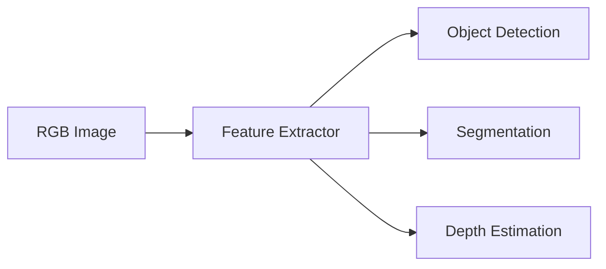

# Computer Vision

> **Status:** draft
>
> **Related chapters:** Builds on Chapter 2 — Robot Perception; feeds into Chapter 4 — Manipulation.

## Why This Matters

For humanoid robots operating in human-centric environments, vision is the primary modality for understanding the scene. Computer vision allows robots to detect objects, recognize humans, understand spatial relationships, and navigate complex spaces.

## Learning Objectives

After this chapter you will be able to:

- Explain fundamental concepts in computer vision: from image processing to deep learning.
- Describe object detection and segmentation pipelines.
- Understand the basics of monocular and stereo depth estimation.
- Apply pre-trained vision models for object recognition.

## Core Concepts

| Concept | Definition |
| ------- | ---------- |
| Object Detection | Identifying and locating instances of objects in an image. |
| Segmentation | Classifying every pixel in an image to belong to a specific object class. |
| Stereo Vision | Estimating depth by comparing images from two slightly offset cameras. |
| CNN | Convolutional Neural Network, a class of deep learning models for image analysis. |

## Technical Explanation

Computer vision for robotics has shifted from hand-crafted features (e.g., SIFT, HOG) to deep learning-based approaches.

### Modern Vision Pipelines

Deep CNNs and Transformers are used to extract high-level semantic information. Architectures like YOLO (for detection) or Mask R-CNN (for segmentation) are standards in modern robotics.

### Depth Estimation

Depth is essential for 3D interaction. Stereo cameras infer depth from disparity, while monocular depth estimation uses learned priors to infer 3D structure from 2D images.

## Real-World Examples

:::info Real system
Humanoid robots use computer vision to recognize objects to manipulate (e.g., picking up a cup) and to map human poses for safe human-robot interaction.
:::

## Architecture Diagrams

## Summary

Computer vision is the "eyes" of the robot. Deep learning has drastically improved the ability of robots to interpret visual scenes.

**Key takeaways**

- Vision is essential for scene understanding.
- Modern pipelines rely on CNN/Transformer-based deep learning.
- Depth estimation is crucial for spatial manipulation tasks.

## Exercises

1. **Easy — Image Processing** — Use OpenCV to perform basic image pre-processing (grayscale conversion, thresholding) on a sample image.
2. **Medium — Object Recognition** — Load a pre-trained YOLO model and use it to identify objects in a video stream.
3. **Challenge — Depth Estimation** — Implement a basic stereo matching algorithm using two calibrated camera views to estimate distance.

## Further Reading

- *Szeliski* — Computer Vision: Algorithms and Applications. — A comprehensive guide to the field.
- *OpenCV Documentation* — https://docs.opencv.org/ — Practical implementation details.
