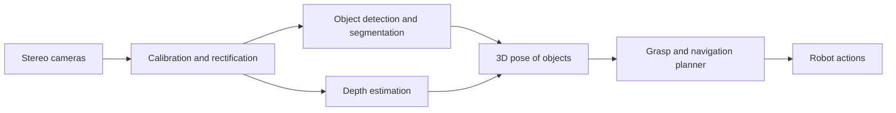
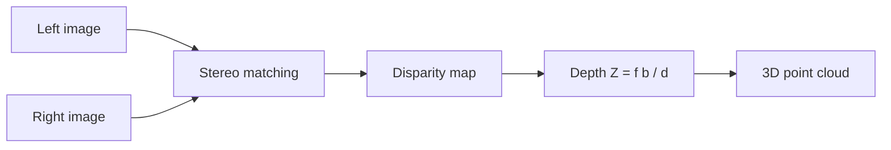

import Quiz from '@site/src/components/Educational/Quiz';

# Computer Vision

> **Status:** complete
>
> **Related chapters:** Builds on Chapter 6 — Robot Perception; feeds into Chapter 12 — Manipulation and Chapter 4 — Humanoid Robot Architecture.

## Why This Matters

Vision is how humanoids understand a world built for people. A factory built for humans — shelves, doors, tools, stairs — is a vision-native environment, and a robot that cannot see cannot thrive in it. When a Figure 02 picks a part from a bin, or an Optimus navigates an aisle, every decision traces back to interpreting pixels: finding the part, estimating its 3D pose, judging the distance to the shelf, watching a person approach.

Vision is also the sensor with the most dramatic recent progress. Ten years ago, robots ran hand-tuned feature detectors; today, deep networks detect and segment objects in real time, and learned models estimate depth from a single camera. This chapter gives you the model of a camera, the classical foundations, the modern deep-learning toolbox, and the depth geometry — everything you need to wire vision into a robot's perception pipeline.

## Learning Objectives

After this chapter you will be able to:

- Explain how a camera maps the 3D world into a 2D image, and the pinhole model behind it.
- Distinguish classical hand-crafted features from learned deep representations.
- Apply object detection and segmentation to a robot perception task.
- Explain how depth estimation feeds planning and control.

## Core Concepts

| Concept | Definition |
| ------- | ---------- |
| Pinhole camera model | The geometric model of how a 3D point projects to a 2D pixel through a focal point. |
| Intrinsics | The camera's focal length, principal point, and distortion — how pixels relate to rays. |
| Extrinsics | The camera's pose (rotation + translation) in the world. |
| Classical feature | A hand-designed detector such as an edge, corner, or descriptor (SIFT, HOG, ORB). |
| CNN | Convolutional Neural Network — a learned feature extractor for images. |
| Object detection | Finding objects and drawing boxes around them with class labels. |
| Segmentation | Labeling every pixel: semantic (class) or instance (individual object). |
| Disparity | The pixel difference between the two images of a stereo pair, which encodes depth. |

## Technical Explanation

### Cameras: how robots see

A camera is a light-tight box with a lens on one side and a sensor on the other. The lens focuses incoming rays so that a 3D scene collapses onto a 2D array of pixels, each pixel recording the intensity (or color) of the light that struck it. The robot does not see "a cup" — it sees a grid of numbers, and everything else is inference.

Two camera types matter for robots: **monocular** (one lens) and **stereo** (two lenses with a fixed baseline, like eyes). Monocular cameras are cheap and light but lose depth; stereo cameras recover depth from the parallax between the two views. Some robots add a **depth camera** that projects structured light or measures time-of-flight to output depth directly per pixel.

### Image formation, camera models, and calibration

The workhorse model is the **pinhole camera**: a point in the world at $(X, Y, Z)$ in camera coordinates projects to a pixel at

$$x = f \frac{X}{Z}, \quad y = f \frac{Y}{Z}$$

where $f$ is the focal length in pixels. The division by $Z$ is the entire story of perspective: farther things project smaller. From this equation, a *single* camera image can never give depth, because $(X, Y, Z)$ and $(2X, 2Y, 2Z)$ project to the same pixel — the depth is divided away. Depth must come from elsewhere: a second camera, a depth sensor, or learned priors.

**Calibration** estimates the intrinsics (focal length, principal point, lens distortion) and extrinsics (camera pose relative to the robot). The standard procedure photographs a checkerboard from many angles; the detector finds the corners, and the solver fits the model. Every pixel coordinate in your perception pipeline will be wrong until this is done right — calibration errors of one or two pixels become centimeters of error at arm's length.

### Classical features: edges, corners, descriptors

Before deep learning, vision was a toolbox of hand-designed detectors:

- **Edges** — sudden intensity changes, found with gradient filters (Sobel, Canny). Edges mark object boundaries.
- **Corners** — points where the image gradient changes in two directions at once (Harris corners). Good to track because they are locally unique.
- **Descriptors** — a vector summarizing a patch around a keypoint, designed to be invariant to rotation and lighting (SIFT, ORB). Matching descriptors across frames tracks motion; matching across views finds stereo correspondences.

These features are fast and need no training, but they capture only *geometry*, not *meaning*. A corner tells you "something is here" but not "this is a door handle." That semantic gap is what deep learning closes.

### Deep-learning vision: CNNs and backbone models

A **convolutional neural network (CNN)** learns its own features from data instead of relying on hand design. A convolution slides a small learned filter across the image, producing a feature map; stacked convolutions build features of increasing abstraction — first edges, then textures, then parts, then objects. The early layers are, strikingly, similar to the classical detectors, but they are tuned to the actual task data.

Modern robot vision uses a **backbone** — a CNN such as ResNet or EfficientNet, or a vision transformer (ViT) — pretrained on massive image data, then **fine-tuned** on robot-specific data. This transfer is what makes vision tractable for robots: you inherit the world knowledge of the pretrained model and adapt it to your factory, warehouse, or home with a modest amount of labeled data. The pretrained backbone converts the image into a feature map, and task heads on top of it do detection, segmentation, or depth.

### Object detection and segmentation

- **Object detection** predicts, for each object, a bounding box and a class label. The dominant modern family is **YOLO** (You Only Look Once) — a single network that predicts all boxes in one forward pass, running at 30–100+ FPS, which is why it dominates embedded robotics. The output is a list like `[cup, 0.93, x=320, y=210, w=80, h=60]`.
- **Segmentation** labels every pixel. **Semantic segmentation** assigns each pixel a class (this pixel is "floor," this one is "wall"); **instance segmentation** separates individual objects of the same class (cup A vs. cup B). Mask R-CNN is the classic instance-segmentation architecture. Segmentation is heavier than detection but gives pixel-precise object shapes — valuable for grasping, where the box around an object is not enough to aim the fingers.

For a robot, the boxes from detection are often enough for navigation, while manipulation benefits from masks, and both feed the 3D stage: the 2D detection is back-projected into 3D using the depth channel to get the object's position in the robot's frame.

### Depth and 3D understanding: stereo and depth sensors

Depth is the bridge from pixels to physical interaction. Three routes:

- **Stereo vision** — given a calibrated pair of images, find corresponding pixels and compute **disparity** $d = x_L - x_R$. Depth follows from the baseline $b$ and focal length:

$$Z = \frac{f \cdot b}{d}$$

Stereo is passive (no extra light), but needs texture to match on — a blank wall defeats it.
- **Active depth sensors** — structured-light or time-of-flight cameras (Intel RealSense, Microsoft Kinect) project patterns or measure light round-trips. They give dense depth even on textureless surfaces, at the cost of range and power.
- **Monocular depth estimation** — a learned network predicts a depth image from a single frame, using prior knowledge of the world (sky is far, chairs have seat height). It is the cheapest and the least accurate, with scale ambiguity unless calibrated by another source.

In practice, humanoids fuse vision depth with LiDAR and IMU (Chapters 6 and 8) to get both dense semantics and trustworthy metric distance.

### Visual odometry and vision for locomotion

Vision also serves locomotion directly. **Visual odometry (VO)** tracks how the camera moves by matching features (classical ORB features or learned deep features) between frames and solving for the relative pose. It gives the robot a velocity and trajectory estimate that complements the drifting IMU — a drift-free-but-slow correction to the fast-but-drifting proprioceptive state.

On a humanoid, head cameras feed two loops: the **planning loop** uses depth and semantics to pick footholds and path; the **stability loop** watches the horizon and nearby features to sense body motion. When the robot looks down while stepping, the vision stack must keep both interpretations straight — the same pixels serve the world model and the balance estimate.

### Evaluating vision models for robot use

Robot vision models are judged by more than the classic mAP (mean Average Precision):

- **Latency and throughput** — a YOLO model at 60 FPS on a workstation may run at 8 FPS on the robot's edge GPU. Test on the deployment hardware.
- **Robustness** — how the model behaves under motion blur, changing light, and unusual views. Robots move; the training data usually does not.
- **Calibrated confidence** — a robot should know when it is unsure, so it can slow down or ask for help. Precision on easy cases matters less than honesty on hard ones.
- **Sim-to-real transfer** — models trained on synthetic data (Chapter 21, 22) must transfer to the messy real world; measure the gap explicitly.

## Real-World Examples

:::info Real system
The Unitree G1 carries a stereo camera pair in its head, and its perception stack runs YOLO-style detection for people and objects, depth from the stereo pair, and a semantic map for navigation. This is the same architecture as larger platforms at a fraction of the cost — a good reference for what a minimal, modern vision stack looks like.
:::

:::note Mini case study
Figure's humanoid uses its head cameras to locate parts in a bin, then estimates the 3D pose of each part from the 2D detection plus depth, and hands that pose to the grasp planner. Reported cycle time improvements on bin-picking tasks came not from a better detector but from a tighter depth-pose-grasp loop: the 2D model stayed the same while the 3D pose stage and calibration were fixed. The lesson: in robot vision, the plumbing around the model often matters more than the model itself.
:::

## Architecture Diagrams

### Vision pipeline from pixels to action



### Stereo depth geometry



## Code Examples

### A minimal camera projection and stereo depth check

```python
import numpy as np

# Pinhole projection: 3D point in camera frame to pixel coordinates.
f = 500.0          # focal length, pixels
cx, cy = 320.0, 240.0  # principal point

def project(X, Y, Z):
    return f * X / Z + cx, f * Y / Z + cy

x, y = project(0.2, 0.1, 1.0)
print(f"a point 1 m away projects to pixel ({x:.1f}, {y:.1f})")

# Stereo: depth from disparity.
baseline = 0.06    # 6 cm between the two cameras
pixel_disparity = 10.0  # measured horizontal shift, px
depth = f * baseline / pixel_disparity
print(f"stereo depth: {depth:.2f} m")
```

**What each piece does:** the projection is the pinhole equation in code; the stereo line inverts the disparity formula. Both are two lines of math that every vision-enabled robot relies on thousands of times per second.

:::tip Where this runs
Any Python environment. In ROS 2, this exact math runs inside `image_proc` for rectification and `stereo_image_proc` for disparity — `ros2 run stereo_image_proc stereo_image_proc` on a logged bag gives you a live depth image from a stereo pair.
:::

## Common Mistakes

| Mistake | Why it happens | How to avoid it |
| ------- | -------------- | --------------- |
| Running vision models untested on edge hardware | Workstation FPS looks fine | Benchmark the model on the robot's GPU; expect a 5-10x slowdown |
| Ignoring lens distortion | Calibration feels optional | Undistort before any pixel geometry; distortion error grows toward image edges |
| Trusting monocular depth scale | It looks correct in a demo | Monocular depth is scale-ambiguous; fuse with stereo, depth sensor, or LiDAR |
| Using detection boxes for grasping | Boxes are easier than masks | Grasp aims need pixel-precise masks; use segmentation for manipulation |
| Training on clean static images only | Public datasets are tidy | Add motion blur, lighting changes, and unusual views before deployment |

## Summary

Computer vision is the robot's eyes: the pinhole model explains how the 3D world becomes pixels and why a single camera cannot measure depth, calibration makes those pixels meaningful, and deep networks supply the semantic understanding — detection and segmentation — that classical features cannot. Depth from stereo or active sensors turns 2D understanding into 3D positions, feeding both manipulation and locomotion, and the models must be evaluated on the robot, not just on a benchmark.

**Key takeaways**

- The pinhole projection divides by depth; a single image alone cannot recover it.
- Calibration (intrinsics and extrinsics) is the foundation of every downstream estimate.
- Modern vision uses pretrained backbones fine-tuned for robot tasks; classical features survive in tracking and matching.
- Detection gives boxes, segmentation gives masks; manipulation needs masks.
- Depth is the bridge from pixels to physical interaction; fuse sources for reliability.

## Exercises

1. **Easy — Projection practice.** Using the pinhole equation, compute where a point at $(1.0, 0.5, 2.0)$ m projects with $f = 800$ px. What happens to the pixel coordinates if the point moves to $Z = 4.0$ m?
2. **Medium — Stereo depth.** A stereo rig has baseline 0.08 m and focal length 600 px. A feature appears at disparity 15 px. Compute the depth, then explain what would happen to the depth estimate if the disparity measurement were off by 1 px. *Hint: revisit the $Z = fb/d$ formula.*
3. **Challenge — Pick-and-place vision.** Design the vision stack for a humanoid picking a known object from a cluttered shelf: choose detection vs. segmentation, depth source, and calibration steps, and state the expected latency budget from image to grasp pose.

Check your understanding:

<Quiz
  question="Why can a single monocular camera not directly measure depth?"
  options={[
    'The lens distorts the image too much',
    'Depth is divided away by the perspective projection',
    'The sensor is not fast enough',
    'Depth requires a LiDAR by definition',
  ]}
  correctAnswerIndex={1}
/>

## Further Reading

- Richard Szeliski, *Computer Vision: Algorithms and Applications* (Springer) — the definitive survey, from calibration through modern learning. [szeliski.org](https://szeliski.org/Book/)
- Joseph Redmon et al., *You Only Look Once: Unified, Real-Time Object Detection* (CVPR 2016) — the paper that made real-time detection possible; read the abstract and architecture.
- Kaiming He et al., *Mask R-CNN* (ICCV 2017) — instance segmentation for pixel-precise perception.
- Intel RealSense documentation — practical depth-camera intrinsics, extrinsics, and sample code. [dev.intelrealsense.com](https://dev.intelrealsense.com/)
- OpenCV documentation — calibration and stereo code that runs everywhere. [docs.opencv.org](https://docs.opencv.org/)
