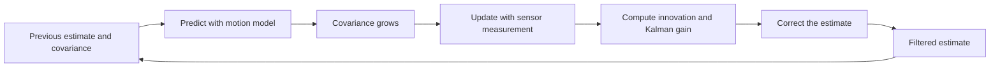
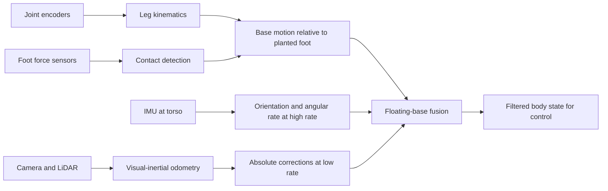

import Quiz from '@site/src/components/Educational/Quiz';

# State Estimation

> **Status:** complete
>
> **Related chapters:** Builds on Chapter 5 — Sensors and Actuators and Chapter 6 — Robot Perception; feeds into Chapter 10 — Motion Control.

## Why This Matters

A robot never directly knows where it is. It knows what its encoders read, what its IMU feels, and what its cameras see — and every one of those is noisy, delayed, and incomplete. A walking humanoid must answer a deceptively hard question thousands of times per second: *what is my body doing right now?* Balance, stepping, and reaching all depend on the answer, and a wrong answer means a fall.

State estimation is the art of converting the noisy, contradictory stream of measurements into a single best estimate of the robot's state — position, orientation, velocity, and angular rate. It is the "internal sense of self" that every controller below it trusts. When a Tesla Optimus keeps its torso level on uneven ground or a Boston Dynamics Atlas lands a jump, the invisible hero is the estimator fusing IMU, force sensors, and vision fast enough to keep the control loop stable.

## Learning Objectives

After this chapter you will be able to:

- Define the state-estimation problem for a robot in probabilistic terms.
- Explain the Kalman filter's predict-update cycle conceptually and in code.
- Describe how a humanoid estimates its own body state from IMU, encoders, and force sensors.
- Compare odometry, filtering, and SLAM approaches and their trade-offs.

## Core Concepts

| Concept | Definition |
| ------- | ---------- |
| State | The variables that describe the robot: position, orientation, linear and angular velocity. |
| Belief | A probability distribution over possible states, updated as measurements arrive. |
| Motion model | How the state evolves from one instant to the next given control inputs. |
| Observation model | How measurements relate to the underlying state. |
| Kalman filter | The optimal estimator for linear systems with Gaussian noise — a predict-update loop. |
| Odometry | Position estimated by integrating motion over time from encoders, legs, or vision. |
| Drift | The slow accumulation of error when integrating noisy motion over time. |
| SLAM | Simultaneous Localization and Mapping — estimating the robot's pose and the map at once. |

## Technical Explanation

### The state-estimation problem

Let the robot's state at time $k$ be the vector $x_k$ — typically position, orientation, linear velocity, and angular rate. We never observe $x_k$ directly. Instead we have:

- A **motion model** describing how the state evolves, driven by control inputs $u_k$:

$$x_k = f(x_{k-1}, u_k) + w_k$$

- An **observation model** describing how measurements $z_k$ depend on the state:

$$z_k = h(x_k) + v_k$$

The terms $w_k$ and $v_k$ are the process and measurement noise. The goal of state estimation is to compute the **belief** $p(x_k \mid z_{1:k}, u_{1:k})$ — the probability of the state given everything the robot has sensed so far. The magic is that we never need the full distribution if we make the right assumptions: for linear systems with Gaussian noise, the belief stays Gaussian, and a Gaussian is fully described by its **mean** (the estimate) and **covariance** (the uncertainty). The Kalman filter tracks exactly those two numbers.

### Odometry: wheel, leg, and visual

Before the Kalman filter, there is the naive answer: **integrate the motion**. 

- **Wheel odometry** counts encoder ticks and integrates them into a path. It works on wheeled robots but not on a legged humanoid, whose wheels are always slipping.
- **Leg odometry** is the humanoid equivalent: use the joint encoders and the kinematics to compute where each foot is planted, then chain the moving base through the stationary feet. It is surprisingly accurate between footfalls but cannot detect the base slipping through the world.
- **Visual odometry** tracks how the camera moves by matching features between frames, giving a drift-free-in-the-short-term estimate that depends on good light and texture.

All odometry shares one fatal flaw: it **integrates error**. Small biases in each step accumulate into large position errors over time — that is the drift that has been mentioned in every perception chapter. Odometry alone is unusable after a minute of walking. The fix is to correct the drifting estimate with *absolute* measurements — and that is exactly what the Kalman filter's update step does.

### The Kalman filter, intuitively

The Kalman filter is a loop with two steps:

1. **Predict.** Use the motion model to project the state and its uncertainty forward one time step. The estimate moves; the covariance grows (uncertainty spreads).
2. **Update.** When a measurement arrives, compare it to what the observation model predicted from the current estimate. The *innovation* — the difference between actual and predicted measurement — is used to correct the estimate. The **Kalman gain** decides how much to correct, balancing the confidence in the prediction against the confidence in the measurement.

The gain is the heart of it. If the measurement is far more certain than the prediction, the filter trusts the measurement almost completely; if the measurement is very noisy, it barely moves. This is exactly the inverse-variance weighted fusion from Chapter 6, now running in a loop over time. The steady result: an estimate that is *better than either source alone*, with a covariance that honestly reports how much to trust it.

For a linear system, the filter is provably optimal. In code it is a handful of matrix equations, given in the code example below.

### Extended and unscented Kalman filters

Real robots are not linear. A humanoid's orientation lives on the rotation group, and the projection of a landmark through a camera is nonlinear. Two standard extensions handle this:

- **The Extended Kalman Filter (EKF)** linearizes the nonlinear functions $f$ and $h$ around the current estimate using the Jacobian (partial derivatives), then runs the standard linear equations. It is simple and dominant in practice — ROS 2's `robot_localization` is built on it — but the linearization is approximate, and if the system is highly nonlinear the approximation degrades.
- **The Unscented Kalman Filter (UKF)** avoids linearizing by passing a small set of "sigma points" through the true nonlinear functions and reconstructing the Gaussian from the transformed points. It captures nonlinearity better than the EKF at similar cost, and is preferred on platforms where the state dynamics are strongly curved — like a humanoid swinging its torso.

Both still assume the belief is Gaussian. When that assumption breaks (multi-modal belief, e.g. "I am either in room A or room B"), the proper tool is a **particle filter**, which represents the belief with hundreds of weighted samples — the workhorse of the SLAM and Monte Carlo localization literature.

### Probabilistic localization and SLAM

**Localization** asks: given a known map, where am I? Monte Carlo Localization scatters particles across the map, weights them by how well their predicted sensor readings match the measurements, and resamples — a discrete, non-Gaussian version of the Kalman loop. It recovers from catastrophic failures (the kidnapped-robot problem) that Gaussian filters cannot.

**SLAM** asks the harder question: I have no map and no location — can I build both at once? The answer is yes, because they constrain each other: a consistent map makes localization easier, and accurate localization makes the map consistent. Modern visual SLAM (ORB-SLAM, VINS-Mono) fuses camera, IMU, and sometimes LiDAR into a globally consistent trajectory and map. For a humanoid, visual-inertial SLAM is the standard way to build the world model while walking through an unfamiliar building — the map produced is exactly the world model the planner needs.

### Legged state estimation on humanoids

A humanoid's estimator fuses a special mix. The IMU (torso) provides high-rate orientation and angular velocity but drifts; the leg kinematics via encoders provide the base motion between footfalls; the foot force sensors reveal which feet are planted and where the contact points are; vision and LiDAR provide slower absolute corrections.

The structure is typically a **floating-base estimator**: the torso is treated as free-floating, and each step, the planted foot becomes a virtual anchor — the estimator knows the foot did not move while it was on the ground, so the base's motion is measured relative to a stationary point. Contact is the single most valuable measurement: if the right foot is planted, the robot's base position is rigidly tied to that foot, and the estimator's uncertainty collapses. Getting contact detection right (from foot force sensors) is worth more than any filter sophistication.

The practical recipe on robots like Unitree's: IMU pre-integration for high-rate orientation, leg kinematics between contacts, foot-contact detection to reset drift, and visual-inertial fusion at a slower rate for global position.

### Practical filtering in ROS 2

In practice you rarely write a Kalman filter from scratch — you configure one. ROS 2's `robot_localization` package provides a ready EKF node (`ekf_node`) that fuses any subset of: IMU, wheel/leg odometry, GPS, and visual odometry. The workflow is:

1. Feed it a config declaring the state variables to estimate and the sensors to fuse, with per-sensor noise covariances.
2. Publish measurement topics; the node produces a fused `odometry/filtered` topic.
3. Tune the covariance numbers — they are the design knobs that express *how much you trust each sensor*.

The hard part is not the filter math; it is setting the covariances honestly. Set them too small and the filter trusts a bad sensor; too large and it ignores a good one.

## Real-World Examples

:::info Real system
Unitree's G1 and H1 run a floating-base estimator fusing a torso IMU, joint encoders, and foot force sensors at control rate, with visual-inertial odometry providing slower absolute corrections. The IMU handles the high-frequency torso state; the force sensors decide when a foot is planted; the vision stack fixes the drift that pure integration would accumulate within seconds of walking.
:::

:::note Mini case study
A research team testing a humanoid on a soft foam floor found its leg-odometry estimate drifted badly — the foam compressed under the feet, so the planted foot was not actually stationary. The foot force sensor showed contact, but the "anchor" moved. The fix was to add a contact-compliant model: when the ground yields, the estimator accounts for the foot sinking. The lesson: state estimation fails when an assumption of the model — here, "a planted foot does not move" — is violated by the real world, and the fix is usually in the model, not the filter.
:::

## Architecture Diagrams

### The predict-update cycle



### The floating-base estimator on a humanoid



## Code Examples

### A 1D Kalman filter in a few lines

```python
import numpy as np

class Kalman1D:
    def __init__(self, process_var, measure_var):
        self.x = 0.0          # estimate
        self.P = 1.0          # estimate variance
        self.q = process_var  # process noise
        self.r = measure_var  # measurement noise

    def predict(self, u=0.0):
        self.x = self.x + u   # constant-velocity-ish motion model
        self.P = self.P + self.q

    def update(self, z):
        gain = self.P / (self.P + self.r)
        self.x = self.x + gain * (z - self.x)
        self.P = (1 - gain) * self.P
        return self.x

kf = Kalman1D(process_var=0.1, measure_var=0.5)
for z in [1.1, 1.3, 0.9, 1.2]:      # noisy position measurements
    kf.predict()
    print(f"measurement {z:.1f} -> estimate {kf.update(z):.2f}")
```

**What each piece does:** `predict` adds the process noise to the covariance (uncertainty grows); `update` computes the gain as the ratio of prediction to total uncertainty and moves the estimate toward the measurement by exactly that fraction. The gain automatically gets more conservative as `P` shrinks — the filter trusts its trajectory more once it has converged.

:::tip Where this runs
Any Python environment. The same structure runs in ROS 2 via `ros2 launch robot_localization ekf.launch.py` with your sensor topics and covariance config — the package is the production version of these ten lines.
:::

## Common Mistakes

| Mistake | Why it happens | How to avoid it |
| ------- | -------------- | --------------- |
| Trusting raw odometry over time | Integration errors feel small at first | Remember all odometry drifts; always correct with absolute measurements |
| Setting covariances arbitrarily | They are "just noise numbers" | Covariances encode trust; measure noise, or the filter trusts the wrong sensor |
| Forgetting contact detection | The model assumes planted feet | On legged robots, contact from force sensors is the single highest-value input |
| Ignoring measurement latency | Filters assume measurements are current | Time-align measurements and prediction; stale IMU data can destabilize balance |
| Using a Gaussian filter for multi-modal belief | Kalman is easy and familiar | When belief has two modes, use a particle filter or track multiple hypotheses |

## Summary

State estimation is the robot's internal sense of self: it fuses noisy, drifting measurements into a belief about the state using the predict-update cycle of the Kalman filter. Odometry integrates motion and drifts; filtering corrects drift with absolute measurements; EKF and UKF extend the idea to nonlinear robots; SLAM builds map and pose together; and a humanoid's floating-base estimator leans on contact detection to anchor the body. Every controller in the next part of the book consumes this belief.

**Key takeaways**

- State estimation computes a belief, not a single number; uncertainty is part of the answer.
- All odometry drifts because it integrates error; filters exist to correct that drift.
- The Kalman gain is inverse-variance fusion running over time.
- EKF and UKF handle nonlinearity; particle filters handle multi-modal belief.
- On humanoids, contact detection from foot force sensors is the highest-value input.

## Exercises

1. **Easy — Prediction only.** Using the 1D model, predict the position of a robot moving at 1 m/s after 3 seconds from a known start. Then explain what happens to the covariance if you never measure anything. *Hint: revisit the predict step.*
2. **Medium — Kalman behavior.** Run the `Kalman1D` code with `measure_var` set to 100 (a terrible sensor) versus 0.01 (an excellent one). Compare how quickly the estimate converges to the truth and explain the gain's role. *Hint: watch `gain` in the update step.*
3. **Challenge — Estimator for a walking robot.** Design the state-estimation stack for a humanoid walking on uneven terrain: choose the sensors, the filter type (EKF vs. UKF vs. particle filter), the contact strategy, and the fusion rate for each source. Justify each choice against drift, latency, and robustness.

Check your understanding:

<Quiz
  question="Why does every odometry-based estimate eventually drift?"
  options={[
    'Odometry sensors are too slow to read',
    'Integrating noisy motion accumulates small errors over time',
    'Odometry does not use the IMU',
    'Odometry only works for wheeled robots',
  ]}
  correctAnswerIndex={1}
/>

## Further Reading

- Sebastian Thrun, Wolfram Burgard, and Dieter Fox, *Probabilistic Robotics* (MIT Press) — the definitive treatment of the Kalman filter, particle filters, and SLAM.
- Greg Welch and Gary Bishop, *An Introduction to the Kalman Filter* — a short, classic tutorial. [cs.unc.edu](https://www.cs.unc.edu/~welch/media/pdf/kalman_intro.pdf)
- Tim Barfoot, *State Estimation for Robotics* (Cambridge University Press) — Lie-group math for the rotation-aware estimators humanoids need.
- ROS 2 `robot_localization` documentation — the production EKF node and its covariance tuning. [docs.ros.org](https://docs.ros.org/en/ros2/p/robot_localization/)
