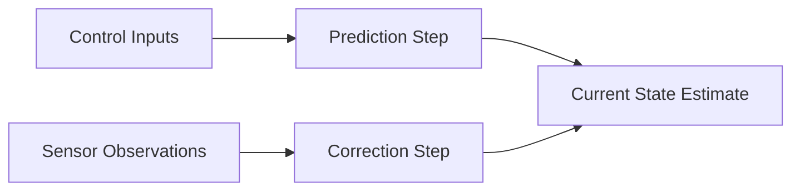

# State Estimation

> **Status:** draft
>
> **Related chapters:** Builds on Chapter 2 — Robot Perception; feeds into Chapter 2 — Motion Control.

## Why This Matters

A robot rarely knows its exact position or velocity in the world directly. State estimation combines noisy sensor data (like IMU, encoders, and cameras) over time to produce the best estimate of where the robot is and how it is moving, which is critical for all control tasks.

## Learning Objectives

After this chapter you will be able to:

- Explain the probabilistic basis of state estimation.
- Describe the core concepts of Recursive Bayesian Estimation.
- Implement a basic Kalman Filter for a simple system.
- Understand the role of IMU integration and bias compensation.

## Core Concepts

| Concept | Definition |
| ------- | ---------- |
| State | The variables that describe the robot (position, orientation, velocity). |
| Bayesian Estimation | A framework to estimate the state of a system given noisy observations. |
| Kalman Filter | An optimal estimator for linear systems with Gaussian noise. |
| Odometry | Using motor encoders to estimate change in position over time. |

## Technical Explanation

State estimation bridges the gap between raw, instantaneous sensor measurements and the continuous "belief" of the robot's state.

### Probabilistic Framework

We model the system using a transition model (how the state evolves) and an observation model (how sensors relate to the state).

### Filtering

For linear systems, the Kalman Filter is the gold standard. For non-linear systems (common in robotics due to rotations), Extended Kalman Filters (EKF) or Unscented Kalman Filters (UKF) are used.

## Real-World Examples

:::note Mini case study
Humanoids use IMU pre-integration to maintain high-frequency pose estimates, fused with slower, absolute corrections from visual odometry to avoid drift.
:::

## Architecture Diagrams

## Summary

State estimation is the "internal sense of self" for a robot. It leverages probability to handle sensor noise and provides the reliable state information required for high-level control.

**Key takeaways**

- State estimation is inherently probabilistic.
- Filtering (like EKF) is essential for integrating IMU and odometry.
- Handling drift is a primary challenge in state estimation.

## Exercises

1. **Easy — Linear Prediction** — Implement a simple linear prediction step for a 1D robot moving at a constant velocity.
2. **Medium — Kalman Filter** — Implement a 1D Kalman Filter to track the position of a robot with noisy distance measurements.
3. **Challenge — EKF** — Implement an Extended Kalman Filter for a 2D mobile robot, fusing wheel odometry and landmark observations.

## Further Reading

- *Bar-Shalom et al.* — Estimation with Applications to Tracking and Navigation. — A classic text on estimation theory.
- *Goodfellow et al.* — Deep Learning (Chapter on Graphical Models). — For those interested in advanced probabilistic methods.
