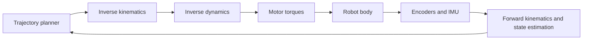
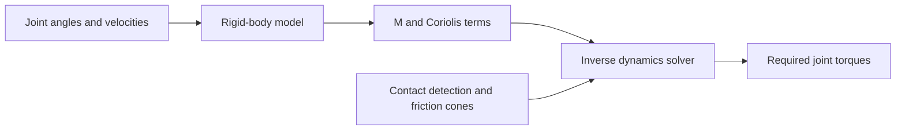

import Quiz from '@site/src/components/Educational/Quiz';

# Kinematics and Dynamics

> **Status:** complete
>
> **Related chapters:** Builds on Chapter 3 — The Math Toolkit for Embodied Machines; feeds into Chapter 10 — Motion Control and Chapter 11 — Balance and Locomotion.

## Why This Matters

A robot is a chain of metal links pushed by motors. **Kinematics** is the study of that chain's geometry: given the angle of every joint, where is the hand? **Dynamics** is the study of its physics: given the forces in the actuators, how does the body accelerate? Both answers run through every control decision a humanoid makes, hundreds of times per second.

Think of a basketball player catching a ball. Their eyes track where the ball is (kinematics), their muscles compute how hard to push so the catch decelerates smoothly (dynamics), and their legs shift to keep them balanced while the arm does the work. A humanoid faces the identical problem, except its "eyes" are encoders and cameras and its "muscles" are electric motors that must be commanded with millisecond timing.

This chapter gives you the two mathematical machines underneath all of that: kinematic models that map joint angles to end-effector poses, and dynamic models that map torques to motion. Every later chapter — motion control, balance, manipulation, reinforcement learning — assumes you can write these equations down and, more importantly, read them in the simulators and control stacks modern robots are built on.

## Learning Objectives

After this chapter you will be able to:

- Compute forward kinematics for a simple chain using rotation matrices and homogeneous transforms.
- Explain the role of the Jacobian in mapping joint velocities to end-effector velocities and forces.
- Derive the rigid-body equations of motion $M(q)\ddot{q} + C(q,\dot{q})\dot{q} + g(q) = \tau$ from a Lagrangian.
- Explain why a humanoid is a floating-base system and how contact forces change its dynamics.
- Use MuJoCo and Pinocchio to obtain these models for any robot you load.

## Core Concepts

| Concept | Definition |
| ------- | ---------- |
| Configuration space | The set of all joint positions $q$; every robot posture is one point in this space. |
| Forward kinematics | Map joint angles $q$ to the pose of a link, $x = f(q)$. |
| Inverse kinematics | Solve for joint angles that put the end-effector at a desired pose, $q = f^{-1}(x)$. |
| Jacobian | Matrix $J(q)$ relating joint velocities to end-effector velocities, $\dot{x} = J(q)\dot{q}$. |
| Mass matrix | $M(q)$, the inertia of the whole mechanism projected into joint space. |
| Floating base | A mobile robot whose base pose in the world is not actuated; it is settled by gravity and contact. |
| Contact constraints | The rule that feet can push but not pull on the ground, limiting where the center of mass can live. |

## Technical Explanation

### Configuration space and degrees of freedom

A robot arm is a sequence of joints, each with an angle. Collect them into the **joint vector** $q = (q_1, q_2, \ldots, q_n)$. The set of all possible $q$ is the **configuration space** — the space the robot "lives" in, one dimension per joint. A two-link planar arm has two joints, so its configuration space is a 2D torus (each joint angle wraps around). A humanoid has 30 to 50 joints, so its configuration space is a 30-to-50-dimensional manifold — you can never visualize it, only compute with it.

The first habit of a robotics engineer is to always ask *what frame am I in?* Joint angles live in **joint space**. The position and orientation of the hand live in **task space** (also called operational space), usually a position vector $p$ plus an orientation, packed as a pose $x = (p, \phi)$.

### Forward kinematics: from joints to the end-effector

Forward kinematics (FK) answers: given $q$, where is the end-effector? For a two-link planar arm with link lengths $l_1$, $l_2$:

$$x = l_1\cos(q_1) + l_2\cos(q_1 + q_2), \qquad y = l_1\sin(q_1) + l_2\sin(q_1 + q_2)$$

In general, FK is computed by multiplying the homogeneous transforms of each link, as in the Math Toolkit chapter:

$$T_{0 \leftarrow n}(q) = T_{0 \leftarrow 1}(q_1)\, T_{1 \leftarrow 2}(q_2) \cdots T_{n-1 \leftarrow n}(q_n)$$

The result is the 4×4 matrix that takes points from the last link's frame into the base frame. FK is *always* unique: one joint configuration, exactly one pose.

### Inverse kinematics: finding the joints

Inverse kinematics (IK) runs the map backwards: find $q$ such that $f(q) = x_{desired}$. Unlike FK, IK is rarely unique — a 7-DoF humanoid arm has a whole **null space** of elbow positions that all reach the same hand pose — and sometimes it has no solution at all, when the desired pose lies outside the robot's workspace.

The practical approach is numerical: start from a guess, linearize with the Jacobian, and iterate:

$$q_{k+1} = q_k + J(q_k)^\dagger (x_{desired} - f(q_k))$$

where $J^\dagger$ is the pseudo-inverse of the Jacobian. This is gradient descent on the squared pose error, exactly the optimization you learned in Chapter 3 — a reminder that kinematics and learning share one toolkit.

### The Jacobian: velocities and forces

The **Jacobian** $J(q)$ is the derivative of the forward kinematics, a matrix that maps joint velocities to end-effector velocities:

$$\dot{x} = J(q)\,\dot{q}$$

Its rows correspond to task directions (linear and angular), its columns to joints. The Jacobian is the bridge in both directions: invert it to plan joint motions from desired task motions, and transpose it to convert forces at the hand into the torques needed at the joints:

$$\tau = J(q)^{\mathsf{T}} F$$

This duality — *velocities map through $J$, forces map through $J^{\mathsf{T}}$* — is the principle of virtual work, and it is the workhorse behind operational-space control in Chapter 10. Watch for **singular configurations**, where $J$ loses rank: near a singularity the robot cannot move in some task direction no matter how the joints spin, and naive inverse solutions explode to huge joint speeds.

### Rigid-body dynamics: the equations of motion

Kinematics tells you where things are; dynamics tells you how they move under forces. The golden equation of manipulator dynamics is:

$$M(q)\ddot{q} + C(q,\dot{q})\dot{q} + g(q) = \tau$$

- $M(q)$ — the **mass matrix**: how much each joint "feels" the inertia of every link, including cross-couplings (move the elbow and the shoulder feels it).
- $C(q,\dot{q})\dot{q}$ — **Coriolis and centrifugal** forces, which appear whenever links rotate relative to each other.
- $g(q)$ — the **gravity vector**, the torque each joint must hold to resist gravity.
- $\tau$ — the applied joint torques from the actuators.

This equation is derived from the **Lagrangian**, the difference between kinetic and potential energy:

$$L = K - U = \tfrac{1}{2}\dot{q}^{\mathsf{T}} M(q)\,\dot{q} - U(q)$$

Applying the Euler–Lagrange equation,

$$\frac{d}{dt}\frac{\partial L}{\partial \dot{q}} - \frac{\partial L}{\partial q} = \tau$$

expands term by term into the equation of motion above. The derivation is mechanical — literally — but the intuition matters more than the algebra: the mass matrix turns accelerations into forces, and the $C$ and $g$ terms are the "hidden loads" the controller must cancel before the robot can move the way you asked.

### Floating-base dynamics for humanoids

A humanoid is not bolted to the floor like an industrial arm, and this changes everything. Its base (the torso) floats in space, so its full state is the 6-DoF base pose plus all joint angles:

$$q = (q_{\text{base}}, q_{\text{joints}}), \qquad q_{\text{base}} \in SE(3)$$

The base has no motor attached to the world, so the actuation only enters through a **selection matrix** $S$, and the dynamics gain an extra term: the contact forces $\lambda$ that the ground applies through the contact Jacobian $J_c$:

$$M(q)\ddot{q} + C(q,\dot{q})\dot{q} + g(q) = S^{\mathsf{T}}\tau + J_c^{\mathsf{T}}\lambda$$

This is why walking is hard. An industrial arm is a closed system — every degree of freedom is driven. A humanoid is an *open* system held up by its feet; its balance comes from arranging those contact forces so they exactly cancel gravity. If the contact breaks (a foot slips), the equations change instantly, and a controller that assumed otherwise will fall over. Chapter 11 is devoted to managing this instability.

### Contact: friction and the center of mass

Contacts are unilateral: a foot can push on the ground but never pull. Within the **friction cone**, the tangential friction force $\mathbf{F}_t$ at a contact must satisfy:

$$\|\mathbf{F}_t\| \le \mu F_n$$

with $\mu$ the friction coefficient and $F_n$ the normal force. The robot can only stay balanced while the net reaction forces it demands stay inside the cones of all its contacts. Equivalently, the horizontal projection of the center of mass must be steered into the **support polygon** — the convex hull of the feet on the ground. If the center of mass drifts outside, no amount of ankle strength saves you. Kinematics tells you where the center of mass is; the friction cone tells you which places are legal.

### Software: MuJoCo, Pinocchio, and friends

You will rarely derive these matrices by hand for a 30-joint robot. Physics engines such as **MuJoCo** compute forward and inverse dynamics for arbitrary models, including contacts, at thousands of steps per second — this is the engine under most reinforcement-learning locomotion work today. **Pinocchio** and **RBDyn** compute the kinematic and dynamic quantities (Jacobians, mass matrices, inertia) with efficient recursive algorithms like the *Recursive Newton–Euler Algorithm* and the *Composite Rigid-Body Algorithm*. The skill to build: read a URDF or MJCF model file, and know which API returns $M(q)$, $J(q)$, or the forward kinematics — then treat the theory in this chapter as the Rosetta stone for reading their output.

## Real-World Examples

:::info Real system
The Unitree G1 humanoid uses high-torque-density electric actuators with no hydraulic assist. Its real-time controller runs inverse dynamics at about 1 kHz so that every commanded acceleration is converted into the exact motor currents needed — compensating for the mass of each swinging leg and the Coriolis loads from the arms. This is why G1 can balance and walk with surprisingly small, light actuators: the model does the heavy lifting before the motor is even asked.
:::

:::note Mini case study
Boston Dynamics' research Atlas (hydraulic) and the newer electric Atlas both lean on floating-base dynamics. During a standing backflip, the robot must plan a sequence where the center of mass travels *outside* the support polygon for most of the motion, then re-enters it at touchdown. The whole trick is an exercise in contact dynamics: compute the contact forces that accelerate the floating base, and only commit to the flip if the resulting forces stay inside the friction cone at every planned foot strike.
:::

## Architecture Diagrams

### Where kinematics and dynamics sit in the control loop



### Contact forces hold up the floating base



## Code Examples

### Forward kinematics and the Jacobian in NumPy

```python
import numpy as np

def fk_2link(q1, q2, l1, l2):
    """End-effector position of a 2-link planar arm."""
    x = l1 * np.cos(q1) + l2 * np.cos(q1 + q2)
    y = l1 * np.sin(q1) + l2 * np.sin(q1 + q2)
    return np.array([x, y])

def jacobian_2link(q1, q2, l1, l2):
    """Analytic Jacobian: maps joint velocities to end-effector velocity."""
    c12, s12 = np.cos(q1 + q2), np.sin(q1 + q2)
    return np.array([
        [-l1*np.sin(q1) - l2*s12, -l2*s12],
        [ l1*np.cos(q1) + l2*c12,  l2*c12],
    ])

q = np.array([0.5, 0.8])            # joint angles, radians
l1 = l2 = 0.4                        # link lengths, meters

p = fk_2link(q[0], q[1], l1, l2)
J = jacobian_2link(q[0], q[1], l1, l2)

v_task = np.array([0.3, -0.1])       # desired end-effector velocity
dq = np.linalg.solve(J, v_task)      # required joint velocities

print("end-effector position:", p.round(3))
print("required joint velocities:", dq.round(3))
```

**What each piece does:** `fk_2link` implements the forward-kinematics equations of this chapter; `jacobian_2link` differentiates them by hand; `np.linalg.solve(J, v_task)` is the velocity-level inverse kinematics $\dot{q} = J^{-1}\dot{x}$ for this square case. Try driving the Jacobian to singularity (set $q_2 = 0$) and watch `dq` explode.

:::tip Where this runs
Run this anywhere NumPy works. To see the same math at robot scale, load the Unitree G1 MJCF model in MuJoCo and compare the engine's `mj_jac` against this analytic Jacobian, or query Pinocchio's `computeJointJacobians` on a URDF you download from any robot repository.
:::

## Common Mistakes

| Mistake | Why it happens | How to avoid it |
| ------- | -------------- | --------------- |
| Forgetting that IK has many solutions | The forward map is nonlinear and many postures reach one pose | Use a numerical solver with a good initial guess; check the whole null space, not one answer |
| Naively inverting the Jacobian near a singularity | Near singular configurations $J$ loses rank and solutions blow up | Use the pseudo-inverse with damping: $J^\dagger = J^{\mathsf{T}}(JJ^{\mathsf{T}} + \lambda I)^{-1}$ |
| Ignoring the Coriolis term in control | At slow speeds it is small, so students drop it | Keep $C(q,\dot{q})\dot{q}$ for fast or multi-link motion; at high speeds it dominates |
| Treating a humanoid like a fixed-base arm | The base floats and contacts add unknown forces | Always include the base pose and the contact-force term $\lambda$ in the model |
| Trusting $M(q)$ from a single test pose | The mass matrix changes with configuration | Recompute $M(q)$ at runtime (MuJoCo, Pinocchio) rather than caching one value |

## Summary

Kinematics and dynamics are the two halves of "why the body moves the way it does." Kinematics maps joint angles to poses through forward and inverse kinematics and to velocities through the Jacobian; dynamics maps torques to acceleration through the equation $M(q)\ddot{q} + C(q,\dot{q})\dot{q} + g(q) = \tau$. A humanoid complicates both: its base floats in space, and its balance depends on unilateral contact forces living inside friction cones. The good news is that the models are now standard software — MuJoCo and Pinocchio compute them for you — and the equations in this chapter are the vocabulary for reading their output and for everything that follows.

**Key takeaways**

- Forward kinematics is unique and easy; inverse kinematics is multi-valued and usually needs iteration.
- The Jacobian maps velocities forward through $J$ and forces backward through $J^{\mathsf{T}}$.
- The equations of motion $M(q)\ddot{q} + C(q,\dot{q})\dot{q} + g(q) = \tau$ derive from the Lagrangian.
- A humanoid is a floating-base system: contact forces $\lambda$ and the selection matrix $S$ are part of its dynamics.
- Balance requires the center of mass over the support polygon and contact forces inside friction cones.
- MuJoCo and Pinocchio turn all of this into library calls.

## Exercises

1. **Easy — One-link FK.** Write forward kinematics for a single joint at angle $\theta$ and link length $L$, and verify the end-effector position lies on a circle of radius $L$.
2. **Medium — Jacobian force mapping.** Using the two-link Jacobian from the code example, compute the joint torques needed to push with $\mathbf{F} = (10, 0)$ newtons at the hand. *Hint: use $\tau = J^{\mathsf{T}}F$ and compare with the virtual-work argument in the Jacobian section.*
3. **Challenge — Simulated inverse dynamics.** Load a two-link pendulum into MuJoCo, apply a sinusoidal torque, and log whether the actual acceleration matches $M(q)\ddot{q} + C(q,\dot{q})\dot{q} + g(q) = \tau$ computed with Pinocchio on the same state. Then extend the model to a floating base and observe how contact changes the numbers.

Check your understanding:

<Quiz
  question="Which quantity maps joint velocities to end-effector velocities?"
  options={[
    'The mass matrix',
    'The Jacobian',
    'The gravity vector',
    'The friction cone',
  ]}
  correctAnswerIndex={1}
/>

## Further Reading

- Kevin Lynch and Frank Park, *Modern Robotics: Mechanics, Planning, and Control* (Cambridge University Press, 2017). [modernrobotics.org](http://modernrobotics.org) — the definitive text; Chapter 4–6 cover kinematics and dynamics at depth.
- Roy Featherstone, *Rigid Body Dynamics Algorithms* (Springer, 2008) — the recursive algorithms behind Pinocchio, explained from first principles.
- MuJoCo documentation, *Computation* — how a physics engine actually integrates these equations. [mujoco.org](https://mujoco.org)
- Justin Carpentier et al., *The Pinocchio C++ library* (2020) — the paper behind the software library. [github.com/stack-of-tasks/pinocchio](https://github.com/stack-of-tasks/pinocchio)
