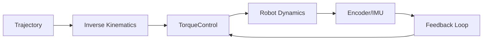

# Kinematics and Dynamics

> **Status:** complete
>
> **Related chapters:** Builds on Chapter 3 — Math Toolkit; feeds into Chapter 06 — Motion Control.

## Why This Matters

Robotics is fundamentally about movement in the physical world. Kinematics defines *how* a robot can move, while dynamics defines *why* it moves—the forces and torques required to generate that motion. Understanding these fields is essential for planning trajectories, controlling actuators, and achieving precise manipulation.

## Learning Objectives

After this chapter you will be able to:

- Derive forward and inverse kinematics for a simple manipulator.
- Explain the difference between rigid body dynamics and kinematic constraints.
- Formulate the equations of motion using the Lagrangian approach.
- Identify the physical parameters (mass, inertia, friction) needed for simulation.

## Core Concepts

| Concept | Definition |
| ------- | ---------- |
| Kinematics | The study of motion without regard to the forces causing it. |
| Dynamics | The study of motion considering the forces and torques involved. |
| Configuration Space | The set of all possible positions and orientations of a robot. |
| Lagrangian | A function describing the dynamics of a system in terms of kinetic and potential energy. |

## Technical Explanation

### Kinematics

Forward kinematics maps joint angles $q$ to the end-effector position $x = f(q)$. Inverse kinematics solves for $q = f^{-1}(x)$.

$$x = \begin{bmatrix} p \\ \phi \end{bmatrix} = f(q)$$

### Dynamics

The equations of motion for an $n$-degree-of-freedom manipulator are generally written as:

$$M(q)\ddot{q} + C(q, \dot{q})\dot{q} + g(q) = \tau$$

Where:
- $M(q)$ is the mass/inertia matrix.
- $C(q, \dot{q})$ represents Coriolis and centrifugal forces.
- $g(q)$ is the gravitational vector.
- $\tau$ is the applied torque.

## Real-World Examples

:::info Real system
The Unitree G1 humanoid uses high-torque density actuators, where accurate inverse dynamics are critical to compensate for limb mass during walking, ensuring the motor current stays within safety limits.
:::

## Architecture Diagrams



## Code Examples

```python
# Simple Forward Kinematics for a 2-link planar robot
import numpy as np

def forward_kinematics(q, l1, l2):
    """q: joint angles [q1, q2], l1, l2: link lengths"""
    x = l1 * np.cos(q[0]) + l2 * np.cos(q[0] + q[1])
    y = l1 * np.sin(q[0]) + l2 * np.sin(q[0] + q[1])
    return np.array([x, y])

# Example usage
q = np.array([np.pi/4, np.pi/4])
position = forward_kinematics(q, 1.0, 1.0)
print(f"End-effector position: {position}")
```

:::tip Where this runs
Run this in any standard Python environment or integrate into a ROS 2 node.
:::

## Summary

**Key takeaways**

- Kinematics focuses on geometry; dynamics focuses on physics.
- The Lagrangian formulation is standard for deriving equations of motion.
- Inverse kinematics is often non-linear and may have multiple solutions.

## Exercises

1. **Easy — Forward Kinematics** — Calculate the end-effector position of a 1-link robot arm with length $L$ at angle $\theta$.
2. **Medium — Lagrangian Formulation** — Derive the dynamics for a 1-degree-of-freedom pendulum.

## Further Reading

- Lynch & Park, *Modern Robotics*. Cambridge University Press, 2017. — The definitive text on the subject.
