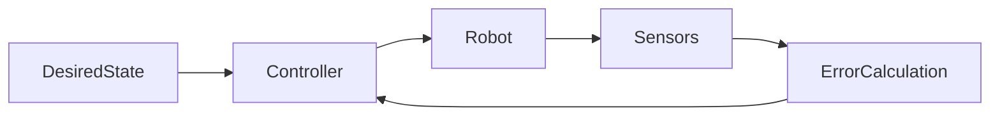

# Motion Control

> **Status:** complete
>
> **Related chapters:** Builds on Chapter 1 (Kinematics) and Chapter 3 (Dynamics); feeds into Chapter 4 (Locomotion).

## Why This Matters

Motion control translates high-level trajectory goals into low-level torque commands. Without robust control, a humanoid cannot reliably track a path, compensate for disturbances, or maintain stability under external forces.

## Learning Objectives

After this chapter you will be able to:

- Design a PID controller for a joint.
- Implement feedforward control for trajectory tracking.
- Analyze the stability of a control system.

## Core Concepts

| Concept | Definition |
| ------- | ---------- |
| PID | Proportional-Integral-Derivative controller for error correction. |
| Feedforward | Open-loop control based on a model of the system. |
| Trajectory Tracking | The process of following a time-varying desired state. |

## Technical Explanation

The control input $\tau$ is typically:

$$\tau = \tau_{ff} + K_p(q_d - q) + K_d(\dot{q}_d - \dot{q}) + K_i\int(q_d - q)dt$$

Where $\tau_{ff}$ is computed from the inverse dynamics model.

## Architecture Diagrams



## Code Examples

```python
# Simple PID Control loop
def control_step(q_desired, q_actual, kp, kd):
    error = q_desired - q_actual
    torque = kp * error + kd * (0 - velocity_actual) # Simplification
    return torque
```

## Exercises

1. **Easy — PID Tuning** — Tune a PID controller for a simulated joint.
2. **Medium — Feedforward** — Add a gravity compensation term to the controller.

