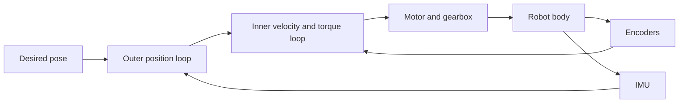
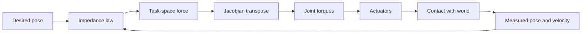

import Quiz from '@site/src/components/Educational/Quiz';

# Motion Control

> **Status:** complete
>
> **Related chapters:** Builds on Chapter 9 — Kinematics and Dynamics; feeds into Chapter 11 — Balance and Locomotion and Chapter 12 — Manipulation.

## Why This Matters

Knowing where the hand *should* be is only half of robotics. The other half is making the body *actually go there*, despite gravity, friction, inertia, and the noisy, ever-changing real world. That is the job of **motion control**: the discipline of converting a desired trajectory into the exact torque commands that make motors obey.

Imagine driving a car down a straight highway with a strong crosswind. You want to hold the lane. You don't just point the steering wheel once — you sense your drift, correct, over-correct slightly, and settle into a steady correction against the wind. A robot joint does exactly this, thousands of times per second, except its "lane" is a target angle or torque and its "driver" is a control law you wrote.

This chapter covers the feedback control loop, the three terms of PID control, feedforward and computed-torque control, impedance control for making robots safe around humans, and the practical art of tuning. After this chapter you will be able to look at a humanoid's low-level controller — the part that runs at 1 kHz while everything smarter runs on top — and understand exactly what each gain is doing.

## Learning Objectives

After this chapter you will be able to:

- Explain the feedback control loop and the role of each PID term.
- Contrast position, velocity, and torque control and when each is appropriate.
- Add feedforward and gravity compensation to a feedback controller.
- Explain impedance control and why compliance matters on humanoids.
- Tune a PID controller for a simple motor using a principled procedure.

## Core Concepts

| Concept | Definition |
| ------- | ---------- |
| Feedback loop | Sense the state, compare it with the reference, act on the error, repeat. |
| PID control | A controller combining proportional, integral, and derivative error terms. |
| Feedforward | An open-loop command computed from a model, anticipating the required effort. |
| Gravity compensation | A feedforward torque $g(q)$ that cancels gravity at the current pose. |
| Impedance control | Command the robot to behave like a spring-damper toward its environment. |
| Admittance control | Measure an external force and respond by moving along the desired compliance. |
| Bandwidth | How fast the loop can track; higher gains raise it, but noise and delay limit it. |

## Technical Explanation

### The feedback control loop

Every controller is a loop. At each control tick the robot measures its state $x$ — a joint angle from an encoder, a velocity from a tachometer, a pose from an estimator — and compares it with the reference $x_d$ it was asked to track. The difference is the **error**:

$$e(t) = x_d(t) - x(t)$$

The controller turns that error into a command $u(t)$, and the command drives the actuator. The loop closes because the measurement feeds back into the next command. Without feedback, the controller is **open-loop**: it commands blindly and hopes. With feedback, it constantly repairs its own mistakes — which is the difference between a toy that marches into a wall and a robot that stops at one.

### The three terms of PID

The most widely used control law on Earth is PID. Its three terms each fix a different failure mode:

$$u(t) = K_p\, e(t) + K_i \int_0^t e(\tau)\,d\tau + K_d\, \frac{de(t)}{dt}$$

- **Proportional** ($K_p$): push proportional to the error. This is the intuitive term — big error, big push. Alone, it leaves a steady-state offset because at equilibrium the push must equal the load, so some error must remain.
- **Integral** ($K_i$): accumulate past error. This term *eliminates* the steady-state offset: the integrator keeps winding up until the output exactly cancels the constant disturbance (gravity, friction). Too much integral and the loop overshoots and oscillates.
- **Derivative** ($K_d$): push against the *rate* of change of error. This is the damper — it anticipates where the error is heading and adds a force opposing fast motion, calming overshoot and ringing.

Think of holding a heavy door open against a gusty wind: proportional is how hard you push based on how far it closed, integral is the memory of all the gusts that pushed it back, and derivative is how you brace the moment it starts to move. A well-tuned PID feels like exactly that — firm, calm, and unbothered.

### Position, velocity, and torque control

Robots command actuators at three levels, each nested inside the next:

- **Position control** — "go to angle $\theta$": a stiff high-gain loop, good for precise but forceful motions, dangerous when the robot touches people.
- **Velocity control** — "spin at $\dot{\theta}$": used for wheels and for joints driven through velocity interfaces.
- **Torque control** — "apply $\tau$": the honest, physical level. This is where dynamics, impedance, and learning all operate. A torque-controlled robot can be made stiff *or* soft; a position-controlled robot can only be stiff.

In practice the levels nest: an outer position loop produces a velocity command, which an inner velocity loop turns into a torque, which the motor produces. The fastest loop runs innermost. On humanoids, the innermost torque loop runs at 1–10 kHz; the balance layer runs at about 1 kHz; the planner runs far slower.

### Feedforward and computed torque

Feedback only reacts to errors that have already happened. **Feedforward** uses the model to predict the effort *before* the error appears. The full law for trajectory tracking is:

$$\tau = M(q)\ddot{q}_d + C(q,\dot{q})\dot{q} + g(q) + K_p\, e + K_d\, \dot{e}$$

The first three terms are the **inverse dynamics**: the torque the robot *should* need to follow the reference exactly, given its mass, Coriolis, and gravity — this is precisely the inverse dynamics from Chapter 9. The $K_p e + K_d\dot{e}$ terms then mop up whatever the model got wrong. This two-part structure — *model handles the physics, feedback handles the uncertainty* — is the template for almost every serious controller in robotics. The simplest and most valuable special case is **gravity compensation**:

$$\tau = g(q) + K_p\, e + K_d\, \dot{e}$$

A PD controller plus a gravity term. It converts a controller that sags under the arm's own weight into one that holds its pose and only responds to disturbance.

### Impedance control: making robots gentle

A stiff position controller fighting a human is dangerous. **Impedance control** changes the goal: instead of commanding a position, the controller programs a *dynamic relationship* between motion and force. The robot is made to behave like a mass–spring–damper anchored at the desired pose:

$$\tau = J(q)^{\mathsf{T}}\left( K_p\, \Delta x + K_d\, \Delta \dot{x} \right), \qquad \Delta x = x_d - x$$

Here $K_p$ is the virtual spring stiffness and $K_d$ the virtual damping, both in task space, mapped back to joints through the Jacobian transpose. If a human pushes the arm, the virtual spring yields smoothly; when the push stops, it returns. The robot is compliant *by design* instead of by fighting. Impedance control is why humanoids can carry objects, be physically nudged, and interact with people — and it is the low-level substrate that reinforcement-learned policies in Chapter 14 command.

**Admittance control** is the dual: the robot *measures* an external force and moves so that the resulting motion matches the desired compliance. Impedance is best when the robot has good torque control; admittance is the fallback when it only has position control but has a force sensor.

### Operational-space control

When an arm must move its hand while interacting, it is cleaner to control in task space than joint space. **Operational-space control** computes the effective inertia of the mechanism at the hand, $\Lambda(q)$, and applies:

$$F = \Lambda(q)\ddot{x}_d + \mu(q,\dot{q}) + p(q) + K_p\, \Delta x + K_d\, \Delta \dot{x}, \qquad \tau = J(q)^{\mathsf{T}}F$$

The task-space inertia $\Lambda = (JM^{-1}J^{\mathsf{T}})^{-1}$ accounts for how the arm's mass is perceived at the hand, and $\mu, p$ are the task-space Coriolis and gravity terms. The result: the hand behaves like a controlled mass-spring-damper in Cartesian space, so the same gains work everywhere in the workspace. This is the standard way to make a humanoid arm track a hand pose while staying compliant.

### Tuning controllers on real robots

Tuning is where theory meets reality. A principled workflow for one joint:

1. **Start with PD only** ($K_i = 0$). Raise $K_p$ until the joint rings (sustained oscillation); that gain is the *ultimate gain* $K_u$, and its oscillation period is $T_u$.
2. **Back off** — set $K_p$ to about half of $K_u$, then add $K_d$ until the overshoot dies out (roughly $K_d \approx 2\sqrt{K_p J_{eff}}$ for a joint with inertia $J_{eff}$).
3. **Add $K_i$ last**, and only as much as needed to remove steady-state error — integral is the easiest way to introduce instability.
4. **Saturate**: real motors cap torque and current. An integrator that keeps winding while the motor is saturated causes *integrator windup* and a huge overshoot when the reference finally moves. Clamp the integral term (anti-windup) before it becomes a problem.

Every loop you tune on a real humanoid — ankle, knee, neck, wrist — will reward you for obeying this sequence and punish you for skipping it.

## Real-World Examples

:::info Real system
Figure 02's arms use low-level torque control with feedforward from inverse dynamics, layered with impedance behavior. The headline "human-like" motions are not magic — the arm's joint controller treats each motion as a virtual spring-damper in task space, so the robot can hand objects to a person and release them without crushing the person's hand, because the compliant impedance law gives way instead of fighting.
:::

:::note Mini case study
A common field failure in hobby humanoids is **joint chatter**: the motor buzzes audibly and the joint runs hot. The cause is almost always a derivative gain set too low for the measurement noise, or an integral gain high enough to fight friction every tick. The fix follows the tuning recipe — reduce $K_i$, add filtering on the derivative term, and give the loop a little damping. Teams that log the torque command and the velocity error find the answer in minutes instead of chasing "the right gains" blindly.
:::

## Architecture Diagrams

### The nested feedback loop on a robot joint



### Impedance control for safe interaction



## Code Examples

### A PID controller with anti-windup and gravity compensation

```python
import numpy as np

class PID:
    """Discrete-time PID with integral clamping (anti-windup)."""

    def __init__(self, kp, ki, kd, dt, clamp=5.0):
        self.kp, self.ki, self.kd = kp, ki, kd
        self.dt = dt
        self.clamp = clamp
        self.integral = 0.0
        self.prev_error = 0.0

    def step(self, error, torque_ff=0.0):
        self.integral += error * self.dt
        self.integral = np.clip(self.integral, -self.clamp, self.clamp)  # anti-windup
        derivative = (error - self.prev_error) / self.dt
        self.prev_error = error
        return self.kp * error + self.ki * self.integral + self.kd * derivative + torque_ff

def gravity_torque(q, m, g=9.81):
    """Gravity torque of a single pendulum of mass m and center at length l."""
    l = 0.3                                # center of mass distance, meters
    return m * g * l * np.sin(q)           # feedforward term g(q)

# Simulation of one joint
pid = PID(kp=8.0, ki=0.4, kd=0.6, dt=0.001)
m = 2.0                                    # pendulum mass, kg
q, dq, t = 0.0, 0.0, 0.0
while t < 3.0:
    qd = np.deg2rad(60.0)                  # hold at 60 degrees
    error = qd - q
    tau = pid.step(error, torque_ff=gravity_torque(q, m))
    ddq = (tau - gravity_torque(q, m)) / (m * 0.3**2)   # simple pendulum physics
    dq += ddq * pid.dt
    q += dq * pid.dt
    t += pid.dt
print(f"final angle: {np.rad2deg(q):.2f} degrees")       # should converge to 60
```

**What each piece does:** `PID.step` is the discrete version of the PID law with a clamped integrator; `gravity_torque` is the feedforward term $g(q)$ from this chapter; and the simulation loop applies the torque to a simple pendulum. Remove the `torque_ff` argument and you will see a steady-state error — add it back and the joint holds exactly 60 degrees.

:::tip Where this runs
Run this in plain Python. To see it on hardware, take the same PID class into a ROS 2 control node (`ros2_control`), attach it to the G1 or G1-compatible joint interface, and tune `kp`, `ki`, `kd` while watching the `JointState` topic — the tuning recipe from this chapter is exactly what you will follow live.
:::

## Common Mistakes

| Mistake | Why it happens | How to avoid it |
| ------- | -------------- | --------------- |
| Cranking $K_p$ until it works | High proportional gain feels "strong" but causes ringing and actuator saturation | Use the ultimate-gain procedure: raise $K_p$ until oscillation, then back off to half |
| Skipping the derivative term | Students see $K_i$ fixing offsets and forget damping | Add $K_d \approx 2\sqrt{K_p J_{eff}}$ to stop overshoot before raising $K_i$ |
| Integrator windup | The integrator grows while the motor is saturated, then overshoots wildly | Clamp the integral with anti-windup, as in the code example |
| Treating the joint as independent | Moving the elbow changes the shoulder's load through the mass matrix | Add feedforward from inverse dynamics, or at least a gravity-compensation term updated with pose |
| Controlling torque with a position-only motor | Position loops cannot produce honest compliance | Use admittance control: measure force, then let a position loop follow the compliant motion |
| Tuning every gain at once | The terms interact, so no single change is identifiable | Tune in order: $K_p$, then $K_d$, then $K_i$, one joint at a time |

## Summary

Motion control is the layer that turns "be here" into "push this hard." The feedback loop closes the gap between reference and reality; PID supplies the three essential corrections; feedforward and gravity compensation let the model carry the load while feedback cleans up; and impedance control makes the robot safe and gentle by programming a spring-damper relationship instead of a rigid position. Tuning remains an engineering skill, but a principled order — proportional, derivative, integral, with anti-windup — turns it from black art into a routine. With this layer in place, the balance and manipulation of the next two chapters have a foundation to stand on.

**Key takeaways**

- Feedback converts reference-minus-state error into command; open-loop control cannot correct itself.
- PID = proportional (current error) + integral (past error) + derivative (future error trend).
- Feedforward from inverse dynamics carries the physics; $K_p e + K_d \dot{e}$ handles the uncertainty.
- Torque control is the honest physical layer; position control is a stiff special case.
- Impedance control makes robots compliant and safe; admittance control is its force-measuring dual.
- Tune in order, clamp the integrator, and log what the loop is doing.

## Exercises

1. **Easy — PID on a simulated joint.** Extend the code example to log the error every tick, then try $K_p = 2, 20, 200$ and describe what changes in the error trace.
2. **Medium — Add feedforward properly.** Write a two-link arm simulator, compute $\tau = M(q)\ddot{q}_d + C(q,\dot{q})\dot{q} + g(q) + K_p e + K_d \dot{e}$, and show the tracking error drops by orders of magnitude versus PD-only. *Hint: reuse the Jacobian and mass matrix from Chapter 9.*
3. **Challenge — Impedance in simulation.** In MuJoCo or Isaac Lab, drive a single joint with the impedance law $\tau = -K_p(q - q_d) - K_d \dot{q}$, push the simulated joint with an external force, and verify it returns to $q_d$ while staying compliant. Then raise $K_p$ until the same push barely moves it, and reflect on why a human might not want to be near that robot.

Check your understanding:

<Quiz
  question="A robot arm that must push gently against a surface, yielding rather than fighting, should use which control mode?"
  options={[
    'High-gain position control',
    'Impedance control',
    'Open-loop feedforward',
    'Bang-bang control',
  ]}
  correctAnswerIndex={1}
/>

## Further Reading

- Kevin Lynch and Frank Park, *Modern Robotics* (Cambridge University Press, 2017) — Chapter 11 develops feedforward and computed-torque control rigorously. [modernrobotics.org](http://modernrobotics.org)
- Bruno Siciliano, Lorenzo Sciavicco, Luigi Villani, Giuseppe Oriolo, *Robotics: Modelling, Planning and Control* (Springer, 2009) — the classic treatment of impedance and operational-space control.
- ROS 2 Control documentation — how PID and torque loops are deployed on real robots. [control.ros.org](https://control.ros.org)
- Kristin Y. Pettersen et al., *Feedback Control of Dynamic Systems* (Franklin, Powell, Emami-Naeini) — the standard undergraduate text for the feedback loop and PID tuning.
