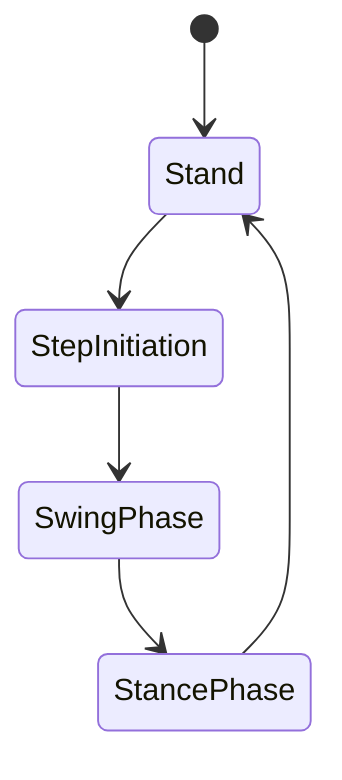

# Balance and Locomotion

> **Status:** complete

## Why This Matters

Locomotion is the defining challenge of humanoid robotics. Balancing requires maintaining the Center of Mass (CoM) within the support polygon, while locomotion requires dynamic gait generation.

## Learning Objectives

After this chapter you will be able to:

- Define the Zero Moment Point (ZMP) and its role in stability.
- Understand the Pendulum Model for walking.
- Implement a simple gait controller.

## Core Concepts

| Concept | Definition |
| ------- | ---------- |
| ZMP | The point on the ground where total inertia/gravity forces have no moment. |
| Support Polygon | The convex hull of contact points on the ground. |
| Gait | A pattern of movement for locomotion (e.g., walk, run). |

## Technical Explanation

The linear inverted pendulum model (LIPM) approximates the CoM as a mass on a massless rod:

$$\ddot{x} = \frac{g}{h}x$$

where $h$ is the CoM height.

## Architecture Diagrams



## Code Examples

```python
# ZMP-based trajectory planner snippet
def plan_com_trajectory(zmp_ref, h, g):
    # Simplified LIPM integration
    # ...
    return trajectory
```

## Exercises

1. **Easy — Stability** — Determine if a given robot posture is stable.
2. **Medium — Gait** — Implement a simple trot gait pattern.
