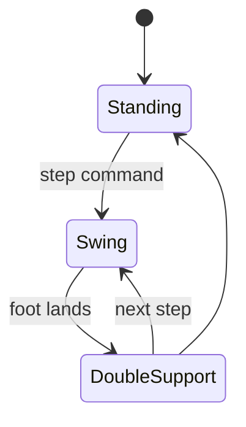

import Quiz from '@site/src/components/Educational/Quiz';

# Balance and Locomotion

> **Status:** complete
>
> **Related chapters:** Builds on Chapter 9 — Kinematics and Dynamics and Chapter 10 — Motion Control; feeds into Chapter 14 — Reinforcement Learning and Chapter 21 — Simulation.

## Why This Matters

Balance is the defining challenge of humanoid robotics — and the reason humanoids have been a half-century dream instead of a commodity. An industrial arm is bolted down; a wheeled robot balances trivially on its wheels. A humanoid stands on two small feet, with its center of mass a meter above the ground, held up by nothing but friction cones and coordination. Get the physics slightly wrong, and it falls over in half a second.

Yet balance is exactly why humanoids are attractive in the first place. The human body plan — two legs, two arms, upright torso — is the shape of the world we built: stairs, doors, tool handles, factory floors. A robot that walks like us can go where our tools and environments already are, without redesigning them. Walking is how the body becomes *mobile*.

This chapter explains the physics of staying upright, the classic **zero-moment-point (ZMP)** walking framework, the model predictive controllers that plan footsteps, dynamic and running gaits, and the modern reinforcement-learning approaches that train whole-body walking policies in simulation and transfer them to robots like Unitree's G1 and H1.

## Learning Objectives

After this chapter you will be able to:

- Explain walking through the inverted-pendulum model.
- Define the center of mass, center of pressure, and ZMP, and their role in balance.
- Contrast quasi-static (ZMP) and dynamic gaits.
- Describe how model predictive control plans center-of-mass motion.
- Describe how reinforcement learning generates locomotion policies that transfer to hardware.

## Core Concepts

| Concept | Definition |
| ------- | ---------- |
| Center of mass (CoM) | The single point where the robot's whole mass acts; balance is the battle to steer it. |
| Support polygon | The convex hull of the robot's ground contacts — the safe region for balance. |
| Center of pressure (CoP) | The point where the ground reaction force actually acts on the feet. |
| Zero-moment point (ZMP) | The point on the ground where the net moment of inertial and gravity forces is zero. |
| Inverted pendulum | A mass on a massless rod balancing above a pivot — the canonical model of a walker. |
| Capture point | The point on the ground where stepping lets a walking robot stop without falling. |
| Sim-to-real | Training a policy in simulation and transferring it to real hardware with domain randomization. |

## Technical Explanation

### Why walking is hard: the inverted pendulum

A humanoid standing still is, to a first approximation, an **inverted pendulum**: a heavy mass (the torso, roughly the center of mass) balanced on a pivot (the ankle). Inverted pendulums are unstable by nature — unlike an ordinary pendulum, small disturbances grow instead of shrink. A step or a gust pushes the mass slightly off vertical, gravity then accelerates it further, and unless something corrects, it accelerates toward the floor.

The relevant physics is captured by the **linear inverted pendulum model (LIPM)**, which assumes the center of mass moves on a horizontal line at constant height $h$:

$$\ddot{x} = \frac{g}{h}\, x$$

where $x$ is the horizontal offset of the CoM from the stance foot and $g$ is gravity. The solution grows (or decays) exponentially, with time constant $\omega = \sqrt{g/h}$ — for a 1 m tall center of mass, $\omega \approx 3.1$ rad/s, meaning an error doubles in roughly 0.2 seconds. That is how little time a humanoid has to react. Balance is not a posture; it is a continuous race against this instability.

### Center of mass, center of pressure, and ZMP

Three points on the ground side of that race are easy to confuse, so separate them clearly:

- **Center of mass (CoM)** — a property of the robot alone. It is the weighted average of every link's mass position and is computed from kinematics.
- **Center of pressure (CoP)** — where the *ground reaction force* vector passes through the foot. The feet apply pressure; the CoP is where that pressure is centered.
- **Zero-moment point (ZMP)** — the point on the ground where the inertial and gravitational forces produce *zero net moment* about the horizontal axes. For a flat foot that is not slipping, the ZMP coincides with the CoP.

The rule of balance is simple and old: **the robot is statically stable if and only if the ZMP lies inside the support polygon.** If the ZMP reaches the edge of the foot, the foot starts to tip — the ankle cannot push any further, the moment balance breaks, and the robot rotates about that edge. Step on a curb and overbalance forward: the moment you feel your weight leave the heel, your ZMP has passed the support-polygon edge.

### Zero-moment-point walking

Classic humanoid walking is **ZMP-based**: plan a sequence of footsteps, then plan a center-of-mass trajectory such that the ZMP always stays safely inside the support polygon — ideally near the center of the stance foot. This guarantees the feet never tip, which makes the gait robust and easy to reason about. The cost is that the robot is *quasi-static*: it is effectively always in balance, which looks deliberate and waddles rather than glides.

The standard mathematical tool for planning that trajectory is a **linear model predictive controller (MPC)**. Over a preview horizon, the controller solves, at every step:

$$\min_{x, u} \sum_{k} \left( \|x_k - x_{k}^{ref}\|_Q^2 + \|u_k\|_R^2 \right) \quad \text{subject to} \quad x_{k+1} = A x_k + B u_k$$

where the state $x$ contains the CoM position and velocity, the control $u$ is the CoM acceleration (equivalently the ZMP), and the constraint matrix encodes the LIPM dynamics:

$$\dot{x} = \begin{bmatrix} \dot{x} \\ \ddot{x} \end{bmatrix} = \begin{bmatrix} 0 & 1 \\ \omega^2 & 0 \end{bmatrix} \begin{bmatrix} x \\ \dot{x} \end{bmatrix} - \begin{bmatrix} 0 \\ \omega^2 \end{bmatrix} p$$

with $p$ the ZMP position. Because the LIPM is linear and the horizon is short, this quadratic program solves in milliseconds on onboard compute — fast enough to re-plan every control tick. This *preview control* formulation, introduced by Kajita in 2003, is the engine behind decades of walking robots and remains the backbone of industrial humanoid walking.

### The capture point and divergent component of motion

A cleaner view comes from separating the stable from the unstable part of the LIPM dynamics. The **divergent component of motion (DCM)** — also called the **capture point** — combines position and velocity into a single quantity:

$$\xi = x + \frac{\dot{x}}{\omega}$$

Its dynamics are beautiful: the unstable part factors out into a first-order system,

$$\dot{\xi} = \omega\,(\xi - p)$$

which means the DCM *always* moves away from the ZMP, and it moves faster the further it is from it. Balance becomes a tracking problem: put the ZMP (the foot) where the DCM is heading, and the robot stops there. Take a step so the foot lands at $\xi$, and you capture the fall. This is the modern language of footstep planning — instead of keeping the ZMP in a safe polygon, walking becomes "place footsteps under a moving capture point," which is both simpler and more powerful, because it extends to dynamic, even running, gaits.

### Dynamic gaits and running

As the robot moves faster, the constraint that the ZMP stays inside the support polygon becomes overly conservative — humans certainly violate it. In **dynamic gaits** the robot intentionally spends parts of the cycle with no support at all (flight phases) and uses the horizontal CoM velocity as a tool. The recipe generalizes: the capture point tells you where to put the foot to shape the fall into a step, and the ZMP concept relaxes into the general *angular momentum management* — the robot actively modulates its angular momentum so the whole system (not just the CoM) comes down safely.

This is how running and hopping work, and it is why athletic robots like Boston Dynamics' Atlas can sprint, jump, and do gymnastics. The planner no longer asks "is the ZMP inside the polygon?" but rather "does the net effect of all these contact forces steer the center of mass to the next capture point?"

### Model predictive control for gaits

Modern humanoids treat locomotion as one continuous optimization. A **whole-body MPC** maintains a receding-horizon problem over the full dynamics, optimizing footstep locations, center-of-mass motion, and contact forces together — then hands a short trajectory to a low-level controller (from Chapter 10) that executes it. The trade-off is computational: full-body nonlinear MPC is heavy, so implementations use linearized models (LIPM, DCM) for the high-level planner and reserve full dynamics for the low-level tracker. This hierarchy — *plan with a simple model, execute with a rich one* — is the standard architecture of every serious walking robot.

### Learning-based locomotion policies

The modern alternative is to *learn* the whole thing. Instead of writing a ZMP planner and a tracking controller, teams train a neural-network policy with reinforcement learning that observes the robot's state and outputs joint torques directly. The reward function asks for the essentials — forward speed, upright torso, minimal energy, feet placed reasonably — and the RL optimizer discovers a gait, often one that looks strikingly human because the reward implicitly encodes human-like costs.

Training happens entirely in simulation (Chapter 21, 22), where millions of episodes run in parallel on GPUs, and the policy transfers to hardware through **domain randomization**: randomizing mass, friction, delay, and sensor noise during training so the policy becomes robust to the sim-to-real gap. This is the approach behind Unitree's G1 and H1 dynamic gaits, Figure 02, and Tesla Optimus demonstrations — walking, stair climbing, and recovery from pushes — all with a policy trained mostly in MuJoCo or Isaac Lab. The learned policy does not replace the physics of this chapter; it *internalizes* it. The capture point still governs the fall; the policy has simply learned to place its feet under it.

## Real-World Examples

:::info Real system
Unitree G1 walks, climbs stairs, and resists shoves using a learned locomotion policy trained in simulation and deployed at about 1 kHz on the real robot. Its robustness to pushes comes straight from domain randomization: training episodes randomize ground friction, payload mass, and joint latency, so the deployed policy has seen "unexpected" conditions before and has learned to recover from them by stepping — precisely the capture-point behavior described above.
:::

:::note Mini case study
Boston Dynamics' Atlas backflip is a masterclass in dynamic gaits. The robot spends almost the entire maneuver with its center of mass *outside* the support polygon — the entire flight phase has no support at all. What keeps it upright is the angular-momentum management of the whole body: the legs tuck to spin the torso, and the landing legs are pre-positioned so the feet arrive under the capture point the instant the flight phase ends. A ZMP-only planner could never produce this; it is the dynamic, capture-point view of locomotion taken to the extreme.
:::

## Architecture Diagrams

### The gait state machine



### The locomotion control stack


## Code Examples

### Integrating the LIPM and checking ZMP stability

```python
import numpy as np

G = 9.81
H = 1.0            # constant center-of-mass height, meters

def lipm_step(x, dx, p, dt):
    """Advance the linear inverted pendulum by dt.
    x: CoM horizontal position, p: ZMP position, both in meters."""
    w = np.sqrt(G / H)          # pendulum time constant
    ddx = w**2 * (x - p)        # LIPM equation of motion
    dx_new = dx + ddx * dt
    x_new = x + dx * dt
    return x_new, dx_new

def zmp_from_state(x, dx, ddx):
    """ZMP implied by a CoM state under the LIPM."""
    return x - (H / G) * ddx

def in_support_polygon(p, foot_center, half_width):
    """Is the ZMP inside the foot support region?"""
    return abs(p - foot_center) <= half_width

# Walk: stance foot at 0 m, half-foot length 0.12 m
foot_center, half_width = 0.0, 0.12
x, dx = 0.05, 0.0                # CoM slightly ahead of the ankle
ddx = (G / H) * (x - foot_center)

p = zmp_from_state(x, dx, ddx)
print("ZMP position:", round(p, 3))
print("Stable:", in_support_polygon(p, foot_center, half_width))
```

**What each piece does:** `lipm_step` integrates $\ddot{x} = (g/h)x$ with the ZMP as input; `zmp_from_state` inverts the model to recover the ZMP a given CoM state implies; `in_support_polygon` applies the balance rule. Push `x` to 0.5 m and watch the ZMP leave the foot — that is a robot falling over in miniature.

:::tip Where this runs
Run this in plain Python. To see it at scale, run the Unitree G1 locomotion example in MuJoCo or Isaac Lab and watch the state estimator's CoM estimate in real time — the physics above is exactly what the sim is integrating, and what the RL policy is secretly exploiting.
:::

## Common Mistakes

| Mistake | Why it happens | How to avoid it |
| ------- | -------------- | --------------- |
| Confusing CoM, CoP, and ZMP | All three are points near the feet, so they blur together | Remember: CoM is a property of the robot, CoP is where the ground pushes, ZMP is the balance criterion |
| Thinking balance means "stay inside the polygon forever" | The ZMP rule is taught first, so it sounds universal | It applies to quasi-static walking; dynamic and running gaits spend time outside the polygon by design |
| Forgetting the LIPM's constant-height assumption | The model is so clean it is easy to trust blindly | Real robots squat, jump, and climb; the LIPM is valid only for flat-footed level walking |
| Tuning gains instead of fixing the reference | When the tracker fights, the habit is to crank $K_p$ | The reference (footsteps, CoM) is usually the problem — fix the plan first, then the gains |
| Skipping domain randomization | Real hardware is not in the training loop, so it is easy to forget | Randomize friction, mass, and delay in training or the policy will transfer poorly |
| Treating RL as a replacement for the physics | "The policy handles everything" is a seductive slogan | The policy must still satisfy the same dynamics; understanding them is what makes debugging possible |

## Summary

Balance and locomotion reduce to one fight: the center of mass is an inverted pendulum that wants to fall, and the robot wins by steering it — keeping the ZMP inside the support polygon for quasi-static walking, or planting footsteps under the moving capture point for dynamic gaits. Classic robots plan this with ZMP preview control and linear MPC; modern robots learn locomotion policies in simulation with reinforcement learning and transfer them with domain randomization. The two approaches are not rivals: the learned policy has internalized the capture-point physics, and the physics is what lets you debug it.

**Key takeaways**

- The LIPM, $\ddot{x} = (g/h)x$, says a humanoid's CoM diverges from its foot on a 0.2 s time scale.
- Static balance means the ZMP stays inside the support polygon; dynamic gaits violate this on purpose.
- ZMP preview control and linear MPC plan CoM trajectories in milliseconds.
- The capture point $\xi = x + \dot{x}/\omega$ turns walking into "put your feet where you are falling."
- RL locomotion policies transfer to hardware through domain randomization and internalize this physics.

## Exercises

1. **Easy — Stability check.** Using the code example, compute whether a robot with CoM 4 cm ahead of its ankle and a half-foot length of 10 cm is stable. Then find the CoM offset that pushes the ZMP to the toe.
2. **Medium — Capture point.** Derive the capture point of a robot moving at $\dot{x} = 1$ m/s with $\omega = 3.1$ rad/s, and place a footstep there. Simulate the LIPM and confirm the robot comes to rest. *Hint: use $\xi = x + \dot{x}/\omega$ and put the ZMP at $\xi$.*
3. **Challenge — Learn a gait.** In Isaac Lab or MuJoCo, train a small RL policy (PPO, from Chapter 14) to make a biped walk forward, with a reward for forward speed minus a penalty for torso tilt and energy. Then add domain randomization on friction and verify the policy still walks. Compare the learned gait's CoM trajectory against the LIPM prediction.

Check your understanding:

<Quiz
  question="A walking robot is statically stable when its ZMP lies ..."
  options={[
    'Inside the support polygon',
    'At the height of the center of mass',
    'On the swing foot',
    'Outside the support polygon',
  ]}
  correctAnswerIndex={0}
/>

## Further Reading

- Shuuji Kajita et al., *Introduction to Humanoid Robotics* (Springer, 2014) — the definitive textbook on ZMP, LIPM, and walking control.
- Shuuji Kajita et al., *Biped Walking Pattern Generation by Using Preview Control of Zero-Moment Point* (ICRA, 2003) — the original paper that made ZMP walking practical. [ieeexplore.ieee.org](https://ieeexplore.ieee.org)
- Jerry Pratt and Russ Tedrake, *Velocity-Based Stability Margins for Fast Bipedal Walking* (2006) — the capture-point / DCM foundation. [groups.csail.mit.edu](https://groups.csail.mit.edu)
- Junfeng Long et al., *Humanoid Locomotion as Next Token Prediction* (2024) — modern learned locomotion at scale. [arxiv.org/abs/2402.19469](https://arxiv.org/abs/2402.19469)
