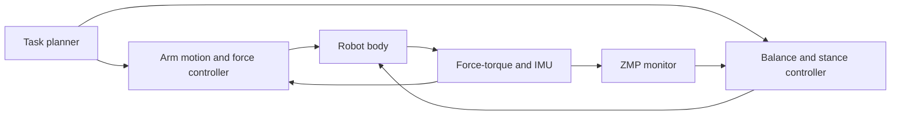

import Quiz from '@site/src/components/Educational/Quiz';

# Manipulation and Grasping

> **Status:** complete
>
> **Related chapters:** Builds on Chapter 9 — Kinematics and Dynamics and Chapter 10 — Motion Control; feeds into Chapter 15 — Imitation Learning and Chapter 16 — Vision-Language-Action Models.

## Why This Matters

Walking gets a humanoid to the table. **Manipulation** is what it does when it gets there: reaching, grasping, lifting, turning, inserting, handing over. It is the physical skill that makes robots useful in human environments — picking a part off a shelf, pouring a cup, plugging a cable, folding laundry. Locomotion without manipulation would leave a robot that can go anywhere but touch nothing.

Manipulation is also where the gap between digital and physical AI is sharpest. In a browser, "pick up the cup" is a sentence; in the real world it is a cascade of perception, grasp selection, motion planning, and contact-rich execution, all under uncertainty — the cup might be a different shape, heavier, slippery, or hidden behind another object. A human solves this without thinking; a robot needs the entire stack this chapter describes.

This chapter defines the manipulation problem, classifies grasps the way robotics engineers do, explains the contact mechanics that make a grasp stable (**force closure**), walks through the pick-and-place pipeline, introduces whole-body manipulation, and ends with the learning-based approaches — including vision-language-action models from Chapter 16 — that are driving the current wave of humanoid manipulation.

## Learning Objectives

After this chapter you will be able to:

- Define the manipulation problem and a grasp taxonomy.
- Explain force closure and why it matters for stable grasps.
- Compare scripted, model-based, and learned grasping.
- Describe whole-body vs. arm-only manipulation.

## Core Concepts

| Concept | Definition |
| ------- | ---------- |
| Grasp | A set of contacts on an object that together can hold it against gravity and disturbance. |
| Force closure | A grasp that can resist arbitrary external forces and moments through its contacts. |
| Form closure | A grasp that holds an object purely by geometry, with no friction required. |
| Friction cone | The set of forces a contact can transmit — tangential force limited by $\mu F_n$. |
| Antipodal grasp | Two opposite contacts whose normals point at each other along the same line. |
| Pre-grasp pose | The approach configuration the hand takes just before closing on the object. |
| Whole-body manipulation | Using legs, torso, and arms together to push, carry, or stabilize large objects. |

## Technical Explanation

### The manipulation problem

Manipulation is an interaction between a robot and an object, mediated by contacts. Formally, a manipulation task is: transform the object's pose from a start to a goal, possibly while applying forces (press, push, pour), using the robot's end-effector. The robot must decide *where to touch* (the grasp), *how to get there* (the motion plan), and *how hard to push* (the force control) — and do all of it despite perception noise and a world that pushes back.

It is useful to separate the problem into levels. **Task-level planning** decides what to do (pick up cup, place on tray). **Grasp-level planning** decides how to hold it. **Motion-level planning** decides how to move the arm and hand. **Contact-level control** decides how hard to push while holding. Real manipulation systems chain these levels together, each one feeding the next — and each one can be the reason a demo fails.

### Grasp types and hand anatomy

Not all grasps are the same, and the taxonomy matters because it tells the planner what the hand must do. The classic division:

- **Power grasps** — the whole hand wraps around the object; fingers and palm share the load. Maximal stability and force, minimal dexterity. Think of gripping a hammer.
- **Precision grasps** — the fingertips oppose each other with fine control; the palm is free. Less force, far more dexterity. Think of picking up a needle.
- **Intermediate grasps** — the hand holds the object with the fingers in a C-shape, using friction more than full wrapping. The workhorse of everyday manipulation: picking up a cup, a box, a phone.
- **Pinch and lateral** — two- or three-finger pinches, and the thumb-along-side lateral pinch used for thin flat objects like cards.

The mechanical design of a hand encodes which grasps it can even attempt. A parallel-jaw gripper can pinch and nothing else. An articulated hand with 12 to 16 joints and underactuated fingers (like the hands on Figure 02 or Unitree G1) can do all of the above but is much harder to control. This is the central trade of manipulation hardware: *dexterity costs control.*

### Force closure and grasp synthesis

A grasp must not just touch the object — it must *hold* it. The concept that captures this is **force closure**: a grasp is force-closed if, through its contact forces alone, it can resist any external force and moment applied to the object. Mathematically, the contact forces must be able to span the whole wrench space of the object — that is, the combined effect of all contacts must be able to balance gravity and any disturbance:

$$\sum_i \mathbf{f}_i + \mathbf{f}_{ext} = \mathbf{0}, \qquad \sum_i (\mathbf{r}_i \times \mathbf{f}_i) + \mathbf{m}_{ext} = \mathbf{0}$$

with each contact force $\mathbf{f}_i$ constrained to its **friction cone**:

$$\|\mathbf{f}_{t,i}\| \le \mu_i\, f_{n,i}$$

If the contacts can balance every external wrench while staying inside their friction cones, the grasp is force-closed. A weaker notion, **form closure**, requires only geometry: the contacts cage the object so no motion is possible even with zero friction — think of a cube wedged into a box corner.

The simplest force-closed grasp worth internalizing is the **antipodal grasp**: two contact points on opposite sides of the object, with normals pointing at each other along the same line. For a parallel-jaw gripper, this is the whole game — squeeze until the friction cones of the two contacts overlap, and the object is held. Grasp synthesis — picking which contacts to make — is often reduced to *find two opposite, nearly-aligned normals* on the object's surface, which is why so many learned grasp detectors output exactly that: a parallel-jaw center and approach direction.

### Trajectory generation and pick-and-place

The canonical manipulation task is **pick-and-place**, and its pipeline is worth memorizing because every fancier task is an extension:

1. **Perceive** — from an RGB-D camera, detect the object and estimate its 6-DoF pose (Chapter 7).
2. **Select a grasp** — synthesize a grasp on the estimated object, scoring candidate grasps by expected force closure.
3. **Plan the approach** — compute a collision-free trajectory from the current hand pose to a **pre-grasp pose**, then a straight-line approach along the grasp normal, then a close command.
4. **Execute and adapt** — close the hand, check force or contact feedback, lift, move, place. If the grasp is bad, regrasp.

Each step is a place where uncertainty enters: the pose estimate is noisy, the object may have moved, the grasp may slip under load. Robust systems close these loops with sensing — vision to re-localize, force-torque sensing to detect contact and slip — exactly the sensor fusion from Part II applied to the hand.

### Whole-body manipulation

Objects heavier than one arm can lift, or positioned awkwardly, require more than the arm. **Whole-body manipulation** coordinates the legs, torso, and arms so the robot can push, carry, brace, or lean. The walking and manipulation stacks meet here: the arms produce forces, and the legs must adjust the stance so the ZMP stays inside the support polygon *while* those forces act (Chapter 11). This is a genuinely harder problem than either walking or arm manipulation alone, because the arms' forces feed directly into the balance dynamics.

Think of a humanoid sliding a heavy crate: the arms push forward, the torso leans in, the hips and knees shift so the push doesn't tip the body backward, and the feet shuffle to stay under the center of mass. Modern whole-body controllers solve the combined dynamics — arm forces plus balance — in one optimization, with the contact forces and joint torques as variables.

### Learning-based grasping

The scripted and model-based approaches above assume a known object geometry. **Learning-based grasping** relaxes this: a neural network is trained — on synthetic or real data — to score candidate grasps directly from images, without an explicit object model. Given a camera image of a novel object, the network outputs a ranked set of grasp poses (position, orientation, gripper width), and the robot executes the highest-scoring one. This is how industrial arms pick arbitrary objects from bins, and it is the technology behind many current humanoid manipulation demos.

The newest wave adds language. **Vision-language-action (VLA) models** (Chapter 16) accept an image plus a natural-language instruction — "pick up the red mug" — and output action tokens that the robot executes. They are trained on internet-scale data plus robot demonstrations, and they blur the line between manipulation and the broader intelligence of the book. What does not blur is the physics underneath: even the smartest VLA must still produce a grasp that satisfies force closure, or the cup falls.

## Real-World Examples

:::info Real system
Figure 02 demonstrates bimanual manipulation of objects — assembling parts, loading and unloading — using learned manipulation policies running on its two 7-DoF arms with compliant torque control. The whole-body coordination is visible in the footage: the arms move while the legs rebalance underneath, so the torso stays upright as the payload shifts. That coordination is a whole-body controller solving arm forces and balance together, exactly the combined optimization described above.
:::

:::note Mini case study
The classic failure in pick-and-place is the **scoop-and-drop**: the robot picks up an object by the edge, the grasp is not force-closed, and the object slips mid-lift. The root cause is almost always a bad grasp candidate — the detector scored a marginal antipodal pair — combined with no slip feedback. The fix is a closed loop: a wrist force-torque sensor detects the slip signature and triggers a regrasp, while the grasp scorer is trained on force-closure-relevant features. Teams that instrument the gripper with force sensing convert intermittent drop rates into reliable operations.
:::

## Architecture Diagrams

### The pick-and-place pipeline


### Whole-body manipulation control



## Code Examples

### Antipodal grasp check with friction cones

```python
import numpy as np

def friction_cone_check(f_normal, f_tangential, mu):
    """Is the contact force inside the friction cone?"""
    return np.linalg.norm(f_tangential) <= mu * f_normal + 1e-9

def antipodal_grasp(gripper_dir, object_surface_normals):
    """Score a candidate grasp by how closely the surface normals
    oppose the gripper closing direction."""
    alignment = [abs(np.dot(n, gripper_dir)) for n in object_surface_normals]
    return np.mean(alignment)

def is_force_closed(grasp_contacts, mu):
    """Minimal force-closure check: contacts on both sides, each
    force inside its friction cone, and forces sum to zero."""
    if len(grasp_contacts) < 2:
        return False
    left  = [c for c in grasp_contacts if c["side"] == "left"]
    right = [c for c in grasp_contacts if c["side"] == "right"]
    if not left or not right:
        return False
    forces = []
    for c in grasp_contacts:
        f = np.array(c["force"])
        fn = np.dot(f, c["normal"])
        ft = f - fn * np.array(c["normal"])
        if not friction_cone_check(fn, ft, mu):
            return False
        forces.append(f)
    return np.allclose(np.sum(forces, axis=0), 0.0)

# Two antipodal contacts, each pushing 5 N inward
contacts = [
    {"side": "left",  "normal": [1.0, 0.0], "force": [ 5.0, 0.0]},
    {"side": "right", "normal": [-1.0, 0.0], "force": [-5.0, 0.0]},
]
print("force closed:", is_force_closed(contacts, mu=0.6))
print("antipodal score:", antipodal_grasp([1.0, 0.0], [[1.0, 0.0], [-1.0, 0.0]]))
```

**What each piece does:** `friction_cone_check` applies $\|\mathbf{f}_t\| \le \mu f_n$; `antipodal_grasp` scores a candidate by normal alignment; `is_force_closed` verifies the grasp can hold equilibrium with legal contact forces. Perturb one normal by 30 degrees and the score drops — that is the intuition behind grasp scoring.

:::tip Where this runs
Run this in plain Python. To see grasp synthesis at industrial scale, load a bin-picking example in Isaac Sim: the grasp scorer there ranks thousands of candidate contacts per object and outputs a ranked set for the robot to execute — the same force-closure logic, but learned from data.
:::

## Common Mistakes

| Mistake | Why it happens | How to avoid it |
| ------- | -------------- | --------------- |
| Confusing force closure with touching the object | A grasp "looks" fine so it is assumed stable | Always verify the contacts can balance the object's weight under friction limits |
| Ignoring friction in grasp analysis | The simplest grasp models are frictionless | Most practical grasps rely on friction; always keep the cone $\|\mathbf{f}_t\| \le \mu f_n$ |
| Grasping from a noisy pose directly | Perception error passes straight into the grasp | Add a pre-grasp approach, re-localize at close range, and verify contact with force sensing |
| Forgetting the balance cost of the arms | Arms move, torso tips, robot falls | Treat arm forces as inputs to the balance controller (whole-body), not as free variables |
| Treating grasp synthesis as one static problem | Objects are never exactly where the model thinks | Close the loop: detect slip, regrasp, and re-score with new observations |
| Skipping the pre-grasp pose | The hand collides or pushes the object before closing | Plan a straight-line approach along the grasp normal, then close |

## Summary

Manipulation is how a humanoid makes contact with the world usefully: perceiving an object, choosing where to touch it, planning a collision-free path, closing the hand with the right forces, and adapting when reality disagrees. The theory rests on contact mechanics — force closure, friction cones, antipodal grasps — while the practice rests on closing perception and force loops. Modern systems increasingly replace scripted grasps with learned ones, culminating in vision-language-action models that turn language instructions into manipulation, but the physics of force closure is the non-negotiable foundation under all of them. Whether the grasp is hand-written or learned, a robot that drops the cup has failed.

**Key takeaways**

- The manipulation problem is choosing contacts, planning motion, and controlling force under uncertainty.
- Power, precision, and intermediate grasps trade dexterity for stability — and hand hardware encodes which are possible.
- Force closure means the contacts can resist any external wrench within their friction cones; antipodal grasps are the simplest case.
- Pick-and-place is a closed loop: perceive, grasp, plan, execute, sense, adapt.
- Whole-body manipulation couples arm forces with balance — the arms feed the ZMP dynamics.
- Learned and VLA graspers replace object models with data, but still must satisfy force closure.

## Exercises

1. **Easy — Grasp classification.** For each of these objects, decide the appropriate grasp class (power, precision, intermediate, lateral) and explain why: a hammer, a sewing needle, a water bottle, a credit card.
2. **Medium — Force-closure check.** Using the code example, compute whether a three-contact grasp — two left, one right — is force-closed for a given set of forces, and find the minimum friction coefficient $\mu$ that makes it stable. *Hint: test the boundary of the friction cone.*
3. **Challenge — Learned bin picking.** In Isaac Lab, train a small grasping policy on a bin of cuboids and spheres, using a reward for lifting the object. Then perturb the friction coefficient between training and evaluation and measure the drop rate. Reflect on where force closure is doing the work and where the policy is compensating.

Check your understanding:

<Quiz
  question="Two contact points grasp an object with their normals pointing toward each other along the same line. This grasp is called ..."
  options={[
    'A power grasp',
    'An antipodal grasp',
    'A lateral pinch',
    'A whole-body grasp',
  ]}
  correctAnswerIndex={1}
/>

## Further Reading

- Matthew T. Mason, *Mechanics of Robotic Manipulation* (MIT Press, 2001) — the definitive treatment of contact mechanics and manipulation.
- Kevin Lynch and Frank Park, *Modern Robotics* (Cambridge University Press, 2017) — Chapter 12 covers grasping and manipulation. [modernrobotics.org](http://modernrobotics.org)
- Ian Lenz, Honglak Lee, Ashutosh Saxena, *Deep Learning for Detecting Robotic Grasps* (IJRR, 2015) — the foundational learned-grasp paper.
- Anthony Brohan et al., *RT-2: Vision-Language-Action Models Transfer Web Knowledge to Robotic Control* (2023) — how VLA models scale manipulation to open-vocabulary instructions. [robotics-transformer2.github.io](https://robotics-transformer2.github.io)
