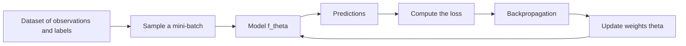
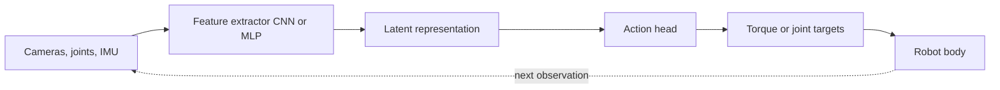

import Quiz from '@site/src/components/Educational/Quiz';

# Machine Learning for Robots

> **Status:** complete
>
> **Related chapters:** Builds on Chapter 3 — The Math Toolkit; feeds into Chapter 14 — Reinforcement Learning, Chapter 15 — Imitation Learning, and Chapter 16 — VLA Models.

## Why This Matters

A robot is not a website. Most machine learning you have seen runs on the
internet: billions of images and sentences, predictions read by a person, and
mistakes that cost fractions of a cent. A robot inverts all three assumptions.
Its data comes from a handful of physical hours — teleoperation, lab trials,
expensive sensors — not a bulk download. Its mistakes act on the world through
motors, so a wrong prediction can break a hand or knock the robot over. And its
predictions close a loop: the action a model takes changes the observations it
will see next.

That last point is the deepest difference: a web model sees independent
inputs, while a robot policy shapes its own future inputs, so a small error
today produces a state the model never trained on tomorrow. Every idea in this
chapter exists because of that loop.

## Learning Objectives

After this chapter you will be able to:

- Explain how robot ML differs from digital ML in data, feedback, and embodiment.
- Choose a neural-network architecture for a perception or action task.
- Curate and label robotic datasets responsibly.
- Evaluate a model with the sim-to-real gap in mind.

## Core Concepts

| Concept | Definition |
| ------- | ---------- |
| Supervised learning | Learning a mapping from inputs to outputs from labeled examples. |
| Loss function | A number that measures how wrong a model's prediction is. |
| Policy | A model that maps observations to actions. |
| MLP | A stack of fully connected layers and nonlinearities. |
| CNN | A network that slides learned filters over images. |
| Transformer | A network that attends to relationships between all input tokens. |
| Sim-to-real gap | The performance drop when a model trained in simulation meets reality. |
| Dataset curation | Selecting, cleaning, labeling, and balancing data for training. |
| Self-supervised learning | Learning representations from the data itself, without labels. |

## Technical Explanation

### How ML meets robotics (and where it differs from digital ML)

Digital ML and robot ML share the same mathematics but not the same physics.
Three differences matter more than any network detail:

- **Data is scarce and expensive.** A language model trains on terabytes of text
  that already exist; a manipulation policy trains on hours of teleoperation
  someone physically recorded, one grasp at a time.
- **Feedback is closed-loop.** In a web app, inputs arrive independent of your
  model's outputs; on a robot, the action moves the robot and changes the next
  camera frame.
- **Errors have bodies.** A mislabeled image costs a retrain; a wrong torque
  command costs a broken joint or a fallen robot.

### Supervised learning: data, labels, and models

Supervised learning is the workhorse. You have input–output pairs
$(x_i, y_i)$ — say, joint positions and the torques an expert applied — and you
fit a model $f_\theta$ so that $f_\theta(x) \approx y$. A **loss function**
measures how wrong the prediction is. For continuous outputs like torques, the
mean squared error is the default:

$$J(\theta) = \frac{1}{N}\sum_{i=1}^{N} \left( \hat{y}_i - y_i \right)^2$$

For classification — is this object a mug? — we use **cross-entropy**, which
compares a predicted probability distribution to the one-hot label:

$$J = -\sum_{c=1}^{C} y_c \log \hat{y}_c$$

Both are minimized with the gradient descent loop from Chapter 3,
$\theta \leftarrow \theta - \alpha \nabla_\theta J(\theta)$: `loss.backward()`
computes the gradient and `optimizer.step()` performs the update. Your job is
the part the framework cannot do — choosing the model, data, and metric.

### Key architectures: MLPs, CNNs, transformers

Three architectures cover nearly every robot model in this book. **MLPs** take a
fixed-length vector and push it through hidden layers — perfect for compact
state like joint angles and forces. **CNNs** slide learned filters across an
image, sharing weights across spatial positions, which makes them the default
for camera inputs. **Transformers** use attention to relate every token to every
other, capturing long-range context; they power vision-language-action models
(Chapter 16) but need data and compute that small projects rarely have.

| Architecture | Best at | Typical robot use |
| ------------ | ------- | ----------------- |
| MLP | Fixed-length tabular state | Joint state to torque; contact-force prediction |
| CNN | Spatially structured images | Grasp detection, segmentation, depth from camera |
| Transformer | Sequences and long-range context | Language-conditioned manipulation, scene reasoning |

The practical rule: start with the simplest architecture that fits the input
shape, then grow only when the data justifies it.

### From perception models to action models

Perception models answer *what is out there*: a bounding box, a depth map, a
class label. Action models answer *what should I do*: a torque, a joint target,
an end-effector velocity. The step between them is the **policy**,
$\pi_\theta(o) \rightarrow a$, which maps an observation to an action. A policy
runs in a **closed loop**: the action moves the robot, and the next observation
depends on that command — which is why a policy trained to imitate one
trajectory can still fail in the real world (Chapter 15).

### Datasets and real-world data curation

On a robot, the dataset is the task. A model trained on a hundred pick attempts
all starting from the same shelf position generalizes to nothing else.
Responsible curation means:

- **Coverage** — collect data across the states the robot will actually see.
- **Balance** — if 90% of demonstrations grasp mugs, the model optimizes for
  mugs; rebalance the task distribution.
- **Cleaning** — remove failed or mislabeled demonstrations; a few poisoned
  labels quietly drag down the whole model.
- **Splitting by trajectory** — adjacent frames of one video are nearly
  identical, so if they leak into train and validation your metrics lie. Hold
  out entire trajectories, not random frames.

Because real data is slow to collect, most teams start in simulation and treat
real teleoperation data as the precious final layer (Chapter 21).

### Evaluation and the sim-to-real gap

In digital ML you split data, train, and report a test score. On a robot you
must also ask: *will it work on the actual robot?* The **sim-to-real gap** is
the performance drop when the simulation you trained in does not match reality —
different friction, noisier cameras, actuators that sag under load.

Evaluation has two halves: offline metrics (loss, success rate on held-out
trajectories) and online validation (running the policy on a real robot or a
photoreal render). A model can score 99% in simulation and fail in the lab
because simulation rewards behavior robust to the physics you modeled, not the
physics you did not.

### Unsupervised and self-supervised methods

Labels are the bottleneck on robots, so researchers mine them out of the data
itself. **Self-supervised learning** creates a pretext task from unlabeled
data — predict the masked patch of an image, match two augmented views of the
same scene — and uses it to pretrain a feature extractor that transfers to
downstream tasks with far fewer labels. A vision backbone pretrained on raw
robot video can later be fine-tuned for grasp detection with a fraction of the
labeled data.

## Real-World Examples

:::info Real system
Figure's robots trialed in BMW factories detect, grasp, and place automotive
parts using learned vision policies. The models must hold up across changing
lighting, part positions, and jig geometry — exactly the robustness that raw
simulation success never measures. Production robotics is won or lost on the
gap between the training distribution and the factory floor.
:::

:::note Mini case study
A lab trains a grasp-detection CNN on synthetic renders: 90% accuracy in
simulation, 60% on the real bench.
- The synthetic textures and lighting were too clean for the lab's cameras.
- The team added domain randomization: random textures, lighting, camera noise.
- Retrained, the model recovered to 82% on the real bench.
- Lesson: evaluate early against the real world, not just the simulator's metric.
:::

## Architecture Diagrams

### The supervised training loop



This is the loop every training script in this book runs.

### From raw sensors to action on a humanoid



The loop on the right is why Chapter 15 talks about distribution shift: the
action changes the body, and the body changes the next observation.

## Code Examples

### A supervised policy in PyTorch

```python
import torch
import torch.nn as nn

class JointPolicy(nn.Module):
    def __init__(self, in_dim=12, hidden=128, out_dim=6):
        super().__init__()
        self.net = nn.Sequential(
            nn.Linear(in_dim, hidden), nn.ReLU(),
            nn.Linear(hidden, hidden), nn.ReLU(),
            nn.Linear(hidden, out_dim),
        )

    def forward(self, state):
        return self.net(state)      # commanded torques

model = JointPolicy()
opt = torch.optim.Adam(model.parameters(), lr=1e-3)
loss_fn = nn.MSELoss()

# state: joint angles and velocities; target: expert torques
for epoch in range(200):
    state = torch.randn(32, 12)     # 32 simulated samples
    torque = torch.randn(32, 6)     # labels from teleoperation or a controller
    loss = loss_fn(model(state), torque)
    opt.zero_grad()
    loss.backward()
    opt.step()
print("final loss:", loss.item())
```

`MSELoss` implements $J(\theta)$; `loss.backward()` computes the gradient and
`opt.step()` performs $\theta \leftarrow \theta - \alpha \nabla J$.

### Splitting demonstrations without leaking data

```python
import numpy as np

def split_by_trajectory(demos, val_fraction=0.2):
    """Hold out whole trajectories, never random frames."""
    n = len(demos)
    split = int(n * val_fraction)
    return demos[split:], demos[:split]

def to_pairs(demos):
    """Flatten (observation, action) pairs from a list of trajectories."""
    X, Y = [], []
    for traj in demos:
        for obs, action in zip(traj["observations"], traj["actions"]):
            X.append(obs)
            Y.append(action)
    return np.array(X), np.array(Y)
```

`split_by_trajectory` keeps adjacent frames together so validation measures
generalization to new runs; `to_pairs` turns episodes into the $(x_i, y_i)$
pairs supervised learning needs.

:::tip Where this runs
Any Python environment with PyTorch. Swap the random tensors for real
teleoperation logs and the loop is identical to what trains policies in Isaac
Lab and MuJoCo-based stacks later in the book.
:::

## Common Mistakes

| Mistake | Why it happens | How to avoid it |
| ------- | -------------- | --------------- |
| Training on simulation and deploying without checking reality | Simulation is cheap and easy to scale | Always validate on real or photoreal data before trusting offline metrics |
| Treating robot data as independent samples | Digital ML assumes i.i.d. inputs | Remember the closed loop; diversify states and split by trajectory, not frame |
| Reaching for a transformer on a small dataset | Bigger models feel better | Start with an MLP or CNN; a small model on good data beats a huge model on none |
| Reporting only average success | Averages hide rare failures | Track per-task success, failure modes, and edge cases separately |
| Using labels from failed demonstrations | It is fast to record everything | Clean the data; a few poisoned labels quietly corrupt the model |

## Summary

Robot ML reuses the supervised learning of digital ML but changes its physics:
data is scarce, feedback is closed-loop, and errors are physical. Choosing the
right architecture — MLP for state, CNN for images, transformer for long-range
context — matters less than the data you feed it, and every model must be
evaluated against the sim-to-real gap before it earns the right to drive a
body.

**Key takeaways**

- Robot data is scarce and expensive; the dataset is the task.
- A policy is a closed-loop model: its actions shape its future inputs.
- Start simple: MLP for tabular state, CNN for images, transformers only when data justifies them.
- Split by trajectory, clean failures, and balance task coverage.
- Always measure the sim-to-real gap — offline metrics lie about the real world.

## Exercises

1. **Easy — Plot a loss curve.** Train the `JointPolicy` above on the random
   data and plot training loss per epoch. Then raise the learning rate to
   `1e-1` and observe what happens.
2. **Medium — Choose an architecture.** For each of three tasks — detecting a
   fallen object from a head camera, predicting ankle torque from joint state,
   and selecting a tool given a verbal command plus an image — pick an
   architecture and justify it. *Hint: re-read "Key architectures."*
3. **Challenge — Curate a mini dataset.** Record or simulate 20 pick-and-place
   trajectories, then build a train/validation split by trajectory, audit class
   balance, remove two deliberately bad demos, and show how each curation step
   changes validation accuracy.

Check your understanding:

<Quiz
  question="What best describes the sim-to-real gap?"
  options={[
    'The difference between a simulator physics and the real worlds physics',
    'The distance a robot can travel on one battery charge',
    'The lag between a camera frame and the robot reaction',
    'The difference between training loss and validation loss',
  ]}
  correctAnswerIndex={0}
/>

## Further Reading

- Andrej Karpathy, *Neural Networks: Zero to Hero* (video course) — builds a
  network and backpropagation from scratch. [karpathy.ai/zero-to-hero](https://karpathy.ai/zero-to-hero.html)
- Ian Goodfellow et al., *Deep Learning* (MIT Press, 2016) — the standard
  reference for supervised learning and architectures. [deeplearningbook.org](https://www.deeplearningbook.org/)
- Sergey Levine, *Robot Learning* lecture videos — how ML is adapted to
  physical systems. [rail.eecs.berkeley.edu](https://rail.eecs.berkeley.edu/)
