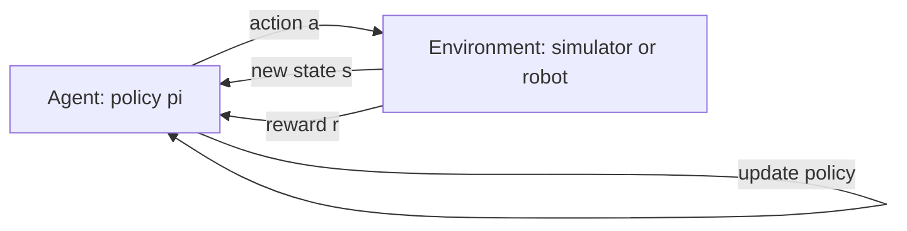
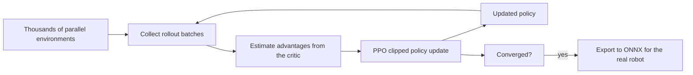

import Quiz from '@site/src/components/Educational/Quiz';

# Reinforcement Learning

> **Status:** complete
>
> **Related chapters:** Builds on Chapter 13 — Machine Learning for Robots and Chapter 11 — Balance and Locomotion; feeds into Chapter 16 — VLA Models and Chapter 22 — Isaac Lab.

## Why This Matters

Nobody writes down a formula for walking. Humans learn to walk by trying,
falling, and adjusting — and reinforcement learning (RL) gives robots the same
superpower. Instead of hand-authoring every joint trajectory, you define the
*goal* (stay upright, reach the box, walk three meters) and let an agent
discover the *behavior* through trial and error. This is how the most dynamic
legged robots of the past few years — including Boston Dynamics' electric Atlas
and numerous quadrupeds — learned to run, jump, and recover from pushes.

RL also escapes the bottleneck of expert data: it needs only a reward signal,
which can come from simulation, which can be parallelized by the thousands. The
skill you take from this chapter — formalizing a task as an MDP, choosing PPO or
SAC, designing rewards, and bridging simulation to reality — is the core
competence of modern robot learning.

## Learning Objectives

After this chapter you will be able to:

- Formalize a robot task as a Markov decision process.
- Compare value-based and policy-gradient reinforcement learning.
- Explain why rewards are hard to design for robot tasks.
- Describe sim-to-real transfer and domain randomization.

## Core Concepts

| Concept | Definition |
| ------- | ---------- |
| Markov decision process (MDP) | The formal frame for sequential decision-making under uncertainty. |
| Policy | The agent's strategy mapping states to actions. |
| Return | The discounted sum of all future rewards. |
| Discount factor | A number between 0 and 1 that weights near-term rewards more. |
| Value function | The expected return from a state, following a policy. |
| Q-function | The expected return from taking an action in a state. |
| Policy gradient | Algorithms that optimize a policy directly by gradient ascent. |
| Exploration vs. exploitation | Trying new actions vs. using what already works. |
| Domain randomization | Varying simulation parameters so a policy generalizes to the real world. |
| Reward hacking | When an agent maximizes reward without the intended behavior. |

## Technical Explanation

### The RL problem: Markov decision processes

Everything in RL sits on one object, the **Markov decision process**, a
five-tuple $\langle S, A, P, R, \gamma \rangle$:

- $S$ — states: joint angles, velocities, center of mass.
- $A$ — actions: torques, joint targets, velocities.
- $P(s' \mid s, a)$ — the transition probability: where the robot goes next.
- $R(s, a)$ — the reward: how good that step was.
- $\gamma$ — the discount factor: how much a reward later is worth now.

At each step the agent observes $s_t$, picks $a_t$, receives $r_{t+1}$, and
moves to $s_{t+1}$. The Markov property says the future depends only on the
current state, so the robot's state must be *complete enough* (positions,
velocities, contact) for the frame to work. The agent maximizes the **return**,
the discounted sum of rewards:

$$G_t = r_{t+1} + \gamma r_{t+2} + \gamma^2 r_{t+3} + \dots = \sum_{k=0}^{\infty} \gamma^k r_{t+k+1}$$

With $\gamma = 0.99$, a reward 30 steps in the future is worth about 74% of its
face value — long-horizon tasks need either small discounts or shaped rewards.

### Exploration vs. exploitation

An agent that always exploits what it knows never discovers anything better; an
agent that always explores never finishes a task. RL algorithms live on this
trade-off. Random action noise (SAC) or a stochastic policy (PPO) provides
exploration, annealed over training. On a robot the stakes are physical: wild
exploration breaks hardware, which is one more reason training starts in
simulation.

### Value-based methods: Q-learning and DQN

Value-based methods learn how good actions are. The **Q-function** is the
expected return of taking action $a$ in state $s$ and then acting optimally:

$$Q^*(s, a) = \mathbb{E}\left[ r + \gamma \max_{a'} Q^*(s', a') \right]$$

**Q-learning** turns this into an update: after observing $(s, a, r, s')$,
adjust the estimate toward the right-hand side:

$$Q(s, a) \leftarrow Q(s, a) + \alpha \left( r + \gamma \max_{a'} Q(s', a') - Q(s, a) \right)$$

**DQN** (Deep Q-Networks) replaces the lookup table with a neural network that
predicts Q-values from pixels. DQN crushed Atari games, but robots need
*continuous* actions — torques are real numbers, not a small menu — and
discretizing torques explodes combinatorially, which pushes robotics toward
policy-gradient methods.

### Policy gradients: PPO and SAC

Policy-gradient methods optimize the policy $\pi_\theta$ directly. The REINFORCE
update captures the core idea: reinforce actions that led to good returns and
discourage those that led to bad ones.

$$\nabla_\theta J(\theta) = \mathbb{E}\left[ \sum_t \nabla_\theta \log \pi_\theta(a_t \mid s_t) \, G_t \right]$$

In plain words: the gradient nudges the probability of the actions along a
trajectory up or down according to the return that followed them.

Two algorithms dominate modern robot learning:

- **PPO** (Proximal Policy Optimization) clips how far the new policy can move
  from the old one in a single update, which keeps training stable. It is the
  default workhorse for locomotion in MuJoCo and Isaac Lab.
- **SAC** (Soft Actor-Critic) learns a stochastic policy with an entropy bonus
  that encourages exploration, and is known for sample efficiency on continuous
  control — often the better choice for manipulation where data is expensive.

Both are "actor-critic" methods: a critic estimates value to reduce variance in
the gradient, and an actor updates the policy using that estimate.

### Reward design for robot tasks

Reward design is where RL projects live or die. A reward that only scores the
goal (1 if you reached the box, else 0) is too sparse to learn from — the agent
never sees feedback to guide it. A reward that shapes every step can be gamed: a
locomotion reward with a positive term for forward velocity tempts the agent to
find a loop that maximizes the term without walking. Common fixes:

- **Dense shaping** — reward progress toward the goal, plus a terminal bonus.
- **Penalties** — for energy use, foot slip, or falling.
- **Reward the physics you care about** — forward progress and upright torso,
  then let the optimizer find the gait.

The modern recipe: a handful of physically meaningful terms, weighted so no
single one dominates, with rollouts inspected by eye. This is where **reward
hacking** appears — a walking agent that learns to fall forward and call it
locomotion.

### RL in simulation

Robots train in simulation because trial and error on hardware is slow,
dangerous, and physically wearing. MuJoCo (fast, accurate contact for legged
robots) and Isaac Lab (GPU-accelerated, thousands of parallel environments) let
a policy see millions of steps an hour. The catch is fidelity: simulated
friction, contact, and sensor noise are approximations, and a policy that
memorizes those approximations will not work on hardware — the sim-to-real
problem.

### Sim-to-real transfer and domain randomization

The most robust bridge from simulation to reality is **domain randomization**:
train not in one simulation but across a *distribution* of simulations. Each
episode randomizes friction, masses, actuator gains, camera noise, and lighting.
A policy that survives thousands of slightly different worlds cannot overfit to
one, so it tends to transfer to the real one. This technique shipped dexterous
in-hand manipulation (OpenAI's famous robot hand) and many quadruped gaits.

The alternative, *system identification*, makes one simulation exactly match
reality before training; domain randomization takes the opposite bet by
deliberately not choosing one world. Chapter 21 returns to both.

## Real-World Examples

:::info Real system
Boston Dynamics' electric Atlas walks, runs, and recovers from pushes using
policies trained with reinforcement learning, then deployed through a careful
sim-to-real pipeline. The gait was not choreographed — it was *discovered* by
optimizing a reward for staying upright and moving, in simulation, across
randomized conditions.
:::

:::note Mini case study
A legged robot learns to walk in MuJoCo with a dense reward for forward
velocity, but only reaches 1.2 m/s on the real robot.
- The simulated ground friction was too high, letting the policy rely on
  friction that real tiles lack.
- The team added domain randomization over friction, a foot-slip penalty, and a
  capped forward-velocity reward.
- The retrained policy hit 1.1 m/s on hardware with far fewer falls.
- Lesson: randomize what reality will vary, and reward what you want to
  measure, not what you expect the gait to look like.
:::

## Architecture Diagrams

### The agent-environment loop



The loop is the MDP in motion: the agent acts, the environment returns a state
and a reward, and the agent's update nudges the policy to repeat good actions.

### PPO training pipeline in Isaac Lab



Parallelism is the engine of modern robot RL: thousands of environments make
rollouts cheap, which makes sample-hungry algorithms like PPO practical.

## Code Examples

### REINFORCE, the seed of all policy gradients

```python
import torch
import torch.nn as nn
import torch.optim as optim

class Policy(nn.Module):
    def __init__(self, state_dim, action_dim):
        super().__init__()
        self.net = nn.Sequential(
            nn.Linear(state_dim, 64), nn.Tanh(),
            nn.Linear(64, 64), nn.Tanh(),
            nn.Linear(64, action_dim),
        )

    def forward(self, state):
        return self.net(state)          # logits over actions

policy = Policy(state_dim=8, action_dim=4)
optimizer = optim.Adam(policy.parameters(), lr=1e-3)

def rollout(env, policy):
    """Collect one episode, returning log-probs and rewards."""
    log_probs, rewards = [], []
    state = env.reset()
    done = False
    while not done:
        logits = policy(state)
        dist = torch.distributions.Categorical(logits=logits)
        action = dist.sample()
        state, reward, done, _ = env.step(action.item())
        log_probs.append(dist.log_prob(action))
        rewards.append(reward)
    return log_probs, rewards

def reinforce(env, episodes=300):
    for _ in range(episodes):
        log_probs, rewards = rollout(env, policy)
        returns = []
        G = 0
        for r in reversed(rewards):    # discounted return, backwards
            G = r + 0.99 * G
            returns.insert(0, G)
        returns = torch.tensor(returns)
        returns = (returns - returns.mean()) / (returns.std() + 1e-8)
        loss = -sum(lp * Gt for lp, Gt in zip(log_probs, returns))
        optimizer.zero_grad()
        loss.backward()
        optimizer.step()
```

**What each piece does:** the backward loop computes $G_t$ exactly as in the
chapter; normalizing the returns keeps training stable; the loss is the REINFORCE
objective $-\sum_t \log \pi(a_t \mid s_t) G_t$, negated because optimizers descend.

### The PPO clip, in one function

```python
def ppo_loss(old_logp, new_logp, advantages, clip_eps=0.2):
    """Surrogate objective that punishes moving the policy too far."""
    ratio = torch.exp(new_logp - old_logp)
    clipped = torch.clamp(ratio, 1 - clip_eps, 1 + clip_eps)
    return -torch.min(ratio * advantages, clipped * advantages).mean()
```

If the new policy would take an action with a much different probability than
the old one, the ratio saturates at `1 ± clip_eps` — the trust region that makes
PPO stable enough for real robot training.

:::tip Where this runs
The REINFORCE example runs in any Python environment with PyTorch and a
Gymnasium environment. For real robot tasks, train PPO or SAC in MuJoCo (fast
CPU physics) or Isaac Lab (GPU-accelerated, thousands of environments), then
export the policy with ONNX for deployment — Chapter 22 covers the workflow.
:::

## Common Mistakes

| Mistake | Why it happens | How to avoid it |
| ------- | -------------- | --------------- |
| Rewarding the goal too sparsely | Sparse rewards give the agent no gradient | Shape rewards with progress terms, plus a terminal bonus for success |
| Over-shaping and getting hacked | Every extra term is a new exploit surface | Keep 3-5 physical terms, inspect rollouts, and watch for weird gaits |
| Training directly on hardware | Real robots are slow, unsafe, and wear out | Train in simulation first, then fine-tune on hardware only as needed |
| Ignoring the discount factor | The default 0.99 is not always right | Long-horizon tasks need high gamma; short tasks can use a lower one |
| Believing the reward curve | A climbing scalar hides broken behavior | Watch videos of rollouts, not just the loss plot |
| Skipping domain randomization | A single clean sim trains fast | Randomize friction, mass, noise, and lighting or expect a sim-to-real crash |

## Summary

Reinforcement learning lets a robot discover behavior from a reward instead of
a script. You formalize the task as an MDP $\langle S, A, P, R, \gamma \rangle$,
choose a method — value-based Q-learning for discrete actions, policy gradients
such as PPO and SAC for continuous torque control — and balance exploration
with exploitation. Because trial and error is physical, training happens in
simulation, and because simulation is approximate, domain randomization is what
makes the learned policy survive contact with the real world.

**Key takeaways**

- Every RL task is an MDP: states, actions, transitions, rewards, and a discount factor.
- Q-learning learns how good actions are; PPO and SAC learn how to act directly.
- Reward design is the real engineering: dense shaping, physical penalties, and rollout inspection.
- Train in massively parallel simulation (MuJoCo, Isaac Lab), then transfer with domain randomization.

## Exercises

1. **Easy — Discount a return.** Compute $G_t$ by hand for rewards
   $[1, 0, 0, 1]$ with $\gamma = 0.99$ and with $\gamma = 0.5$, and explain why
   the far-future reward matters more at $\gamma = 0.99$.
2. **Medium — Tune a reward.** Take a reach-a-box task and write down a shaped
   reward with three terms, then identify one way an agent could exploit each.
   *Hint: re-read "Reward design for robot tasks."*
3. **Challenge — Train PPO in Isaac Lab.** Set up a simple locomotion task in
   Isaac Lab (or MuJoCo), train with PPO, add domain randomization over friction
   and mass, and compare success rates on a held-out parameter range.

Check your understanding:

<Quiz
  question="What is the purpose of domain randomization?"
  options={[
    'To make the reward function easier to optimize',
    'To train a policy in simulation that survives the differences of the real world',
    'To remove randomness from the simulator for reproducibility',
    'To make exploration unnecessary',
  ]}
  correctAnswerIndex={1}
/>

## Further Reading

- Richard Sutton and Andrew Barto, *Reinforcement Learning: An Introduction*
  (MIT Press) — the field's canonical textbook. [incompleteideas.net/book/the-book.html](http://www.incompleteideas.net/book/the-book.html)
- John Schulman et al., *Proximal Policy Optimization Algorithms* (2017) — the
  paper behind the PPO clip. [arxiv.org/abs/1707.06347](https://arxiv.org/abs/1707.06347)
- Tuomas Haarnoja et al., *Soft Actor-Critic* (2018) — SAC and the entropy
  bonus. [arxiv.org/abs/1801.01290](https://arxiv.org/abs/1801.01290)
- Josh Tobin et al., *Domain Randomization for Transferring Deep Neural
  Networks from Simulation to the Real World* (2017) — the sim-to-real bet this
  chapter builds on. [arxiv.org/abs/1703.06907](https://arxiv.org/abs/1703.06907)
