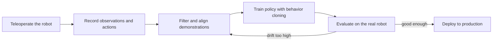
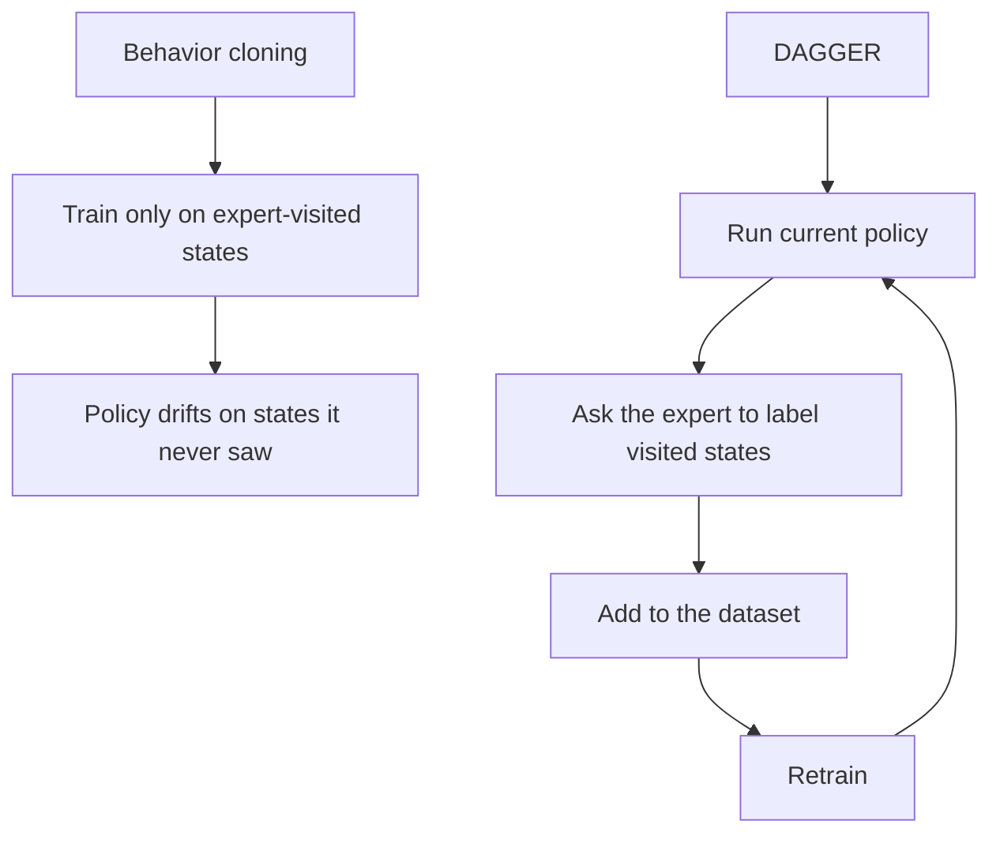

import Quiz from '@site/src/components/Educational/Quiz';

# Imitation Learning

> **Status:** complete
>
> **Related chapters:** Builds on Chapter 13 — Machine Learning for Robots; feeds into Chapter 16 — VLA Models and Chapter 22 — Isaac Lab.

## Why This Matters

Reward design is hard. Reinforcement learning works beautifully when you can
write down a reward for a walk, a run, or a reach — but many human tasks are
easy to *do* and brutal to *specify*. How do you reward "tie this shoelace" or
"assemble this connector with just the right force"? Nobody writes that reward.
Instead, you show a robot the task being done: a human teleoperates the robot
through a few hundred demonstrations, and the robot learns to imitate.

That is imitation learning — and it is how the current wave of humanoids learns
most of its manipulation skills. Where RL needs a reward function, imitation
needs a human expert; where RL explores randomly, imitation copies. It is also
the fastest way to put a skill on a robot this week. This chapter covers the
full arc: how to collect demonstrations, the core method (behavior cloning), why
it fails on long tasks, how interactive methods like DAGGER fix it, and the
diffusion policies that now power the state of the art.

## Learning Objectives

After this chapter you will be able to:

- Explain behavior cloning and its failure modes.
- Compare behavior cloning, DAGGER, and offline RL.
- Describe diffusion policies at a high level.
- Design a data-collection pipeline for imitation learning.

## Core Concepts

| Concept | Definition |
| ------- | ---------- |
| Demonstration | A recorded trajectory of observations and expert actions. |
| Teleoperation | A human controlling the robot to record demonstrations. |
| Behavior cloning | Supervised learning of an observation-to-action mapping from demonstrations. |
| Covariate shift | The drift between training-state distribution and deployed-state distribution. |
| DAGGER | An interactive method that queries the expert on states the learner visits. |
| Diffusion policy | A policy that generates actions by iteratively denoising random noise. |
| Offline RL | Learning a policy from a fixed dataset without further interaction. |
| Distribution shift | When a model must act on inputs unlike those it trained on. |
| Action chunking | Predicting a sequence of actions, not just the next one. |

## Technical Explanation

### Learning from demonstration: why it matters

Some skills are better shown than specified. Imitation learning treats the
expert as an oracle: collect data by demonstrating the skill, then learn
$\pi_\theta(o) \rightarrow a$ from observation-action pairs — exactly the
supervised setting of Chapter 13. The difference is what the labels *are*:
instead of object classes, the labels are the expert's joint targets, torques,
or end-effector velocities.

The trade-off against RL is fundamental. Imitation needs a human in the loop to
generate data, which is slow and expensive. RL needs only a reward, but the
reward must be written — which, for dexterous manipulation, is often harder than
the task itself. The two are not rivals; many modern systems pre-train with
imitation and then fine-tune with RL.

### Teleoperation and data collection

Before the model comes the pipeline. Teleoperation is the act of a human
controlling the robot to record demonstrations, and its fidelity decides the
ceiling of everything after. Common approaches:

- **Direct joint control** — the operator moves each joint; precise but slow.
- **Kinesthetic teaching** — the operator physically drags the arm; intuitive,
  but hard for whole-body poses and hard to combine with cameras.
- **Leader-follower rigs** — the operator drives a mirrored arm (like ALOHA)
  and the robot copies it; the standard for bimanual tasks.
- **VR / exoskeleton teleoperation** — the operator's motion is captured and
  mapped to the robot; natural for whole-body and humanoid data.

The golden rule: *record what the policy will see at deployment*. If the robot
will use a wrist camera, record from that camera; if the arms lag slightly,
include that lag. Every mismatch between the data pipeline and deployment is a
tax paid at evaluation time.

### Behavior cloning and its failure modes

**Behavior cloning** is the naive and remarkably effective baseline: collect
demonstrations, form pairs $(o_t, a_t)$, and train a network with supervised
learning:

$$J(\theta) = \frac{1}{N} \sum_{i=1}^{N} \left\| \pi_\theta(o_i) - a_i \right\|^2$$

It works for short, well-covered tasks — and fails for long ones. The failure
mode has a name: **covariate shift**. During training, the model always sees
states the expert actually visited. During deployment, the model's own errors
take it to states the expert never visited, and the model must act without
training there. Each mistake compounds, so errors grow along the trajectory —
small drift early, total divergence later. Think of a driver who learned only
from perfect highway footage: the first time the car drifts, no demonstration
exists for what to do next.

Behavior cloning also inherits the data problems of Chapter 13 — the dataset is
the task — plus one more: hundreds of clean demos starting from the same pose
teach nothing about recovery.

### DAGGER and interactive imitation

**DAGGER** (Dataset Aggregation) attacks covariate shift at its source: instead
of only training on expert-visited states, it trains on the states the
*learner* visits. The loop is simple:

1. Run the current policy to collect a roll-out.
2. Ask the expert what action to take in each visited state.
3. Add those (state, expert-action) pairs to the dataset.
4. Retrain and repeat.

The result is a dataset that covers the states the policy actually drifts into,
so the policy learns corrections rather than only the happy path. DAGGER is
interactive — it needs the expert available during training — which makes it
expensive on hardware but dramatically more robust than static behavior cloning.

### Diffusion policies and modern architectures

Modern manipulation policies have largely moved beyond predicting a single
next action. **Diffusion policies** reframe action generation as a denoising
problem. A diffusion model learns to reverse a process that gradually corrupts
a target action with noise:

$$\mathcal{L} = \mathbb{E}\left[ \left\| \epsilon - \epsilon_\theta(\mathbf{a}_k, k) \right\|^2 \right]$$

where $\epsilon$ is the noise added to the action and $\epsilon_\theta$ is a
network trained to predict it, conditioned on the observation and the noise
level $k$. At deployment, the policy starts from pure noise and iteratively
denoises into an action — or better, a **chunk** of actions covering the next
0.5–2 seconds.

Why does this help? First, it produces **multimodal** behavior: when several
ways to grasp a mug are equally good, a diffusion policy represents all of them
as modes of a distribution, while a mean-squared-error cloner averages them
into a mushy trajectory. Second, predicting a chunk of actions rather than one
is smoother and more robust to the noise of real teleoperation data.

### Building a robot data pipeline

A production imitation pipeline has six stages, and each is a place data
quality is won or lost:

1. **Capture** — teleoperate with the deployment sensors and control rate.
2. **Filter** — drop failed or jittery demonstrations; keep the behavior you
   want to clone.
3. **Align** — synchronize cameras, joint state, and action labels in time.
4. **Augment** — add small perturbations and re-label with a simulator or a
   learned labeler.
5. **Balance** — make sure rare but critical cases (recovery, edge poses) are
   represented.
6. **Version** — log the sensor setup, robot model, and policy version with the
   data, because you will retrain on it for years.

The best teams treat this pipeline as a product: it is often more valuable than
the model it feeds.

## Real-World Examples

:::info Real system
The ALOHA system from Stanford demonstrated bimanual dexterity — tying
shoelaces, hanging T-shirts — using teleoperated demonstrations and action
chunking with transformers. The takeaway: a modest robot arm plus a strong
imitation pipeline can perform manipulation that was previously the province of
hand-programmed dexterity.
:::

:::note Mini case study
A team behavior-clones a pick-and-place policy from 200 teleoperated
demonstrations. It succeeds 90% of the time when objects start in the
demonstrated pose — and 20% when objects start slightly rotated.
- The demonstrations covered a narrow range of object poses, so the policy
  drifted on unseen orientations.
- The team added edge-pose demonstrations and a small correction dataset from a
  DAGGER-style loop.
- Success on the rotated poses rose to 75%.
- Lesson: covariate shift is defeated by covering the states the policy will
  actually visit, not by collecting more of the same.
:::

## Architecture Diagrams

### From teleoperation to a deployed policy



The feedback arrow is the whole story of imitation learning: evaluation drives
more, better-targeted data collection.

### Behavior cloning vs. DAGGER



Behavior cloning trains once on one distribution; DAGGER keeps pulling the
training distribution toward the states the learner really visits.

## Code Examples

### Behavior cloning in PyTorch

```python
import torch
import torch.nn as nn

class BehaviorCloner(nn.Module):
    def __init__(self, obs_dim, act_dim, hidden=256):
        super().__init__()
        self.net = nn.Sequential(
            nn.Linear(obs_dim, hidden), nn.ReLU(),
            nn.Linear(hidden, hidden), nn.ReLU(),
            nn.Linear(hidden, act_dim),
        )

    def forward(self, obs):
        return self.net(obs)            # joint targets, like the expert's

model = BehaviorCloner(obs_dim=23, act_dim=23)   # a 23-joint humanoid arm
opt = torch.optim.Adam(model.parameters(), lr=1e-3)

for epoch in range(200):
    for obs, action in teleop_loader:            # pairs from demonstrations
        pred = model(obs)
        loss = nn.functional.mse_loss(pred, action)
        opt.zero_grad()
        loss.backward()
        opt.step()
```

**What each piece does:** `teleop_loader` serves the $(o_t, a_t)$ pairs from the
recorded demonstrations; `MSELoss` is exactly the behavior-cloning objective
from the chapter; the loop is the Chapter 13 training loop applied to action
prediction.

### Assembling a supervised dataset from trajectories

```python
import numpy as np

def to_supervised_dataset(trajectories):
    """Turn recorded episodes into (observation, action) pairs."""
    X, Y = [], []
    for traj in trajectories:
        for obs, action in zip(traj["observations"], traj["actions"]):
            X.append(obs)
            Y.append(action)
    return np.array(X), np.array(Y)

def split_by_trajectory(demos, val_fraction=0.2):
    """Hold out whole demonstrations so validation measures new runs."""
    n = len(demos)
    k = int(n * val_fraction)
    return demos[k:], demos[:k]
```

`to_supervised_dataset` is the mechanical heart of behavior cloning — converting
experience into labeled data. The trajectory-based split prevents adjacent
frames from leaking into both train and validation.

:::tip Where this runs
Run the behavior-cloning loop in any Python environment with PyTorch, feeding it
demonstrations recorded with MuJoCo teleoperation or an Isaac Lab dataset. On a
real robot, the identical loop trains on data collected through the
teleoperation pipeline above.
:::

## Common Mistakes

| Mistake | Why it happens | How to avoid it |
| ------- | -------------- | --------------- |
| Expecting behavior cloning to recover from mistakes | Training data never includes recovery states | Use DAGGER-style labeling of learner-visited states, or add recovery demos |
| Recording with different sensors than deployment | The data pipeline is an afterthought | Record with the deployment cameras, control rate, and lag |
| Averaging multiple solutions with MSE | Multimodal behavior collapses into mush | Use a diffusion policy or a mixture model to represent multiple modes |
| Training on perfect demos only | Clean data feels like good data | Include edge poses, recovery, and failures so the policy learns corrections |
| Evaluating on the training distribution | Random-frame splits hide covariate shift | Evaluate on new trajectories with unseen initial states |
| Predicting one action at a time | Single-step prediction amplifies noise | Predict action chunks (0.5-2 s ahead) for smoother, more robust control |

## Summary

Imitation learning puts a skill on a robot by copying an expert instead of
searching for a reward. Teleoperation produces the data, behavior cloning
learns the mapping, and covariate shift — the drift into states the expert
never visited — is the failure that defines the field. DAGGER fixes it by
training on learner-visited states, and diffusion policies fix it further by
representing multimodal, chunked actions. For any task a human can demonstrate,
imitation is often the fastest path to a working policy.

**Key takeaways**

- Behavior cloning is supervised learning on expert actions; it fails on long tasks via covariate shift.
- DAGGER closes the loop by labeling the states the learner actually visits.
- Diffusion policies model multimodal actions and predict chunks, not single steps.
- The data pipeline — capture, filter, align, balance, version — usually matters more than the model.

## Exercises

1. **Easy — Trace covariate shift.** Sketch a 2D path where a behavior-cloned
   policy drifts a little at each step and show how small errors compound into
   a large deviation by the end.
2. **Medium — Design a data pipeline.** For a pick-and-place task on a
   humanoid, list the teleoperation method, sensor alignment plan, and edge
   cases you would deliberately include. *Hint: re-read "Building a robot data
   pipeline."*
3. **Challenge — Compare cloning and DAGGER.** In a simple MuJoCo or Isaac Lab
   task, train a behavior-cloning policy from 50 demonstrations, add a
   DAGGER-style correction loop, and report success rate on unseen initial
   states for both.

Check your understanding:

<Quiz
  question="Why does behavior cloning often fail on long tasks even when it works on the training distribution?"
  options={[
    'The neural network is too small',
    'Small errors compound as the robot drifts off the demonstrated states',
    'Demonstrations are always too noisy',
    'Behavior cloning cannot use images',
  ]}
  correctAnswerIndex={1}
/>

## Further Reading

- Dean Pomerleau, *ALVINN: An Autonomous Land Vehicle in a Neural Network*
  (1989) — the original behavior-cloning system, on the road in the 1980s.
  [cmu.edu](https://www.cs.cmu.edu/afs/cs.cmu.edu/user/raj/www/alvinn.html)
- Stephane Ross et al., *A Reduction of Imitation Learning and Structured
  Prediction to No-Regret Online Learning* (2011) — the DAGGER paper.
  [arxiv.org/abs/1011.0686](https://arxiv.org/abs/1011.0686)
- Cheng Chi et al., *Diffusion Policy: Visuomotor Policy Learning via Action
  Diffusion* (2023) — the architecture powering modern manipulation.
  [arxiv.org/abs/2303.04137](https://arxiv.org/abs/2303.04137)
- Tony Zhao et al., *Learning Fine-Grained Bimanual Manipulation with Low-Cost
  Hardware* (2023) — the ALOHA system and action chunking.
  [arxiv.org/abs/2304.13705](https://arxiv.org/abs/2304.13705)
