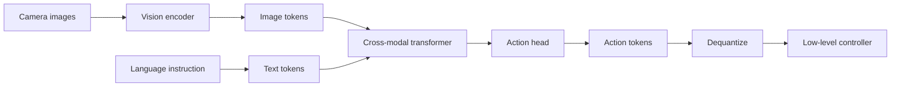
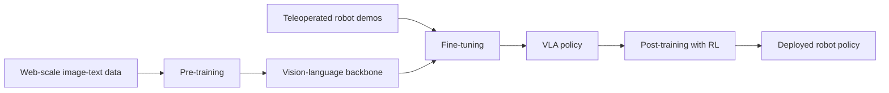

import Quiz from '@site/src/components/Educational/Quiz';

# Vision-Language-Action Models

> **Status:** complete
>
> **Related chapters:** Builds on Chapter 15 — Imitation Learning and Chapter 7 — Computer Vision; feeds into Chapter 17 — LLMs in Robotics and Chapter 18 — AI Agents for Robot Control.

## Why This Matters

Tell someone "put the red mug on the top shelf" and a human instantly does three things at once: sees the mug, understands the instruction, and moves the arm to match. Classical robot stacks do these in separate boxes — a vision module detects the mug, a planner computes a path, a controller tracks it — and every handoff between boxes is a place where the pipeline breaks. A **vision-language-action (VLA) model** fuses all three into a single neural network: the same transformer that reads the image and the instruction also emits the robot's next actions.

This is the single biggest architectural shift in physical AI since deep learning met manipulation. It is what lets robots stop being programmed task-by-task and start being *told* what to do in open-ended language. In this chapter we build a VLA from its components — language model, vision encoder, action head — walk through the three-stage training recipe, and confront the constraint that matters most on hardware: latency.

## Learning Objectives

After this chapter you will be able to:

- Explain how a VLA model unifies perception, language, and action in one transformer.
- Describe the training pipeline in its three stages: pre-training, fine-tuning, post-training.
- Identify the inference bottlenecks on robot hardware and the main mitigations.
- Evaluate a VLA on real manipulation tasks with the right metrics.

## Core Concepts

| Concept | Definition |
| ------- | ---------- |
| Vision-language-action (VLA) model | One network that takes images plus natural-language instructions and outputs robot actions. |
| Action token | A discretized slice of the action space (for example one end-effector pose dimension) emitted like a word. |
| Action head | The module that converts the model's hidden representation into action predictions. |
| Pre-training | Fitting the model on massive web-scale image-text data before it ever sees a robot. |
| Fine-tuning | Training on teleoperated robot demonstrations so the model learns to emit actions. |
| Post-training | Reinforcement learning or preference tuning that polishes behavior on real hardware. |
| Action chunking | Emitting a short trajectory of future actions in a single decoding pass. |
| Latency budget | The hard time limit between sensing the world and commanding a joint. |
| Open-vocabulary instruction | A command the model can follow even though it never saw that exact wording in training. |

## Technical Explanation

### From language models to embodied policies

A language model predicts the next token: given "the capital of France is," it predicts "Paris." A vision-language model (VLM) extends this to inputs that mix text and images. The key insight of VLA research is that robot actions can be treated as *another kind of token*. If a transformer can be trained to continue a sequence of words, it can be trained to continue a sequence that ends in a command like "move the gripper to coordinates (0.3, 0.4, 0.2) and close it." Nothing about the transformer architecture has to change — only the vocabulary.

That insight has a profound consequence: everything a VLM learned from the internet — what objects are, what they are for, how spatial language works — is available to the robot for free. A model that has seen millions of images and captions already knows that a banana is usually on a counter, that a mug has a handle, and that "next to" means something spatial. Fine-tuning transfers that knowledge into motor commands.

### What is a VLA model?

Concretely, a VLA is a transformer with three parts:

1. **A vision encoder** (typically a ViT) that cuts the camera image into patches and encodes them as tokens.
2. **A cross-modal transformer** that fuses image tokens with the tokens of the language instruction.
3. **An action head** that predicts actions from the fused representation.

The action head is where the magic happens. The robot's action space — say a 7-dimensional end-effector pose (position, orientation, gripper) — is **discretized**: each dimension is quantized into, say, 256 bins, and the model outputs a probability over bins, exactly like a token prediction. Training maximizes the log-probability of the demonstrated action tokens:

$$L(\theta) = \sum_{t=1}^{T} \log P_{\theta}\bigl(a_t \mid I,\, g,\, a_{1:t-1}\bigr)$$

where $I$ is the image, $g$ is the instruction, and $a_{1:t-1}$ are the action tokens decoded so far. Read this as: "make the true action tokens probable, given what the robot saw and what it was told." This is just next-token prediction with the last tokens reinterpreted as actions.

### The training recipe: pre-training, fine-tuning, post-training

A VLA is not trained from scratch on robot data — there is nowhere near enough of it. It is built in three stages:

- **Pre-training.** The model first learns to be a general VLM on web-scale image-text data: image captioning, visual question answering, web pages. This stage supplies world knowledge and language competence. It costs millions of GPU-hours, but it is done once, by big labs, and shared.
- **Fine-tuning.** The pretrained VLM gets an action head and is trained on teleoperated demonstrations — humans driving a robot through pick-and-place tasks while cameras and joint states are recorded. The model learns the mapping (image, instruction) → action. This is behavior cloning, from Chapter 15, at the scale of a full transformer. Because robot data is scarce, fine-tuning uses a heavy data mixture — most batches still contain web data to keep the model from forgetting language and vision.
- **Post-training.** Behavior cloning alone leaves gaps: the model acts like a skilled mimic, not a goal-directed agent. Post-training fixes this with reinforcement learning or preference tuning on the physical system (or a high-fidelity sim): the model is rewarded for completing tasks, not just for matching demonstrations, and punished for dropping objects or failing to close a grasp.

The three stages are why a VLA can do things no demonstration ever showed it: pretraining gave it semantics, fine-tuning gave it motor skill, and post-training gave it the drive to finish.

### Inference: latency and compute on the robot

Here is the uncomfortable number: a useful humanoid controller must produce commands at 10–50 Hz, and a 7-billion-parameter transformer takes tens of milliseconds just to encode an image — before it has generated a single action token. The control loop time is roughly

$$t_{\text{loop}} = t_{\text{encode}} + t_{\text{decode}} \cdot N_{\text{tokens}}$$

where $t_{\text{encode}}$ is the vision-forward pass, $t_{\text{decode}}$ is the per-token generation cost, and $N_{\text{tokens}}$ is how many action tokens must be emitted. The whole loop must fit inside the control period. Practitioners use four levers:

- **Action chunking.** Emit a whole short trajectory — say 8 future actions — in one decoding pass instead of 8 passes. Decoding cost amortizes across the chunk.
- **KV-cache reuse.** The transformer recomputes past tokens' attention keys and values on every call; caching them across frames cuts repeated compute.
- **Cached perception.** If the scene is static for a few frames, the vision features can be reused instead of re-encoding the image every frame.
- **Distillation.** Train a small, fast student (a compact policy network or a diffusion policy) to imitate the big VLA, then run the student on the robot. This is the classic teacher–student move, and it is how many deployed systems get VLA-level competence at control-loop speed.

### Robot transformer architectures

The family tree of VLAs is short but important to know:

- **RT-1 and RT-2 (Google).** RT-1 showed a transformer policy trained on real robot data; RT-2 is the first true VLA, starting from a web-scale VLM and adding an action head that discretizes a 7-DoF action into 256 bins per dimension. RT-2's famous trick: because the backbone saw web text, it could reason *about* objects — "the object that works as a hammer is a rock" — and act accordingly.
- **OpenVLA.** An open 7B-parameter VLA fine-tuned from a strong open VLM. Because the weights are public, it became the default starting point for academic robotics and fine-tunes on consumer GPUs.
- **π0 (pi-zero).** Instead of discretized action tokens, π0 attaches a **flow-matching head** that predicts continuous action trajectories — smoother for fast, precise manipulation, and better for dexterous hands.
- **Figure Helix.** A dual-system VLA for a humanoid: a 7B vision-language semantic system that decides *what* to do, and an 80M-parameter visuomotor policy running at 200 Hz that decides *how* to move. Helix runs entirely onboard and controls the whole robot body with one shared network.

The pattern behind all of them: a big semantic brain and a fast motor nervous system, wired together by a training pipeline that knows which part thinks and which part acts.

### Open-vocabulary manipulation

The payoff of the VLA approach is **open-vocabulary manipulation**: the robot can follow instructions it has never seen. "Hand me the squishy thing," "stack the cups," "put the apple next to the laptop" — none of these need to be in the training set, because the model did not memorize instructions, it learned the *mapping* from images plus language to actions. This is what separates a VLA from a classical behavior-cloned policy, which is limited to the fixed set of tasks in its dataset. The frontier is generalization: to unseen objects, unseen kitchens, unseen phrasing — and to measuring it honestly rather than on the training distribution.

### Benchmarking and evaluating VLAs

A VLA looks great in a video and can fail catastrophically in a count. Evaluation needs structure:

- **Task success rate** on a fixed suite — the headline number, but easy to overfit.
- **Generalization splits** — novel objects, novel scenes, novel language. This is the metric that predicts whether the model will work in the real world.
- **Instruction-following accuracy** — did the robot do what was asked, or a plausible-looking thing instead?
- **Efficiency** — task completion time and number of interventions, which matter for economics.
- **Safety incidents** — drops, collisions, contact with fragile items. No VLA is production-safe without this column.

Large shared datasets such as the Open X-Embodiment collection and benchmarks built on them (for example the RT-X evaluation) exist precisely so teams stop comparing models on self-selected videos and start comparing them on the same data and metrics.

## Real-World Examples

:::info Real system
**Google RT-2** demonstrated the core VLA bet: a single model trained on web-scale vision-language data *and* robot data could perform manipulation it was never directly trained on, including reasoning about tool substitutes ("use the rock as a hammer"). The takeaway for your own work: the web pretraining is not a bonus — it is what makes the robot general.
:::

:::note Mini case study
**Figure Helix on a humanoid** splits the work across two systems with one set of shared weights: a 7B vision-language model that reasons about the task at 7–9 Hz, and an 80M-parameter visuomotor policy that executes at 200 Hz for whole-body control. In demos it picked up never-before-seen household objects and sequenced long tasks from natural-language prompts, all on onboard compute. The lesson is architectural: put semantics and reflexes in separate, cooperating systems, then train them together.
:::

## Architecture Diagrams

### Data flow through a VLA



Image and instruction enter as two token streams, are fused in the cross-modal transformer, and exit as discretized action tokens that a controller turns into joint commands.

### The three-stage training recipe



Pre-training buys semantics, fine-tuning buys motor skill, post-training buys reliability.

## Code Examples

### A schematic VLA forward pass

```python
import torch

ACTION_DIM = 7          # x, y, z, roll, pitch, yaw, gripper
NUM_BINS = 256          # quantization bins per action dimension

def discretize_action(action: torch.Tensor) -> torch.Tensor:
    """Map a continuous action in [-1, 1] to integer bins, like a token id."""
    lo, hi = -1.0, 1.0
    normalized = (action.clamp(lo, hi) - lo) / (hi - lo)
    return (normalized * (NUM_BINS - 1)).long()

class TinyVLA(torch.nn.Module):
    """A stand-in for a web-scale VLM plus an action head."""

    def __init__(self):
        super().__init__()
        self.vision_proj = torch.nn.Linear(512, 256)
        self.transformer = torch.nn.TransformerEncoder(
            torch.nn.TransformerEncoderLayer(d_model=256, nhead=4), num_layers=2)
        self.action_head = torch.nn.Linear(256, ACTION_DIM * NUM_BINS)

    def forward(self, image_feats, text_feats):
        x = torch.cat([self.vision_proj(image_feats), text_feats], dim=1)
        x = self.transformer(x)
        logits = self.action_head(x[:, -1])               # last token predicts action
        return logits.view(ACTION_DIM, NUM_BINS)

model = TinyVLA()
image_feats = torch.randn(1, 16, 512)    # 16 visual tokens
text_feats = torch.randn(1, 8, 256)      # 8 text tokens
logits = model(image_feats, text_feats)
action = torch.argmax(logits, dim=-1)    # greedy decoding of the action tokens
print("discretized action:", action.tolist())
```

The real thing is this same shape with a billion-parameter VLM backbone. The loss from the chapter — $\sum_t \log P_\theta(a_t \mid I, g, a_{1:t-1})$ — is exactly a cross-entropy over these action-token logits.

### Estimating your latency budget

```python
def loop_latency_ms(t_encode, t_decode, n_tokens, chunk):
    """Average per-step latency when actions are decoded in chunks."""
    total_ms = t_encode + t_decode * n_tokens
    return total_ms / chunk               # amortized over the chunk

# 50 Hz control means a 20 ms budget per step. Can this VLA fit?
latency = loop_latency_ms(t_encode=12, t_decode=9, n_tokens=40, chunk=8)
print(f"{latency:.1f} ms per step  (budget: 20 ms)")
```

**What this computes:** a 12 ms vision encode plus 9 ms per token over 40 action tokens would be 372 ms — hopeless. Chunking 8 actions into one decode pass brings the *amortized* cost to ~46 ms, and distillation or cached perception closes the rest of the gap.

:::tip Where this runs
Run the skeleton in any Python environment with PyTorch installed. On a real robot, swap `TinyVLA` for a pretrained OpenVLA or π0 checkpoint (GPU required), and connect the decoded action tokens to the impedance controller from Part III.
:::

## Common Mistakes

| Mistake | Why it happens | How to avoid it |
| ------- | -------------- | --------------- |
| Decoding one action per control tick | Large-transformer decoding is far slower than the control period | Emit action chunks and reuse the KV cache across frames |
| Fine-tuning on robot data alone | Robot demos are scarce and the model forgets language and vision | Keep a web-data mixture in every batch and regularize against forgetting |
| Treating the VLA as the whole control stack | A VLA outputs coarse actions or goals, not joint torques | Add a low-level controller below the policy for stability and safety |
| Discretizing actions too coarsely | Heavy quantization makes motion jerky and imprecise | Tune bins and per-dimension scaling, or use a continuous head like π0 |

## Summary

A VLA model collapses the classic perception–planning–control pipeline into one transformer that reads images and instructions and writes actions. It works because actions can be tokenized like words, which means the world knowledge a VLM learned from the internet transfers to the robot almost for free. Building one is a three-stage process — pre-train on the web, fine-tune on demonstrations, post-train with RL — and deploying one is a latency problem as much as a modeling problem. The next chapter asks what happens when you go one level higher: giving the robot a language model that plans whole tasks, not just single actions.

**Key takeaways**

- A VLA treats actions as tokens, so the same transformer machinery that reads language can also command a robot.
- The training recipe is pre-training (semantics), fine-tuning (motor skill), and post-training (reliability).
- The dominant deployment problem is latency; chunking, caching, and distillation are the standard tools.
- Evaluate on generalization and safety, not just success-rate videos.

## Exercises

1. **Easy — Count the action vocabulary.** A VLA discretizes a 7-dimensional action space into 256 bins per dimension. How many distinct discrete actions does the action head choose among, and how many tokens does one action step use?
2. **Medium — Make the budget fit.** A robot runs its control loop at 50 Hz. Vision encoding costs 15 ms, decoding costs 12 ms per token, and you plan to emit 32 action tokens per step. Compute the raw per-step latency, then show how chunking 16 actions per decode pass changes it. *Hint: reuse the `loop_latency_ms` function from the Code Examples section.*
3. **Challenge — Benchmark an open VLA.** Download a small OpenVLA-style checkpoint, pick five manipulation tasks, and build an evaluation that measures success rate on *held-out language* ("the thing on the left" instead of "the red mug"). Report success rate and time-to-completion, and note where the model fails.

Check your understanding:

<Quiz
  question="In a vision-language-action model, what does an action token represent?"
  options={[
    'A word from the robot natural-language vocabulary',
    'A discretized slice of the action space, such as one end-effector pose dimension',
    'A pixel of the camera image',
    'A gain value for the joint PID controller',
  ]}
  correctAnswerIndex={1}
/>

## Further Reading

- Anthony Brohan et al., *RT-1: Robotics Transformer for Real-World Control at Scale* (arXiv 2022) — [arxiv.org/abs/2212.06817](https://arxiv.org/abs/2212.06817) — the first transformer policy that tokenized actions; the seed of the whole line.
- Anthony Brohan et al., *RT-2: Vision-Language-Action Models Transfer Web Knowledge to Robotic Control* (arXiv 2023) — [arxiv.org/abs/2307.15818](https://arxiv.org/abs/2307.15818) — the paper that defines the VLA: web-scale VLM backbone plus action head.
- Moo Jin Kim et al., *OpenVLA: An Open-Source Vision-Language-Action Model* (arXiv 2024) — [arxiv.org/abs/2406.09246](https://arxiv.org/abs/2406.09246) — a public 7B VLA that democratized the approach.
- Kevin Black et al., *π0: A Vision-Language-Action Flow Model for General Robot Control* (arXiv 2024) — [arxiv.org/abs/2410.24164](https://arxiv.org/abs/2410.24164) — continuous action heads for smoother, faster control.
- Figure AI, *Helix: A Vision-Language-Action Model for Generalist Humanoid Control* (2025) — [figure.ai/news/helix](https://www.figure.ai/news/helix) — the dual-system VLA running onboard a humanoid.
- Open X-Embodiment Collaboration, *Open X-Embodiment: Robotic Learning Datasets and RT-X Models* (ICRA 2024) — [arxiv.org/abs/2310.08864](https://arxiv.org/abs/2310.08864) — the shared dataset and evaluation backbone of modern VLA work.
