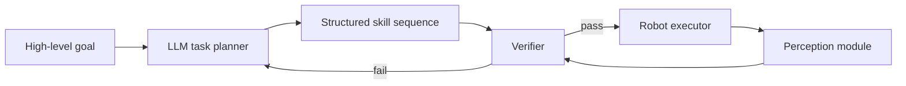

import Quiz from '@site/src/components/Educational/Quiz';

# LLMs in Robotics

> **Status:** complete
>
> **Related chapters:** Builds on Chapter 16 — VLA Models and Chapter 7 — Computer Vision; feeds into Chapter 18 — AI Agents for Robot Control and Chapter 20 — The Robot Software Stack.

## Why This Matters

A humanoid robot is usually told what to do in words: "restock the shelf," "fetch me a soda," "tidy the table but leave the coffee mug alone." Classical planners cannot consume that sentence — they need a formal specification of every object, location, and action. Large language models (LLMs) are the first technology that can read open-ended instructions, apply common sense, and decompose them into concrete steps. They bring the *semantics* the physical body lacks.

But an LLM has no body, no sensors, and no conscience about physics. It will happily plan a motion through a wall or reach for a mug that is not there. This chapter is about the good, the bad, and the guardrails: what LLMs actually contribute to a robot stack, how words get grounded in the world, and how to keep a fast-talking planner from doing physical harm.

## Learning Objectives

After this chapter you will be able to:

- Enumerate the roles an LLM can play in a robot stack, from task planner to language interface.
- Describe how language is grounded in perception, including affordances and object references.
- Identify the specific risks LLMs introduce on physical systems and their mitigations.
- Build a simple LLM-based task planner with structured output and a guardrail.

## Core Concepts

| Concept | Definition |
| ------- | ---------- |
| Large language model (LLM) | A transformer trained on internet text to predict the next token; strong at reasoning and language. |
| Task planning | Decomposing a high-level goal into an ordered sequence of executable subtasks. |
| Grounding | Binding words to the physical world — objects, locations, affordances. |
| Affordance | What an object or place lets the robot do, such as graspable, walkable, or sit-able. |
| Vision-language model (VLM) | A model that accepts images as input and answers questions about them. |
| Structured output | Constraining the LLM's reply to a schema (for example JSON) so a program can parse it. |
| Hallucination | Confidently wrong output — dangerous when it names objects or steps that do not exist. |
| Guardrail | A runtime check that filters or rejects an LLM suggestion before it reaches the robot. |
| Simulator in the loop | Verifying an LLM-generated plan in a physics simulator before executing it on hardware. |

## Technical Explanation

### What LLMs bring to robots

An LLM can play several distinct roles in a robot stack, and it is worth keeping them separate:

- **Natural-language interface.** A non-expert says "clear the table" and the robot understands. The LLM translates human goals into internal form.
- **Task planner.** The LLM decomposes a goal into an ordered sequence of skills: *clear the table → pick(cup, table) → place(cup, rack) → ...*.
- **Semantic reasoner.** "Which object is tallest?" "Which cup is mine?" — the LLM answers questions that require reasoning over the scene description.
- **Code generator.** The LLM writes the parameterized code for a skill ("move to the right of the target, then approach slowly") using a library of motion primitives.

The spectrum is instructive. At one end the LLM is purely a brain with no senses — it plans, and a separate perception system fills in specifics. At the other end the LLM is fused with a VLA (Chapter 16) and its outputs *are* the actions. Most deployed systems sit in the middle: LLM proposes, perception grounds, controllers execute.

### LLMs as task planners

Planning is the most natural fit. Given a goal $g$, an LLM generates a sequence of skills $s_1, s_2, \dots, s_k$, and its training makes it fluent at exactly this kind of chaining:

$$p(s_1, \dots, s_k \mid g) = \prod_{i=1}^{k} p(s_i \mid g, s_{1:i-1})$$

That product is the model's own confidence in the plan, and it is *not* truth — a fluent plan can be wrong. Two problems follow. First, the output must be *executable*: if your skill library has `pick` and `place` but the plan says `pour`, the robot has nothing to run. Second, the output must be *safe*: the plan may be coherent yet violate constraints (don't touch the human, don't knock over the fragile vase). Both problems are handled by constraining the interface — a fixed skill library and a fixed output schema — and by verification, covered below.

### From language to actions: grounding semantics in the world

A plan that says `place(mug, shelf_left)` is useless until "mug" and "shelf_left" are bound to real objects and coordinates. Grounding happens in three layers:

- **Object grounding.** The LLM names a category ("mug"); an open-vocabulary detection module (from Chapter 7) finds all candidate objects and returns their poses. The planner then chooses one by the LLM's description — "the *red* mug" narrows the candidates.
- **Affordance grounding.** A VLM or a learned value function answers "can I act here?" — is the surface clear, is the grasp feasible, is the floor walkable. Affordances convert abstract locations into executable poses.
- **Parameter grounding.** Skills take arguments — `place(obj, location)` — and grounding fills those arguments with the robot's coordinate-frame poses computed from perception.

Grounding is where the LLM's output becomes a *physical* plan. Without it, you have poetry; with it, you have a trajectory.

### LLMs + perception: grounding language in vision

The cleanest way to ground is to let the LLM *see*. A VLM encodes the current scene into tokens, and the LLM reasons over them jointly. This is the pattern behind systems like SayCan: the LLM proposes a candidate skill from language alone, and a perception/control value function scores whether that skill is actually feasible *right now* in this scene. The two scores combine into one decision:

$$score(s_i) = P_{\text{LLM}}(s_i \mid g) \cdot P_{\text{value}}(s_i \mid \text{scene})$$

The LLM term asks "does this step make sense for the goal?"; the value term asks "can the robot actually do it here?" A step that is plausible but impossible — "grab the bottle" when the bottle is behind glass — gets multiplied down. SayCan's famous line, "Do As I Can, Not As I Say," is exactly this: language proposes, the world disposes.

### Multimodal and vision-language models

Text-only LLMs are blind, which limits grounding to what another system tells them. VLMs remove that bottleneck: the robot asks "is the cup empty?" and the VLM answers from the camera image. In practice, robot stacks increasingly use a single VLM for both scene description and question-answering, with the LLM planner on top. The boundary between "VLM" and "VLA" matters: the VLM *understands* the scene, and the VLA (Chapter 16) *acts* on it.

### Hallucination, safety, and verification

Here is the part that keeps robot engineers up at night. LLMs hallucinate — they confidently produce statements that are wrong. On a chatbot that is an embarrassment; on a robot holding a knife it is a liability. The classic failure modes:

- The planner references an object that does not exist ("pick up the imaginary box").
- The planner ignores a physical constraint (a path through a table, a fragile object in the grasp path).
- The planner invents a skill that is not in the library.
- The model repeats a plausible-looking plan even after an execution failure.

The mitigations form a ladder of decreasing trust:

1. **Structured outputs** — force JSON with a schema; the parser rejects malformed plans before they move.
2. **Grounding checks** — every object reference is verified against perception output before execution.
3. **Constraint filters** — a separate, rule-based filter blocks forbidden zones, fragile objects, or human proximity regardless of what the LLM says.
4. **Simulator in the loop** — the plan is executed in a physics simulator against the current state estimate; only collision-free, constraint-satisfying plans reach the robot.
5. **Human approval** — high-risk actions require a human to confirm.

The design principle: **the LLM proposes, the verifier disposes.** The model is allowed to be creative; the safety stack is allowed to be rigid.

### Prompting and structured outputs for robots

Good robot prompting is a contract, not a conversation. A working recipe:

- **System prompt:** enumerate the skill library, the output JSON schema, the physical constraints, and the failure-handling policy ("if a requested object is not present, say `unavailable`, never invent one").
- **Structured decoding:** request JSON, parse it, and on parse failure feed the error back to the model for a retry.
- **Few-shot examples:** show one complete, valid plan so the model matches the format.

The payoff is a plan you can *type-check* before executing — and a system where hallucination becomes a handled exception rather than a silent catastrophe.

## Real-World Examples

:::info Real system
**Google SayCan (2022)** is the canonical LLM-in-robotics result. A kitchen robot received natural-language instructions, an LLM proposed candidate skills, and a learned affordance function scored feasibility from the current scene; the product of the two scores picked the next action. The takeaway: language alone is insufficient, and feasibility alone is myopic — the combination is what makes an instruction executable.
:::

:::note Mini case study
**Simulator-in-the-loop planning on a warehouse arm.** A team let an LLM plan pick-and-place sequences for a shelf-stocking arm, but routed every plan through a MuJoCo simulation first using the current object-pose estimates. A hallucinated shelf location or a collision-in-progress cost a few seconds of simulation time instead of minutes of real execution. Lesson: when trust in the model is uncertain, cheap physical verification is the highest-leverage safety investment you can make.
:::

## Architecture Diagrams

### LLM planner with a verifier in the loop



The verifier is a rule-based or simulated check on top of the model's output. Every arrow back into the LLM is a chance to re-plan with the error as context.

### SayCan-style grounding


Language proposes; the value function grounds; the world's response feeds the next decision.

## Code Examples

### A guardrailed LLM task planner

```python
import json
import re

SKILLS = ["pick(obj, container)", "place(obj, location)", "goto(location)"]

def plan_task(goal: str) -> list[str]:
    """Ask an LLM for a plan, then parse the structured output."""
    prompt = f"""You command a humanoid robot. Reply with a JSON array of skills.
Available skills: {SKILLS}
Goal: {goal}
JSON:"""
    # reply = llm(prompt)   # <-- your LLM call goes here
    reply = '[["pick(mug, tray)"], ["place(mug, counter)"]]'  # stand-in reply
    plan = json.loads(reply)
    return [s for inner in plan for s in (inner if isinstance(inner, list) else [inner])]

def verify_plan(plan: list[str], detected: set[str]) -> list[str]:
    """Guardrail: reject steps that reference objects the robot never detected."""
    verified = []
    for step in plan:
        m = re.search(r"\((\w+)\s*,", step)          # object is the first argument
        if m and m.group(1) not in detected:
            print(f"rejected: {step} (object '{m.group(1)}' not detected)")
            continue
        verified.append(step)
    return verified

plan = plan_task("put the mug on the counter")
print(verify_plan(plan, detected={"mug"}))     # passes: mug was detected
print(verify_plan(plan, detected=set()))        # rejected: hallucinated reference
```

The pattern is the whole chapter in miniature: constrain the output format, parse it, and let a deterministic check veto anything that is not grounded in perception.

:::tip Where this runs
This is the orchestration layer, not the LLM itself. Run it in Python with any LLM behind the `llm(prompt)` stub — an API model or a local one. On a robot, `detected` comes from the open-vocabulary detector of Chapter 7, and `plan` feeds the skill executor of Chapter 18.
:::

## Common Mistakes

| Mistake | Why it happens | How to avoid it |
| ------- | -------------- | --------------- |
| Letting the LLM name objects without checking they exist | The model only ever saw text, not the scene | Force every object reference through the perception module before execution |
| Accepting free-form prose instead of structured output | Chat output is easy to generate and hard to parse | Request JSON with a schema and retry with the parse error |
| Planning without physical constraints | Constraints never reached the prompt or the executor | Put constraints in the system prompt *and* enforce them in a separate filter |
| Trusting token probability as truth | A fluent, likely plan can still be wrong or unsafe | Verify in simulation or with a rule-based checker before executing |

## Summary

LLMs give robots a sense-making brain: they turn open-ended instructions into structured plans, reason about objects and scenes, and even write skill code. The price is that they are ungrounded by default — they will plan for objects that are not there and ignore physics they never felt. The engineering answer is to treat the LLM as a proposal generator behind a deterministic wall of structure, grounding, and verification: the LLM proposes, the verifier disposes. With that wall in place, language becomes a safe and powerful way to command a body. The next chapter wraps this into the full picture: an agent that loops over plan, act, observe, and recover.

**Key takeaways**

- LLMs contribute planning, reasoning, language understanding, and code generation to a robot stack.
- Grounding binds words to the world through detection, affordances, and parameter filling.
- Hallucination is a hardware-safety problem, mitigated by structured output, grounding checks, and sim-in-the-loop.
- The design rule: the LLM proposes, the verifier disposes.

## Exercises

1. **Easy — List the roles.** Enumerate four roles an LLM can play in a robot stack and give one concrete task for each that the robot could not do with a fixed task planner.
2. **Medium — Compute a SayCan score.** The LLM gives "grab the bottle" a probability of 0.8 and "push the mug" a probability of 0.5; the affordance function scores them 0.3 and 0.9. Compute the two combined scores and pick the executed skill. *Hint: see the SayCan equation in the LLMs + perception section.*
3. **Challenge — Build a guardrailed planner.** Extend the code example: call any real LLM, parse its JSON plan, verify every object against a detected set, and on guardrail rejection re-prompt the model with the rejection reason before giving up.

Check your understanding:

<Quiz
  question="What is the main danger of using an LLM as a robot task planner?"
  options={[
    'It runs too slowly for real-time joint control',
    'It can hallucinate objects and steps that do not exist',
    'It cannot process any textual input',
    'It requires a physics simulator to run',
  ]}
  correctAnswerIndex={1}
/>

## Further Reading

- Michael Ahn et al., *Do As I Can, Not As I Say: Grounding Language in Robotic Affordances* (SayCan, arXiv 2022) — [arxiv.org/abs/2204.01691](https://arxiv.org/abs/2204.01691) — the foundational LLM-planner-plus-affordances architecture.
- Wenlong Huang et al., *Inner Monologue: Embodied Reasoning through Planning with Language Models* (arXiv 2022) — [arxiv.org/abs/2207.05608](https://arxiv.org/abs/2207.05608) — grounding LLM plans in real-time feedback from the world.
- Jacky Liang et al., *Code as Policies: Language Model Programs for Embodied Control* (arXiv 2022) — [arxiv.org/abs/2209.07753](https://arxiv.org/abs/2209.07753) — LLMs as generators of control code.
- Danny Driess et al., *PaLM-E: An Embodied Multimodal Language Model* (ICML 2023) — [arxiv.org/abs/2303.03378](https://arxiv.org/abs/2303.03378) — grounding a large model directly in robot sensor streams.
- Jason Wei et al., *Chain-of-Thought Prompting Elicits Reasoning in Large Language Models* (NeurIPS 2022) — [arxiv.org/abs/2201.11903](https://arxiv.org/abs/2201.11903) — why letting the model reason step by step improves plan quality.
