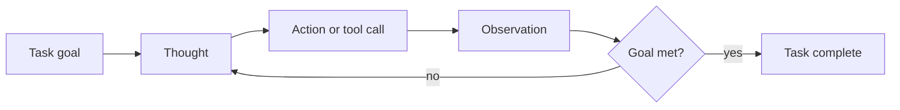
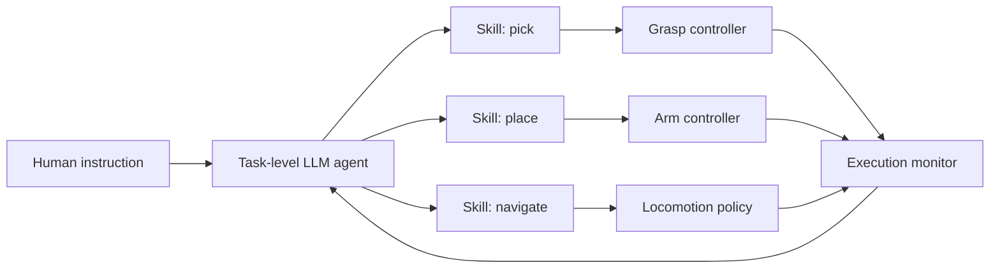

import Quiz from '@site/src/components/Educational/Quiz';

# AI Agents for Robot Control

> **Status:** complete
>
> **Related chapters:** Builds on Chapters 16 and 17 — VLA Models and LLMs in Robotics; feeds into Chapter 20 — The Robot Software Stack and Chapter 24 — The Future of Humanoid Robotics.

## Why This Matters

A model is a one-shot machine: give it input, get output. A single forward pass through a VLA gives you one action; a single LLM call gives you one plan. But real robot tasks are long, uncertain, and full of failure — "unload the dishwasher" takes minutes, dozens of decisions, and at least one dropped mug. Between the model and the worker stands the **agent**: a loop that decides, acts, observes the result, and decides again, with memory of what it has tried and the ability to recover when something goes wrong.

Think of it as the difference between a recipe and a cook. The VLA is the recipe for a single motion; the agent is the cook who reads the recipe, checks the pantry, adjusts when the oven runs hot, and re-plans when the eggs are missing. This chapter builds that cook — the ReAct loop, tools, memory, hierarchy, and the monitoring that keeps it safe — and closes the learning part of the book.

## Learning Objectives

After this chapter you will be able to:

- Define an AI agent in a robotics context and contrast it with a single-policy controller.
- Explain the ReAct reasoning–acting loop and why interleaving thought with action beats either alone.
- Describe hierarchical agents that plan over low-level skills and policies.
- Discuss execution monitoring and failure recovery, including when to hand control to a human.

## Core Concepts

| Concept | Definition |
| ------- | ---------- |
| AI agent | A system that repeatedly decides, acts, observes the result, and updates its plan. |
| ReAct | A pattern that interleaves reasoning (thought) and acting (tool calls) in one loop. |
| Tool use | Giving the model access to functions — sensors, planners, controllers — that it can call. |
| Memory | Storing what happened so later steps can use it, from short-term context to long-term stores. |
| Hierarchical agent | A high-level agent that decomposes goals and dispatches lower-level policies or skills. |
| Skill | A reusable closed-loop capability such as pick, place, or navigate, with parameters. |
| Execution monitoring | Checking that the ongoing action matches the plan and detecting failure. |
| Recovery | Retrying, replanning, or escalating when an action fails. |
| Human-in-the-loop | A human supervisor who can veto, redirect, or take over from the agent. |

## Technical Explanation

### What makes a robotic agent?

Strip the jargon away and an agent is a loop:

1. **Perceive** — read the sensors: "the mug is on the table, the gripper is open."
2. **Reason** — decide what to do next: "grasp the mug by its handle."
3. **Act** — execute: send the command to the controller.
4. **Observe** — read the result: "grasp failed, mug moved 2 cm."
5. **Repeat**, updating the plan with what was learned.

Compare this with the two things it is not. An **open-loop script** runs the same sequence regardless of what happens — fine on a conveyor, dangerous in a kitchen. A **single policy** (a VLA from Chapter 16) maps state to action in one shot — fast, but with no memory of intent and no notion of retrying. The agent sits between them: it uses models for individual decisions but owns the goal, the context, and the loop. Formally, each decision conditions on the whole history:

$$P(a_t \mid \text{goal},\, \text{obs}_{1..t},\, a_{1..t-1})$$

which is exactly why the loop matters — the agent's action at time $t$ depends on what it actually *observed*, not on a predicted world state.

### Agent frameworks: ReAct, Reflexion, tool use

**ReAct** (Reason + Act) is the workhorse pattern. Instead of thinking in a vacuum and then acting, the agent alternates:

- **Thought** — "I need the mug. The scene says objects are on the counter. The mug should be there."
- **Action** — a tool call: `{"tool": "get_object_pose", "args": ["mug"]}`.
- **Observation** — "mug pose: (0.4, 0.2, 0.8)."

Why interleave? Reasoning alone (a pure thought chain) cannot perceive; acting alone (a pure tool sequence) cannot adapt. The thought step is what lets the model change course when the observation contradicts it — and the alternating pattern is what grounds the reasoning in reality. ReAct is the pattern behind almost every LLM-based robot agent deployed today.

**Reflexion** adds memory of failure to ReAct. When the agent fails, it writes a short verbal self-reflection — "I tried to grasp the handle but the gripper hit the bowl; next time approach from the side" — and that note joins the context for the next attempt. ReAct handles the loop; Reflexion makes the loop improve.

**Tool use** is what connects the reasoning model to the body. The agent is given a catalog of functions — `get_scene()`, `get_object_pose(name)`, `plan_trajectory(...)`, `execute_skill(...)` — and emits calls in structured JSON. The functions are *the robot's senses and hands*, so the model gains perception and effect without any retraining. The catalog is also the safety boundary: an agent can only call the tools you give it.

### Memory, context, and long-horizon tasks

Agents accumulate history, and history eats context windows. A 30-minute task generates thousands of tokens of observations, and the model's context is finite. Three strategies keep long-horizon agents coherent:

- **Summarization.** Periodically compress old observations into a running summary — "shelf A restocked, mug placed, two objects remaining." The agent keeps the summary in context instead of the raw stream.
- **Structured memory.** Keep a task ledger: the goal, completed subtasks, failed subtasks, and the current plan. The ledger is always in context and is the object the monitor updates.
- **External storage.** Write details the model does not need every step — object pose logs, trajectory history — to a file or database and query them only when needed. This is retrieval-augmented generation (RAG) applied to a robot's own experience.

The analogy is a worker's notebook: the cook does not keep the entire recipe and every ingredient price in their head at once — they keep the plan in front of them and look up details on demand.

### Hierarchical agents: planners over low-level policies

A single agent trying to decide joint torques directly is a design failure. The right structure is a **hierarchy** with different timescales:

- **Task level (slow, semantic).** An LLM agent plans: decompose the goal, choose skills, sequence them. It reasons in language and about objects; it never touches a joint command.
- **Skill level (medium).** Trained policies or controllers — pick, place, navigate, open — each a closed-loop capability from Chapter 16 or Part III. The planner chooses and parameterizes them.
- **Motor level (fast).** The low-level impedance and whole-body controllers that execute at hundreds of hertz.

The skill library is the interface between levels, and it is also the safety envelope: the task agent cannot invent a new motion — it can only combine existing, verified skills. This is why hierarchical agents are both more capable *and* more predictable than flat ones.

### Multi-agent and human–robot collaboration

Sometimes the right answer is several agents talking to each other. A typical decomposition: a **perception agent** owns the scene model, a **planner agent** owns the goal, and a **safety agent** monitors constraints and can veto. Each has a narrow job and a clean interface, which keeps any single model from doing everything and hiding its errors.

Humans are part of the loop too. In a human–robot workspace, the agent should ask for confirmation on ambiguous instructions, report uncertainty ("I cannot tell which cup is mine"), and hand over control entirely for high-risk actions. **Shared autonomy** — the human and the agent both influencing the motion — is the practical middle ground for tasks too risky or too ill-specified for full autonomy.

### Execution monitoring and recovery

An agent that never checks its own work is a liability. **Execution monitoring** checks three moments:

- **Before acting** — preconditions: is the object actually graspable, is the path clear?
- **During acting** — progress signals: is the end-effector moving toward the target, is the force within limits?
- **After acting** — outcome verification: did the gripper close on the mug, did the mug arrive at the shelf?

Failures flow up a **recovery ladder**, escalating only as needed:

1. **Retry** — same action, perhaps with different parameters ("grasp harder, slower").
2. **Replan** — ask the planner for a different sequence ("approach from the other side").
3. **Ask a human** — when options are exhausted or the situation is ambiguous.

The design goal is *verified autonomy*: the agent is fully autonomous for steps it can verify, and it escalates otherwise. The most expensive failure mode is not failure itself — it is the agent believing a failed step succeeded, because then recovery never triggers.

### From chatbots to embodied agents

The arc of this part of the book is now visible. A chatbot reasons about a world it never sees. A VLA (Chapter 16) turns images and language into actions but has no plan or memory. An LLM planner (Chapter 17) makes plans but no loop. The **embodied agent** unites all three: it perceives through VLAs and sensors, plans through LLMs, remembers its history, and closes the loop by observing and recovering. This is the architecture — not any single model — that can plausibly take a humanoid from a lab trick to a worker.

## Real-World Examples

:::info Real system
**TidyBot (2023)** is a clean example of an agentic robot: given a few example trajectories of a user tidying, an LLM infers the general rule ("socks go in the drawer, papers go in the bin"), then the robot executes that rule on unseen objects via open-vocabulary detection. The takeaway: the agent was never told the rule — it reasoned it out from evidence, remembered it, and generalized it to new items.
:::

:::note Mini case study
**OK-Robot in a real apartment** chained an LLM planner with a VLM for open-vocabulary object detection to perform zero-shot "pick up the apple, bring it to the table" tasks in unseen homes. The system succeeded on a majority of trials, and its failures traced to perception (missing a small object) rather than planning — a reminder that an agent is only as grounded as its sensors.
:::

## Architecture Diagrams

### The ReAct loop



Reasoning and acting alternate, and every observation is fed back into the next thought.

### A hierarchical agent for long-horizon tasks



The planner chooses skills; the monitor reports outcomes back up the hierarchy, where recovery decisions are made.

## Code Examples

### A minimal ReAct loop with tools

```python
import json

class RobotTools:
    """The agent's senses and hands."""

    def __init__(self, seen_objects):
        self.seen = seen_objects
        self.done = False

    def get_scene(self) -> str:
        return f"visible objects: {sorted(self.seen)}"

    def pick(self, obj: str) -> str:
        if obj not in self.seen:
            return f"FAIL: {obj} is not visible"
        self.seen.discard(obj)                 # now in the gripper
        return "SUCCESS: object in gripper"

    def place(self, obj: str, surface: str) -> str:
        if surface in ("table", "shelf", "bin"):
            self.done = True
            return "SUCCESS: task complete"
        return "FAIL: unknown surface"

def react_loop(goal: str, tools: RobotTools, max_steps: int = 5):
    """Interleave thought, action, and observation until the task is done."""
    for step in range(max_steps):
        thought = f"step {step}: working toward '{goal}', {tools.get_scene()}"
        # In production, a model picks the next call; here we script the loop.
        action = ('{"tool": "pick", "args": ["mug"]}' if step == 0
                  else '{"tool": "place", "args": ["mug", "table"]}')
        spec = json.loads(action)
        observation = getattr(tools, spec["tool"])(*spec["args"])
        print(f"thought:  {thought}")
        print(f"action:   {action}")
        print(f"observe:  {observation}\n")
        if tools.done:
            return
    print("step budget exhausted - escalating to a human")

tools = RobotTools(seen_objects={"mug", "spoon"})
react_loop("put the mug on the table", tools)
```

The skeleton has every piece of a real agent: a thought line, a tool call, an observation, and a budget that escalates instead of looping forever.

:::tip Where this runs
Run in plain Python — the loop shape is identical to production LLM agent frameworks. Swap the hard-coded `thought` and `action` strings for real calls to an LLM with function calling; on a robot, `pick` and `place` wrap the trained skills from Chapter 16 and the controllers from Part III.
:::

## Common Mistakes

| Mistake | Why it happens | How to avoid it |
| ------- | -------------- | --------------- |
| Letting the agent loop forever on a failure | The model keeps proposing the same action | Set a step budget and a recovery ladder: retry, then replan, then ask a human |
| Giving the agent tools it can misuse | Too much power, no preconditions | Validate arguments and check preconditions inside every tool |
| Keeping no memory across a long task | Context windows overflow and reset | Compress summaries and keep a structured task ledger in context |
| Treating a failed action as success | The model trusts its own plan over the sensors | Verify outcomes with sensors before marking any step complete |

## Summary

An agent is the missing layer between a capable model and a capable worker: it loops over reason, act, observe, and recover, with memory of what it has tried. ReAct supplies the loop, Reflexion supplies the memory of failure, tool use supplies the senses and hands, and hierarchy keeps the slow semantic decisions separate from the fast motor ones. Execution monitoring closes the final gap — an agent that checks its own work can escalate gracefully when the world refuses to cooperate. This is the architecture, built from the models of the last three chapters, that stands the best chance of taking humanoids from lab tricks to useful workers.

**Key takeaways**

- An agent = model + loop + tools + memory; it decides, acts, observes, and adapts.
- ReAct interleaves thought and action; Reflexion adds memory of failure.
- Hierarchical agents plan in language and execute through verified skills.
- Execution monitoring and a recovery ladder turn failures into handled exceptions.

## Exercises

1. **Easy — Sketch a ReAct loop.** Write the four components — thought, action, observation, next-thought — for the goal "open the door" and state what each observation should contribute to the next decision.
2. **Medium — Add a recovery ladder.** Extend `react_loop` so a failed `pick` triggers a retry with a different argument, then a re-plan, before the budget is exhausted. *Hint: see the Execution monitoring and recovery section.*
3. **Challenge — Build a hierarchical agent in simulation.** In MuJoCo or Isaac Lab, implement a planner that sequences two skills (pick, place) and an execution monitor that detects a failed grasp and re-plans. Report the task success rate with and without the monitor.

Check your understanding:

<Quiz
  question="What distinguishes an AI agent for robot control from a single VLA policy?"
  options={[
    'An agent never uses sensors',
    'An agent loops: it reasons, acts, observes, and updates its plan',
    'Agents are only used for chatbot conversations',
    'An agent is always faster than a policy',
  ]}
  correctAnswerIndex={1}
/>

## Further Reading

- Shunyu Yao et al., *ReAct: Synergizing Reasoning and Acting in Language Models* (ICLR 2023) — [arxiv.org/abs/2210.03629](https://arxiv.org/abs/2210.03629) — the paper that defined the interleaved thought–action loop.
- Noah Shinn et al., *Reflexion: Language Agents with Verbal Reinforcement Learning* (NeurIPS 2023) — [arxiv.org/abs/2303.11366](https://arxiv.org/abs/2303.11366) — verbal self-reflection as the memory that improves the next attempt.
- Timo Schick et al., *Toolformer: Language Models Can Teach Themselves to Use Tools* (arXiv 2023) — [arxiv.org/abs/2302.04761](https://arxiv.org/abs/2302.04761) — how models learn which tools to call.
- Jimmy Wu et al., *TidyBot: Personalized Robot Assistance with Large Language Models* (IROS 2023) — [arxiv.org/abs/2305.05658](https://arxiv.org/abs/2305.05658) — an LLM agent that infers and generalizes user rules.
- Peiqi Liu et al., *OK-Robot: What Really Matters in Integrating Open-Knowledge Models for Robotics* (arXiv 2024) — [arxiv.org/abs/2401.12202](https://arxiv.org/abs/2401.12202) — a zero-shot home-robot agent and an honest analysis of where it fails.
