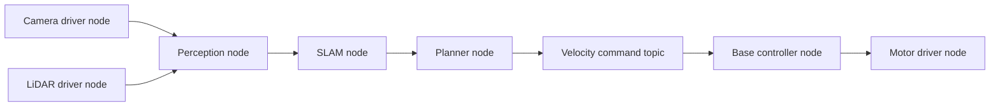
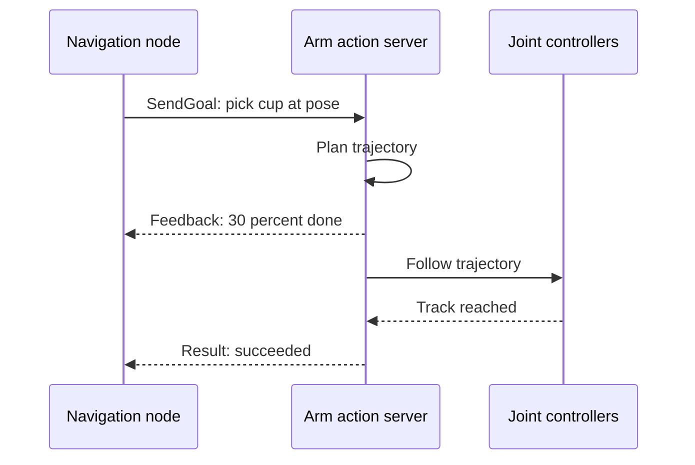

import Quiz from '@site/src/components/Educational/Quiz';

# ROS 2

> **Status:** complete
>
> **Related chapters:** Builds on Chapter 2 — Robotics Foundations; feeds into Chapter 20 — Building the Robot Software Stack and Chapter 23 — Real-World Deployment.

## Why This Matters

A robot is not one program. It is a crowd of programs running at different
speeds: a camera driver streaming images, an estimator fusing IMU and encoder
data, a planner choosing a path, a controller commanding torques, a logging
process writing everything to disk. For the robot to behave as a single
intelligent machine, that crowd has to talk — reliably, quickly, and in a way
that any engineer can reason about.

That is exactly the problem ROS 2 solves. The Robot Operating System is not an
operating system in the Linux sense; it is a *middleware* layer that defines how
processes on a robot discover each other, exchange messages, and stay in sync.
It is the lingua franca of modern robotics: when a lab builds a stack on a
TurtleBot, an industrial arm, or a humanoid, the parts almost always speak
ROS 2. Learn it well and you can read, modify, and assemble almost any robot
software system in existence.

## Learning Objectives

After this chapter you will be able to:

- Explain the role of middleware in robotics.
- Create ROS 2 nodes that communicate over topics, services, and actions.
- Use TF2 to manage coordinate frames across the robot.
- Structure a multi-node robot software stack.

## Core Concepts

| Concept | Definition |
| ------- | ---------- |
| Node | A single process in the robot graph that performs one job and talks to others. |
| Topic | A named, many-to-many publish/subscribe channel for continuous data streams. |
| Service | A one-shot request/response pattern for short transactions. |
| Action | A long-running task with goal, feedback, and result — cancellable mid-flight. |
| DDS | Data Distribution Service — the discovery and transport layer underneath ROS 2. |
| QoS | Quality of Service settings that control reliability, durability, and delivery. |
| TF2 | The transform library that tracks the pose of every coordinate frame on the robot. |
| Launch file | A declarative script that starts a whole set of nodes and their parameters. |

## Technical Explanation

### Why robotics needs middleware

Imagine writing a robot without middleware. Every process would need a bespoke
socket protocol, a hand-rolled discovery mechanism to find the others, and a
serialization format nobody else shares. Changing one component means changing
everyone who talks to it. Middleware removes that coupling: components agree on a
name and a message type, and the middleware handles discovery, delivery, and
serialization behind the scenes.

ROS 2 chose the DDS standard as its transport, which brings two gifts. First,
**true distribution**: nodes can live on different machines over the network —
an operator laptop talking to the robot's onboard computer. Second, **managed
delivery**: DDS lets you choose whether a message must arrive no matter what
(reliable) or whether it is fine to drop it for speed (best-effort). Video
streams, for example, want best-effort; critical control commands want reliable.

### Core concepts: nodes, topics, services, actions

Every ROS 2 system is a **graph** of nodes connected by named edges. There are
three classic edge types, and choosing the right one is a core design skill:

| Pattern | Direction | Use it for | Analogy |
| ------- | --------- | ---------- | ------- |
| Topic | One-way stream, many-to-many | Sensor data, commands, states | A radio broadcast |
| Service | Request/response, one-shot | Turn on a motor, set a parameter | A phone call |
| Action | Long-running, with feedback and cancel | Move to a pose, grasp an object | A delivery job with tracking |

The rule of thumb: continuous streams go on topics; quick, blocking queries use
services; anything that takes time and can be cancelled — the robot's real work —
is an action.

### DDS underneath the hood

When you run `ros2 run` and a node comes alive, DDS does a quiet miracle: the
node **discovers** its peers by announcing itself on the network and caching who
else is there. No central server, no config file listing every address. Discovery
means you can add nodes, restart machines, and move nodes between computers
without reconfiguring anything — a huge practical win in the messy world of robot
deployment.

The cost of that flexibility is that message delivery is now governed by DDS's
**QoS policies**. Publisher and subscriber must have compatible profiles. If one
side demands reliable, in-order delivery and the other side is best-effort, the
match silently fails and you see no data — one of the most confusing bugs in
ROS 2, and one we will return to in Common Mistakes.

### Your first publisher and subscriber

A node in ROS 2 is a class that inherits from `Node`. Inside it you create
publishers, subscribers, timers, and services. The skeleton is always the same:
build the node, register its communication objects, then hand control to
`rclpy.spin()`, which delivers callbacks forever. The code section below shows a
complete talker/listener pair you can run on any ROS 2 install.

### TF2 for coordinate transforms

A humanoid has dozens of coordinate frames: one per joint, plus sensors mounted
on the head, hands, and torso. Software needs to answer questions like "where is
the object that the camera saw, expressed in the base frame?" TF2 is the library
that does this. Each frame is attached to the world with a transform, and TF2
composes them along the kinematic tree:

$$T^{base}_{object} = T^{base}_{hand} \cdot T^{hand}_{object}$$

The key rule: **never store your own transforms**. Ask TF2 at the moment you need
them, because frames move. Querying the transform at the current time gives you
the up-to-date answer; caching a stale one is how robots reach for things that
moved.

### Launch files and lifecycle nodes

Starting a real stack by hand — one terminal per node — works for two nodes, not
twenty. A **launch file** declares the whole graph: which nodes to start, what
parameters to pass, and how they are grouped. Because launch files are Python,
you can add logic: pass different configurations per robot, or only start the
perception stack when a flag is set.

Lifecycle nodes add another layer of discipline. A node like a camera driver goes
through explicit states — `unconfigured`, `inactive`, `active` — and only
publishes real data when `active`. That lets a system supervisor bring up the
stack in a controlled order and tear it down gracefully, instead of letting every
node race to start at once.

### Tooling: RViz, rosbag, and the CLI

ROS 2 ships with a superb command line. `ros2 node list` shows the graph,
`ros2 topic list` and `ros2 topic echo` let you inspect data flowing through the
system, and `ros2 topic hz` reports delivery rates — the first tool to reach for
when debugging. **RViz** is a 3D visualization that renders the TF tree, sensor
clouds, and robot models, letting you literally see what the robot believes.
**rosbag** records topic traffic to disk and replays it later — essential for
reproducing bugs and for training perception models on real data.

### From tutorials to a robot stack

The tutorials in this chapter are the grammar of a robot system. A production
stack is the same grammar at scale: a sensor driver node publishes frames, a
perception node subscribes and publishes detections, a planner subscribes and
publishes trajectories, and a controller acts on them — with TF2 keeping every
frame consistent and rosbag recording the whole performance for later review.

## Real-World Examples

:::info Real system
The TurtleBot3, the most common teaching platform in robotics courses, is a
working ROS 2 stack: a LiDAR driver node publishes laser scans, a SLAM node
turns them into a map, a navigation node publishes velocity commands on a topic,
and a base controller node turns those into motor currents. Two or three laptops'
worth of software, coordinated entirely by topics and TF2.
:::

:::note Mini case study
Unitree's humanoid robots expose a ROS 2 interface alongside their proprietary
SDK. Researchers attach their own perception and planning nodes to the robot's
joint-state topics, reuse standard ROS 2 navigation and manipulation stacks, and
record everything with rosbag for training. The takeaway: a robot that speaks
ROS 2 inherits an entire ecosystem of reusable software — a major reason the
interface exists.
:::

## Architecture Diagrams

### A minimal robot stack in ROS 2

Each box is a node; each arrow is a topic. The graph is the software the same
way a circuit diagram is the hardware.



### An action in flight

Actions add feedback and cancellation on top of request/response — visible here
as a running conversation.



## Code Examples

### A publisher node

```python
# talker.py — publishes a string on the 'chatter' topic once per second.
import rclpy
from rclpy.node import Node
from std_msgs.msg import String

class Talker(Node):
    def __init__(self):
        super().__init__('talker')
        self.pub = self.create_publisher(String, 'chatter', 10)
        self.timer = self.create_timer(1.0, self.tick)
        self.count = 0

    def tick(self):
        msg = String()
        msg.data = f'Hello, world! #{self.count}'
        self.pub.publish(msg)
        self.get_logger().info(f'Sent: {msg.data}')
        self.count += 1

def main(args=None):
    rclpy.init(args=args)
    rclpy.spin(Talker())   # callbacks arrive until Ctrl-C
    rclpy.shutdown()

if __name__ == '__main__':
    main()
```

### A subscriber node

```python
# listener.py — receives whatever appears on the 'chatter' topic.
import rclpy
from rclpy.node import Node
from std_msgs.msg import String

class Listener(Node):
    def __init__(self):
        super().__init__('listener')
        self.sub = self.create_subscription(
            String, 'chatter', self.on_msg, 10)

    def on_msg(self, msg):
        self.get_logger().info(f'Heard: {msg.data}')

def main(args=None):
    rclpy.init(args=args)
    rclpy.spin(Listener())
    rclpy.shutdown()
```

### Running the graph from the terminal

```bash
# Terminal 1: build, then run the publisher
colcon build --packages-select my_robot
source install/setup.bash
ros2 run my_robot talker

# Terminal 2: run the subscriber, then inspect the graph
source install/setup.bash
ros2 run my_robot listener
ros2 node list
ros2 topic echo /chatter
ros2 topic hz /chatter
```

:::tip Where this runs
Any ROS 2 install — run `ros2 --help` first to confirm. On Ubuntu, install the
`ros-humble-desktop` package; on Windows, use the ROS 2 binary release. The code
above runs unmodified on a laptop with two terminals before you ever touch a
robot.
:::

## Common Mistakes

| Mistake | Why it happens | How to avoid it |
| ------- | -------------- | --------------- |
| Using topics for request/response | Topics are the first pattern you learn | Use services for one-shot queries, actions for long tasks |
| Forgetting to spin the node | `rclpy` delivers callbacks only while spinning | Call `rclpy.spin(node)` or add the node to an executor |
| QoS mismatch between publisher and subscriber | Profiles must match or the match silently fails | Check `ros2 topic info` for incompatible QoS, align reliability/durability |
| Caching transforms instead of querying TF2 | Frames move; cached poses go stale | Call TF2's `lookup_transform` at the moment you need the pose |
| Doing heavy work inside a callback | Callbacks must be short and non-blocking | Offload slow work to a thread, or a dedicated node |

## Summary

ROS 2 is the communication backbone of modern robotics: nodes as processes, and
topics, services, and actions as the ways they talk. Underneath, DDS handles
discovery and delivery, TF2 keeps every coordinate frame honest, and launch
files, RViz, and rosbag turn a pile of processes into a debuggable system. With
these tools you can assemble, inspect, and reason about a robot stack — and the
next chapter shows how those pieces fit into a complete, layered humanoid
architecture.

**Key takeaways**

- ROS 2 is middleware, not an OS: it wires processes into a graph of nodes.
- Topics stream, services transact, actions run long tasks with feedback.
- DDS provides automatic discovery; QoS mismatch is a top debugging pitfall.
- TF2 composes transforms along the kinematic tree — never cache your own.
- Launch files, RViz, and rosbag turn a multi-node stack into something inspectable.

## Exercises

1. **Easy — run the talker/listener.** Create a package with the publisher and
   subscriber above, run both, and confirm the messages flow with `ros2 topic
   echo /chatter` and `ros2 topic hz /chatter`.
2. **Medium — add an action.** Implement an action server that moves a simulated
   joint to a target angle over 3 seconds, publishing progress feedback, and a
   client that sends a goal and cancels it halfway. *Hint: review the action
   pattern in Core Concepts — it is a service with feedback added.*
3. **Challenge — build a mini stack with TF2.** Model a two-link arm with a
   camera at the end. Broadcast transforms for each joint and the camera, publish
   a fake detection in the camera frame, and use TF2 to compute where the
   detection is in the base frame.

Check your understanding:

<Quiz
  question="Which ROS 2 communication pattern should you use for a long-running task that reports progress and must be cancellable mid-flight?"
  options={[
    'A topic, because it is a continuous stream',
    'A service, because it is request-response',
    'An action, because it has goal, feedback, and result semantics',
    'A parameter, because it configures the node',
  ]}
  correctAnswerIndex={2}
/>

## Further Reading

- Open Robotics, *ROS 2 Documentation* — the official tutorials and concept
  pages, the best place to go deeper. [docs.ros.org](https://docs.ros.org/)
- Macenski, Foote, et al., *Robot Operating System 2: Design, Architecture, and
  Uses In the Wild* (Science Robotics, 2022) — the peer-reviewed design paper
  behind ROS 2. [arxiv.org/abs/2211.07752](https://arxiv.org/abs/2211.07752)
- Quigley et al., *ROS: An Open-Source Robot Operating System* (ICRA Workshop,
  2009) — the original ROS paper, for historical context on the ideas ROS 2
  carries forward.
- ROS 2 *TurtleBot3 tutorial* — a full hands-on path from a bare Pi to a
  navigating robot. [turtlebot3.readthedocs.io](https://turtlebot3.readthedocs.io/)
