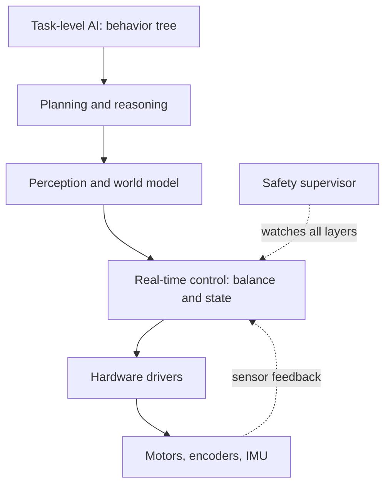
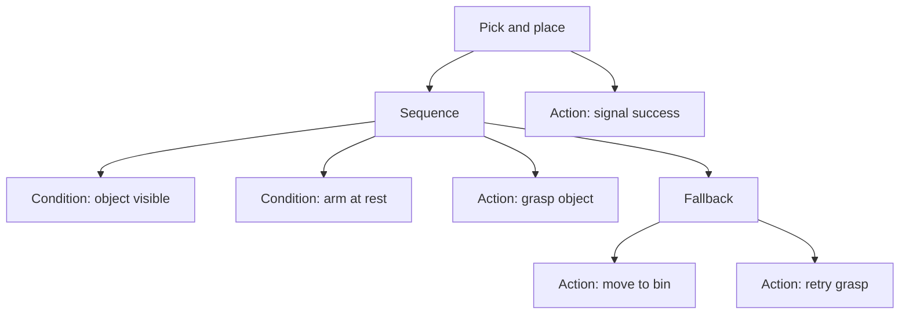

import Quiz from '@site/src/components/Educational/Quiz';

# Building the Robot Software Stack

> **Status:** complete
>
> **Related chapters:** Builds on Chapter 19 — ROS 2 and Chapter 4 — Humanoid Robot Architecture; feeds into Chapter 21 — Simulation and Chapter 23 — Real-World Deployment.

## Why This Matters

A humanoid is the most demanding software target in robotics because everything
happens at once, at different speeds, under a hard physical deadline. Keeping the
robot upright needs decisions every millisecond. Recognizing the room and
choosing a goal happens a few times per second. Deciding what task to do happens
even more rarely. One program cannot do all of that well — a stack that tries to
be everything collapses under its own latency.

The software stack is how a robot survives being a real-time system. It splits
the work into layers with explicit rates, contracts, and fault boundaries, so
that a slow planner cannot crash a fast balance controller, and a crashed camera
does not take down the motors. This chapter shows how professional humanoids are
architected: the layers, the real-time constraints, the behavioral logic that
chooses what to do next, and the observability that lets you debug a moving
machine.

## Learning Objectives

After this chapter you will be able to:

- Sketch the layered software architecture of a humanoid.
- Explain real-time requirements and how they shape design.
- Use state machines and behavior trees for task-level control.
- Design a data pipeline for logging and debugging.

## Core Concepts

| Concept | Definition |
| ------- | ---------- |
| Control loop | A cycle that reads state, computes a command, and applies it at a fixed rate. |
| Real-time system | A system whose correctness depends on finishing by a deadline, not just correctly. |
| Rate | How often a loop runs — joint control at ~1 kHz, perception at ~30 Hz. |
| Finite state machine (FSM) | A model of discrete states and the events that trigger transitions. |
| Behavior tree | A tree of tasks with control nodes that sequence, fall back, and retry. |
| Watchdog | A timer that detects a hung process and triggers recovery. |
| Logging | Recording time-stamped events and data for diagnosis and training. |

## Technical Explanation

### Architecture of a humanoid's software

A professional humanoid stack is a stack of layers, each with a single
responsibility and a clear interface to the ones above and below it:

- **Hardware drivers** — speak the actuator, encoder, IMU, and camera protocols.
- **Real-time control** — joint servoing, state estimation, balance, at 1 kHz.
- **Perception** — vision, depth, and touch processing at 10–60 Hz.
- **Planning and reasoning** — task planning, motion planning, and (increasingly)
  learned policies at 1–10 Hz.
- **Task-level AI** — behavior trees, LLM-driven reasoning, and human interaction.
- **Mission and safety layers** — supervision, fault handling, and shutdown logic.

The rule that holds the stack together is *rate separation*. Fast layers are
small and deterministic; slow layers are big and flexible. Fast layers never
wait on slow ones. When a planner takes 200 ms to decide, the balance controller
does not pause to find out — it keeps stabilizing with the last command.

### The real-time stack: from drivers to policies

Real-time means more than "fast." It means *provable*: a job scheduled to run
every 1 ms must run within that 1 ms window, or the robot falls. Typical rates on
a humanoid:

| Layer | Rate | What happens in one cycle |
| ----- | ---- | ------------------------- |
| Joint torque loop | ~1 kHz | Read encoder, compute torque, write to motor |
| State estimation | ~1 kHz | Fuse IMU + encoders + force sensors |
| Balance / whole-body control | ~500 Hz | Compute desired torques for all joints |
| Perception | ~30 Hz | Detect objects, estimate poses |
| Motion planning | ~10 Hz | Re-plan trajectory around obstacles |
| Task logic | ~1 Hz | Decide which behavior to run |

Achieving the fast rates requires careful engineering: real-time threads with
priority scheduling, no dynamic memory allocation inside the loop, and no
blocking calls. The slow, flexible layers — perception, planning, AI — run as
separate processes and publish their results asynchronously, which is exactly the
pattern ROS 2 supports.

### Communication patterns and data flow

Data flows up and commands flow down, but the pattern is not a simple chain. The
perception layer broadcasts its best guess of the world; the planner subscribes
and publishes candidate trajectories; the balance controller subscribes to the
latest trajectory and ignores it entirely if it is too old. Two ideas keep this
sane:

- **Timestamps everywhere.** Every message carries the time it was measured. A
  controller must know whether the state it is using is 2 ms old or 200 ms old.
- **Deadlines, not hopes.** Subscribers declare "this message is stale after 50
  ms" and act accordingly. Using stale data is how a robot keeps walking into a
  wall after the world changed.

### State machines and behavior trees

Task-level logic has two classic tools. A **finite state machine** describes a
robot as a set of states — *standing*, *walking*, *grasping*, *recovering* — with
guarded transitions. FSMs are simple, fast, and easy to verify, which is why
safety logic and low-level controllers love them. Their weakness: state
explosion. A task with several concurrent conditions becomes a tangle of edges.

**Behavior trees** fix the tangle by organizing tasks hierarchically. Leaves are
actions or conditions; internal nodes are control structures: *sequence* (do A,
then B, then C), *fallback* (try A, then B, then C), and *parallel*. Crucially,
behaviors can return *running*, so the tree can be ticked every cycle and reacts
to the world as it changes. Amazon's warehouse robots and many modern humanoids
use behavior trees for exactly this reason — the tree reads like a plan and is
easy to extend without turning into a plate of spaghetti.

### Logging, monitoring, and diagnostics

A robot that cannot be observed cannot be debugged — and a falling robot is not
the moment to start. Production stacks log continuously: every message, every
command, every state transition, time-stamped and indexed. In ROS 2 this is
rosbag; in-house systems use their own ring buffers. The logs serve three
audiences: the engineer debugging a crash, the safety reviewer proving what the
robot did, and the machine-learning pipeline that needs real sensor data for
training.

Monitoring is the live half of observability. A watchdog timer runs on the
safety computer and requires the main computer to "tick" it periodically. If the
tick stops — a hung process, a deadlock, a crashed driver — the watchdog
triggers a safe stop. The robot is designed to fail safe, not just to fail.

### Integrating perception, control, and learning

The final shape of a modern stack puts a learned policy in the middle. Raw
sensor data flows to perception; perception feeds a state estimate; the state
feeds a learned policy or a classical planner; and the resulting commands go to
the whole-body controller. The stack's job is to make each exchange clean: a
stable interface at every boundary so that the vision model can be swapped
without touching the balance controller, and the balance controller can be
upgraded without retraining perception. Good architecture is what makes learning
and classical robotics composable.

## Real-World Examples

:::info Real system
Unitree's H1 runs a layered stack: a low-level joint and balance controller
onboard at high rate, a ROS 2-based higher layer for perception and navigation,
and a teleoperation or policy interface on top. The same architecture powers
research labs that bolt on their own RL policies — they replace only the policy
layer, leaving the fast real-time core untouched.
:::

:::note Mini case study
Amazon's warehouse robots run hierarchical mission logic built on behavior
trees. The tree decides which station to visit, how to handle an exception
(a blocked aisle, a stuck package), and when to escalate to a human. The result
is a fleet of thousands of robots, each making local decisions, coordinated by a
hierarchy — a live demonstration that tree-based task logic scales.
:::

## Architecture Diagrams

### The layered stack

Each layer runs at its own rate and communicates with its neighbors over clean
interfaces. Slow and flexible at the top; fast and deterministic at the bottom.



### A behavior tree for pick-and-place

Sequence nodes chain behaviors; fallback nodes try alternatives; conditions gate
progress. Tick the root every 50 ms and the tree reacts to the world.



## Code Examples

### A minimal behavior tree with py_trees

```python
# A tiny pick-and-place behavior tree using the py_trees library.
import py_trees

class CheckObjectVisible(py_trees.behaviour.Behaviour):
    def update(self):
        # In reality, query the perception topic.
        if self.robot.get('object_visible'):
            return py_trees.common.Status.SUCCESS
        return py_trees.common.Status.FAILURE

class GraspObject(py_trees.behaviour.Behaviour):
    def update(self):
        return py_trees.common.Status.SUCCESS  # send the grasp action

seq = py_trees.composites.Sequence('pick', memory=False)
seq.add_children([CheckObjectVisible(), GraspObject()])

root = py_trees.composites.Selector('grab-or-retry')
retry = py_trees.composites.Sequence('retry', memory=False)
retry.add_child(CheckObjectVisible())  # waits until the object reappears
root.add_children([seq, retry])

# Tick the tree every 50 ms; it adapts as the world changes.
for _ in range(10):
    root.tick_once()
    print(py_trees.display.ascii_tree(root))
```

### A hard real-time control loop

```python
# The shape of a 1 kHz joint control loop.
# Run on a dedicated RT thread; no allocations, no blocking calls.
dt = 0.001
while robot.is_enabled():
    start = clock.now()
    q     = encoders.read_joint_angles()   # microseconds
    qd    = encoders.read_joint_velocities()
    tau   = balance_controller.compute(q, qd, desired_pose)  # the policy
    motors.write_torques(tau)
    sleep_until(start + dt)   # hold the 1 ms deadline
```

:::tip Where this runs
The py_trees example runs on any laptop: `pip install py_trees`, then execute the
script. The control-loop skeleton is meant for an RT-capable onboard computer
with the drivers in Chapter 5 — on a humanoid it runs in the low-level motor
computer, not on the general-purpose CPU.
:::

## Common Mistakes

| Mistake | Why it happens | How to avoid it |
| ------- | -------------- | --------------- |
| Running everything on one thread | Simplest at first | Split into rate-separated processes from day one |
| Letting a slow layer block a fast one | Shared locks and blocking calls | Use queues and timestamps; fast layers never wait |
| Ignoring deadlines | "It worked in the lab" | Use RT scheduling and watchdog timers; assert on missed cycles |
| Hard-coding task sequences | Fastest to write | Use state machines or behavior trees for task logic |
| Logging only when something breaks | Logs feel like overhead | Log continuously with timestamps; you debug after the fall |

## Summary

A humanoid's software is a stack of layers running at different rates — a
millisecond real-time core for control, a tens-of-hertz layer for perception, and
a hertz-scale layer for task logic — glued by clean interfaces, timestamps, and
deadlines. State machines and behavior trees give the robot task-level
intelligence, while logging and watchdogs make the moving system debuggable and
safe. Understanding this architecture turns ROS 2 (Chapter 19) from a set of
tutorials into the skeleton of a real machine.

**Key takeaways**

- Rate separation is the core design rule: fast and deterministic below, slow and flexible above.
- Every message needs a timestamp; stale data is acted on only with a deadline policy.
- Behavior trees scale where finite state machines tangle.
- Continuous logging is both a debugging tool and a training-data source.
- A safety supervisor with a watchdog must be able to stop the robot regardless of the stack's health.

## Exercises

1. **Easy — sketch the stack.** Draw the layer diagram for a robot you know
   (a vacuum, a drone, a humanoid) and annotate each layer with its approximate
   rate.
2. **Medium — design a behavior tree.** Design a tree for "deliver a box to a
   room": conditions for door state, fallbacks for a blocked path, and actions
   for navigation. *Hint: revisit the sequence/fallback/condition semantics in
   the py_trees example.*
3. **Challenge — add a watchdog.** Build a two-process simulation: a "controller"
   that ticks every 50 ms and a "watchdog" that kills it if it is late. Then
   introduce a slow task and demonstrate the watchdog recovering the system.

Check your understanding:

<Quiz
  question="Which layer of a humanoid software stack typically runs at the highest rate?"
  options={[
    'Task-level AI and behavior trees',
    'Joint torque control and state estimation',
    'Scene perception and object detection',
    'Mission planning and reasoning',
  ]}
  correctAnswerIndex={1}
/>

## Further Reading

- Miguel Tavares et al., *py_trees* documentation — the behavior-tree library
  used across ROS 2 stacks. [py-trees.readthedocs.io](https://py-trees.readthedocs.io/)
- Marzinotto et al., *Towards a Unified Behavior Trees Framework for Robot
  Control* (ICRA, 2014) — the paper that made behavior trees mainstream in
  robotics.
- John Regehr, *Real-Time Programming* essays — practical writing on what
  real-time actually demands of software. [regehr.org](https://regehr.org/)
- ROS 2 *navigation stack documentation* — a production example of layered,
  rate-separated robot software. [navigation.ros.org](https://navigation.ros.org/)
