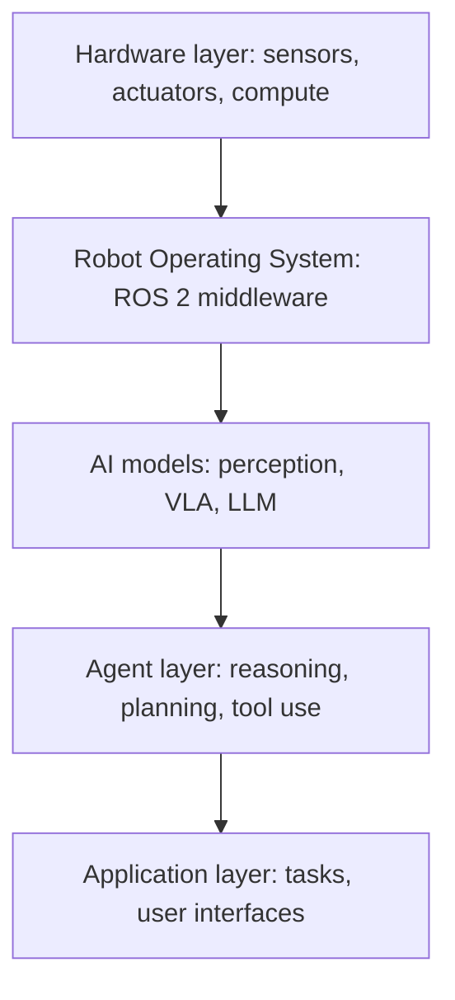

# Building the Robot Software Stack

> **Status: placeholder.** This chapter is part of the working outline for
> *Physical AI and Humanoid Robotics: Building Intelligent Machines*.

## Planned coverage

- The real-time control loop and why it cannot run under a general OS.
- ROS 2 as the glue: topics, services, and lifecycle for a robot.
- Perception, planning, and policy processes and how they share state.
- Determinism, logging, and debugging on hardware.
- A reference repo layout for a working humanoid software stack.

## Architecture Diagram

A humanoid's intelligence is a stack of layers, each building on the one below
it — from the physical body up to the tasks and interfaces people interact with.

## Exercises

*(to be added)*
