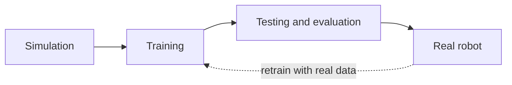

# Simulation for Physical AI

> **Status: placeholder.** This chapter is part of the working outline for
> *Physical AI and Humanoid Robotics: Building Intelligent Machines*.

## Planned coverage

- What a physics simulator must get right for legged robots: contact, friction,
  and solver stability.
- MuJoCo, Isaac Lab, and Gazebo: choosing the right tool for the job.
- Digital twins: running the exact robot model in the exact environment.
- Automating sim-to-real and evaluating policies before touching hardware.
- Performance: thousands of parallel environments for RL training.

## Architecture Diagram

The role simulation plays in the robot learning pipeline: train in simulation,
validate in testing, deploy to the real robot — and feed what the real world
teaches back into training.

## Exercises

*(to be added)*
