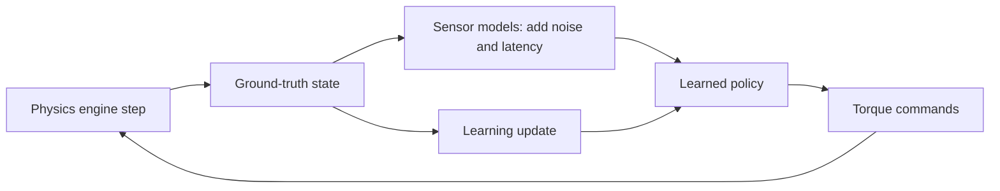
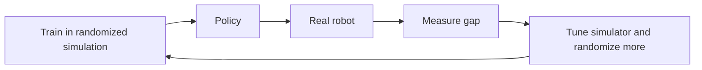

import Quiz from '@site/src/components/Educational/Quiz';

# Simulation for Physical AI

> **Status:** complete
>
> **Related chapters:** Builds on Chapter 9 — Kinematics and Dynamics and Chapter 14 — Reinforcement Learning; feeds into Chapter 22 — NVIDIA Isaac Sim and Chapter 23 — Real-World Deployment.

## Why This Matters

Training a robot in the real world is brutally expensive. Every fall risks
hardware, every experiment consumes hours of a shared robot, and a walking
policy might need a million trials to emerge. Simulation changes the economics
of the entire field: a physics engine can run a thousand robot lifetimes in an
afternoon, on a laptop, with zero risk of breaking anything.

That is why modern robotics is inseparable from simulation. Reinforcement
learning (Chapter 14) needs millions of trials, and only a simulator can provide
them cheaply enough. But simulation is also a lie — a useful, carefully
calibrated lie. This chapter teaches you how physics engines work, where they
lie, how to make the lies harmless with domain randomization, and how to choose
the right simulator for your problem. The gap between the simulator and the real
world, the *sim-to-real gap*, is the central risk of every simulation-driven
robot, and understanding it is a superpower.

## Learning Objectives

After this chapter you will be able to:

- Explain what a physics engine does and where it is inaccurate.
- Compare major simulators — MuJoCo, Bullet, PhysX, Gazebo — and their trade-offs.
- Set up a basic simulation of a robot.
- Describe sensor simulation and domain randomization.

## Core Concepts

| Concept | Definition |
| ------- | ---------- |
| Physics engine | Software that simulates rigid-body motion, contacts, and forces over time. |
| Simulation step | The time increment (e.g. 1 ms) between successive physics updates. |
| Contact model | The rule that computes contact forces from penetration, velocity, and friction. |
| Friction cone | The constraint linking normal and tangential contact forces at a contact. |
| Sensor model | A function that converts ground-truth world state into a noisy sensor reading. |
| Domain randomization | Randomizing simulator parameters so a policy transfers to the real world. |
| Sim-to-real gap | The systematic difference between simulated and real behavior. |

## Technical Explanation

### Why simulate: cost, safety, scale

Simulation wins on three axes at once. **Cost**: a simulator is free to run; a
robot costs thousands of dollars per hour and wears out. **Safety**: you can
throw a simulated humanoid down a flight of stairs and the only casualty is a
line of output. **Scale**: parallelism lets thousands of copies of a robot train
simultaneously, which is the difference between a policy that takes years and one
that takes hours. For learning-based robotics, scale is not a luxury — it is the
whole game, because the number of trials an RL agent needs is astronomically
larger than what a physical robot can survive.

### Physics engines: MuJoCo, Bullet, PhysX, and more

A physics engine integrates the equations of motion forward in time:
velocities update from forces, positions update from velocities, and contact
forces are solved each step. The major engines differ in how they model contact
and how fast they run:

| Engine | Strengths | Weaknesses | Best for |
| ------ | --------- | ---------- | -------- |
| MuJoCo | Fast, stable contacts, smooth gradients | Proprietary license history | RL locomotion, control research |
| Bullet | Open source, widely used, good docs | Stiffer contacts, more tuning | General rigid-body, ROS integration |
| PhysX | GPU acceleration, mature | Less robot-specific tooling | GPU-parallel RL, Isaac ecosystems |
| Gazebo | Full sensor and world simulation | Heavier, slower | Sensor-rich system testing |

The choice is a trade-off between fidelity and speed. For learning, speed wins —
a policy that transfers at 80 percent is worth more than a perfect simulation you
cannot afford to run.

### Contact models, solver settings, and fidelity

Contacts are where physics engines are least honest. Real surfaces deform,
scatter energy, and grip in ways no engine fully captures. Engines approximate
contact with a *contact model*: when two bodies penetrate, the engine computes
forces from the penetration depth, relative velocity, and friction parameters.
Two settings matter most:

- **Friction** is modeled with a cone: the tangential force is capped by the
  normal force times the friction coefficient, $\lVert F_t \rVert \le \mu F_n$.
  Get the friction coefficient wrong and the robot either slides like it is on
  ice or sticks like glue — both fatal to a believable gait.
- **The solver** distributes contact forces across all active contacts. Stiffer
  solver settings reduce penetration but slow simulation and can go unstable at
  large timesteps.

The practical consequence: you must validate contact parameters against real
measurements, not trust defaults. A balance policy tuned on a frictionless floor
will not stand on carpet.

### Simulating sensors and noise

A simulator also has to lie about sensors — and here the lies are intentional and
helpful. Real sensors are noisy: cameras have photon noise and motion blur,
IMUs drift, encoders quantize. If you train a policy on perfect simulated state,
it will rely on perfect information that the real robot never has, and fail
instantly on hardware. Sensor models inject noise, bias, and latency so the
policy learns to be robust.

A useful mental model: **train on the dirty data, not the clean data.** The
ground-truth state is available for the *learner*, but the *policy* should only
see the degraded, realistic signal it will get from real sensors.

### Sim-to-real transfer revisited

The sim-to-real gap is the sum of every place the simulator is wrong: friction,
actuator dynamics, latency, sensor noise, and the simulator's own quirks. There
are three standard tools for shrinking it:

- **Domain randomization** — train across randomized physics, masses, friction,
  and noise, so the real world is just one more sample from the training
  distribution.
- **System identification** — measure the real robot and tune the simulator until
  they match on key metrics (joint response, contact forces).
- **Domain adaptation** — train perception on synthetic images, then fine-tune on
  a small set of real images so the visual features transfer.

None is a silver bullet; professional stacks use all three together, and the
final test is always the same: how the policy behaves on the real machine.

### Choosing a simulator

Choose based on the question you are asking. For fast RL on a humanoid, MuJoCo
or Isaac's PhysX-based simulators dominate. For testing a full ROS 2 stack with
realistic cameras and LiDAR, Gazebo is the workhorse. For GPU-parallel, visually
rich training, Isaac Sim (Chapter 22) is purpose-built. The decision criteria:
how fast must it run, how faithful must contacts be, does the policy use vision,
and what sensor suite does the task need.

## Real-World Examples

:::info Real system
DeepMind and the wider RL community standardize locomotion research on MuJoCo
because it is fast enough to train policies in minutes on a laptop. Its stable
contact model is trusted enough that a MuJoCo-trained walking policy frequently
transfers to real quadrupeds with only modest tuning — the reference example of
sim-to-real that works.
:::

:::note Mini case study
Unitree's robots are trained in simulation and then validated on hardware in a
controlled pipeline: thousands of parallel episodes in a fast engine, a
curriculum from flat ground to rough terrain, domain randomization over friction
and mass, and finally a real-robot evaluation with a safety tether. The takeaway:
simulation produces the policy, but a disciplined hardware validation loop —
not the simulator alone — produces the deployed robot.
:::

## Architecture Diagrams

### The simulation training loop

Ground truth feeds the learner; degraded signals feed the policy; the policy
outputs actions that change the world. The same loop structure will appear again
on real hardware in Chapter 23.



### Sim-to-real transfer

Randomization broadens the training distribution so the real robot is inside it,
not outside it.



## Code Examples

### A minimal MuJoCo simulation

```python
# Load a robot model, step the physics, and read joint angles.
import mujoco
import time

model = mujoco.MjModel.from_xml_path('humanoid.xml')  # an MJCF model
data  = mujoco.MjData(model)

for step in range(1000):
    # Send a control command, then advance physics by the model timestep.
    data.ctrl[:] = 0.0                    # zero torques at every actuator
    mujoco.mj_step(model, data)           # integrate one physics step
    if step % 100 == 0:
        print('t =', data.time, ' q =', data.qpos[:6])
        time.sleep(0.01)                  # slow down for visualization
```

### Domain randomization in a loop

```python
# Train across random friction and mass so the policy generalizes to reality.
import random

for episode in range(2000):
    # Sample this episode's world from a distribution, not a fixed value.
    model.geom_friction[:] = random.uniform(0.4, 1.2)
    model.body_mass[:] *= random.uniform(0.8, 1.2)

    data.reset()
    for _ in range(500):
        action = policy.act(data.obs)     # your agent
        data.ctrl[:] = action
        mujoco.mj_step(model, data)
```

:::tip Where this runs
Install MuJoCo with `pip install mujoco`; the MJCF model file can come from the
MuJoCo menagerie or your own URDF converted to MJCF. The randomization snippet
runs unchanged once you plug in your policy, and the same pattern carries over to
Isaac Lab in Chapter 22.
:::

## Common Mistakes

| Mistake | Why it happens | How to avoid it |
| ------- | -------------- | --------------- |
| Trusting simulator physics blindly | Simulators look authoritative | Validate friction, mass, and contacts against real measurements |
| Training on perfect state | Ground truth is easy to access | Feed the policy only degraded, noisy sensor signals |
| Using a too-large timestep | Faster training, tempting | Match the timestep to the dynamics; check for energy gain or instability |
| Skipping domain randomization | The clean sim trains fastest | Randomize physics and noise or the policy overfits the sim |
| Judging the robot in simulation only | Sim success feels like success | Always close the loop on hardware, even with a safety tether |

## Summary

Simulation is the factory where robot behavior is mass-produced: a physics
engine steps the equations of motion, contact models approximate friction, and
sensor models degrade the truth so policies learn to cope with reality. The
sim-to-real gap is managed, not eliminated, through domain randomization, system
identification, and disciplined hardware validation. Choose a simulator by the
question you are asking — speed for learning, fidelity for system testing — and
remember the field's founding trade-off: a simulation that is 80 percent honest
and a thousand times faster is worth more than a perfect one you cannot run.

**Key takeaways**

- Simulation wins on cost, safety, and scale — RL is impossible without it.
- Contact models and friction are where simulators lie most; validate them.
- Train policies on noisy, degraded signals, not on ground truth.
- Domain randomization makes the real world one sample from the training distribution.
- The sim-to-real gap is closed on hardware, not in the simulator.

## Exercises

1. **Easy — step a robot.** Load any MuJoCo model and step it for a second while
   printing the center-of-mass height. Confirm it falls without control.
2. **Medium — add sensor noise.** Take the perfect-state policy signal in the
   randomization example and add Gaussian noise plus one-step latency. Measure
   how the policy's stability changes. *Hint: see the sensor-model discussion in
   Simulating sensors and noise.*
3. **Challenge — randomization budget.** Design a domain-randomization budget for
   a legged robot: which parameters to vary, over what ranges, and how you would
   measure on real hardware whether the budget was enough.

Check your understanding:

<Quiz
  question="What is the main purpose of domain randomization in robot training?"
  options={[
    'To make training run faster by simplifying the physics',
    'To prevent overfitting to one exact simulator by varying its parameters',
    'To reduce the number of episodes needed for convergence',
    'To replace the need for real-hardware validation',
  ]}
  correctAnswerIndex={1}
/>

## Further Reading

- Todorov, Erez, and Tassa, *MuJoCo: A Physics Engine for Model-Based Control*
  (IROS, 2012) — the design paper for the most influential RL simulator.
  [arxiv.org/abs/1912.11391](https://arxiv.org/abs/1912.11391)
- Tobin et al., *Domain Randomization for Transferring Deep Neural Networks from
  Simulation to the Real World* (IROS, 2017) — the paper that made randomization
  a standard tool. [arxiv.org/abs/1703.06907](https://arxiv.org/abs/1703.06907)
- DeepMind, *MuJoCo Menagerie* — ready-made, validated robot models in MJCF
  format. [github.com/google-deepmind/mujoco_menagerie](https://github.com/google-deepmind/mujoco_menagerie)
- Gazebo documentation — the standard for full-stack sensor and world
  simulation. [gazebosim.org](https://gazebosim.org/)
