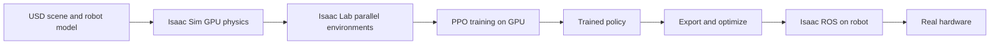
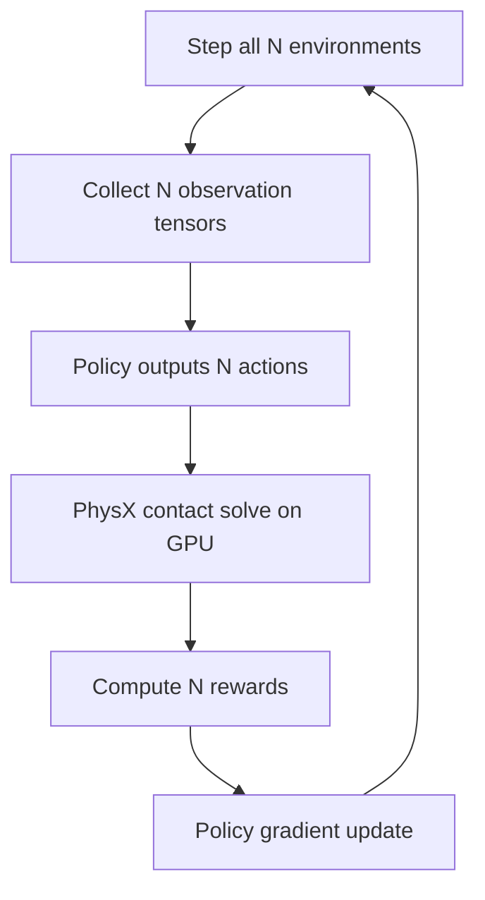

import Quiz from '@site/src/components/Educational/Quiz';

# NVIDIA Isaac Sim and Isaac Lab

> **Status:** complete
>
> **Related chapters:** Builds on Chapter 21 — Simulation and Chapter 14 — Reinforcement Learning; feeds into Chapter 23 — Real-World Deployment.

## Why This Matters

Classical simulators run one robot at a time, on one CPU core, at roughly real
speed. That is fine for testing a controller, but it is hopeless for the modern
recipe that produces humanoid behavior: train a reinforcement-learning policy on
tens of thousands of parallel environments, each with its own randomized scene,
until the policy generalizes. To make that tractable, NVIDIA built a simulator
with a different philosophy: put the physics on the GPU, express the whole scene
in a single universal format, and let thousands of robots train in parallel.

Isaac Sim and its learning layer, Isaac Lab, are the current workhorses of
simulation-driven humanoid development. If you want to train a walking policy on
a Unitree G1 or a grasping policy on a dexterous hand, this is the toolchain most
likely to get you there. This chapter explains what Isaac adds over classical
simulators, how USD organizes a scene, how Isaac Lab turns a scene into a
massively parallel RL environment, and how trained policies travel back to real
hardware.

## Learning Objectives

After this chapter you will be able to:

- Explain what Isaac Sim adds over classical simulators.
- Build and load a robot scene using USD.
- Use Isaac Lab to train an RL policy with massive parallelism.
- Describe the Isaac Sim → Isaac ROS → robot deployment path.

## Core Concepts

| Concept | Definition |
| ------- | ---------- |
| Isaac Sim | NVIDIA's GPU-accelerated robot simulator built on the Omniverse platform. |
| USD | Universal Scene Description — a scalable format for composing complex 3D scenes. |
| Omniverse | NVIDIA's platform for connecting 3D tools and simulating digital twins. |
| Isaac Lab | A framework on Isaac Sim for defining and training RL robot environments. |
| GPU parallelism | Running thousands of environment copies simultaneously on a GPU. |
| Replicator | Isaac's tool for generating synthetic training data from simulated scenes. |
| Isaac ROS | NVIDIA's ROS 2 packages that run GPU-accelerated perception on robots. |

## Technical Explanation

### Isaac Sim and the Omniverse platform

Isaac Sim is a simulator built from the ground up for the GPU. Where MuJoCo and
Bullet integrate physics on the CPU, Isaac runs PhysX on CUDA cores, so contact
solving, rendering, and even ray-cast sensors scale with the GPU rather than with
a single core. It is built on Omniverse, NVIDIA's platform for scene interchange
and simulation, which gives Isaac three advantages a classical simulator does
not: **photorealistic rendering** (so computer-vision models trained here see
realistic images), **scalable scenes** (a warehouse with thousands of objects),
and a **pipeline story** (the same USD scene used in design can be simulated
directly).

### USD: the universal scene description

USD — Universal Scene Description, originated at Pixar — is how Isaac Sim
represents everything: a robot, a factory, a humanoid, its environment. USD's
superpower is *composition*. A scene is not one monolithic file; it is a stack of
*layers* that reference and override each other. You can have a base layer with
the robot's geometry, an asset layer with a sensor's specifications, and a scene
layer that instantiates both — and any layer can be overridden without editing
the others.

This matters practically because robots are developed by teams. The designer
edits the CAD-based mesh; the controls engineer adds joint limits; the RL
engineer adds randomization ranges — each in their own layer, merged into one
scene at load time. When you import a URDF, Isaac converts it into USD, but the
native format is USD itself, and learning to think in composed layers is the key
to building maintainable robot scenes.

### Building a robot scene

A robot scene in Isaac starts from an asset — a USD robot model or a URDF
import — placed in an environment with a ground, lighting, and optional assets.
You then attach what the task needs: actuators or *articulation* drives for each
joint, sensors (cameras, lidar, contact sensors), and physics properties (mass,
friction, joint damping). Isaac's Kit UI lets you build this by clicking; the
code path uses the `omni.isaac.core` API to load, reset, and step the scene
programmatically, which is what a training script needs.

The scene is not static: for RL, every episode resets the robot to a starting
pose, randomizes the environment, and runs until a termination condition. Isaac
Lab formalizes this reset-and-step contract so the same scene definition serves
both the simulator and the learning loop.

### Isaac Lab: RL training at scale

Isaac Lab is the framework that connects Isaac Sim to the RL ecosystem. You
describe an environment — robot, task, observation, action, reward — and Isaac
Lab runs *thousands* of copies of it in parallel on the GPU, collecting
experience for PPO or another algorithm. The workflow is familiar if you have
used Gymnasium: define `reset`, `step`, and reward; the difference is the
parallelism.

The anatomy of an Isaac Lab environment:

- **Observation** — what the policy sees, e.g. joint positions and velocities,
  contact forces, and a velocity command.
- **Action** — what the policy outputs, e.g. target joint positions that a
  lower-level PD controller tracks.
- **Reward** — the learning signal, e.g. surviving (small positive per step),
  matching a target velocity, staying upright, and penalties for falling.

Because thousands of environments run at once, a policy that would take months on
a single MuJoCo instance trains in hours. That parallelism, more than any single
feature, is why Isaac is the default for humanoid RL.

### GPU-accelerated physics and massive parallelism

The number that matters is *environments per second*. A CPU simulator gives you a
few; Isaac Sim on a modern GPU gives you thousands. Every environment is an
independent randomized world, so the policy sees a rich distribution of friction,
mass, terrain, and initial conditions in a single training run. This is
domain randomization (Chapter 21) operating at industrial scale: instead of one
friction value per episode across a few runs, Isaac varies it across ten thousand
concurrent episodes, and the resulting policy has effectively seen more
worlds than a human could construct.

### Synthetic data generation with Replicator

Not everything a robot needs is a control policy. Vision models need labeled
images — millions of them, and manual labeling does not scale. Isaac's
**Replicator** generates synthetic datasets: render scenes from many angles and
lighting conditions, and auto-emit perfect pixel-level labels for objects, depth,
segmentation, and 3D poses. The labels are free and exact, which is impossible
with real data. Synthetic data is rarely a complete replacement for real images,
but it is the ideal pre-training set, later fine-tuned on a small amount of real
data.

### Isaac ROS and the deployment bridge

The pipeline does not end at training. **Isaac ROS** is a set of GPU-accelerated
ROS 2 packages — stereo depth, object detection, segmentation, path planning —
that run the same NVIDIA libraries the simulator used. A policy and perception
model developed in Isaac Sim can be exported (typically to TensorRT, covered in
Chapter 23) and run on the robot's NVIDIA edge GPU through Isaac ROS. The
simulator, the learning framework, and the on-robot runtime share one stack, so
the sim-to-real journey is one continuous pipeline instead of a rewrite.

### A worked training workflow

Putting it together, a typical humanoid training run:

1. Import or build the robot in USD with actuated joints and sensors.
2. Define an Isaac Lab environment: observations, actions, rewards, resets.
3. Configure randomization: friction, masses, terrain, and initial poses.
4. Launch PPO training across thousands of GPU environments.
5. Export the policy to a deployable format and run it in Isaac Sim to verify.
6. Deploy on the robot via Isaac ROS and close the loop on hardware.

## Real-World Examples

:::info Real system
NVIDIA's humanoid foundation-model work trains in Isaac Sim at scale: thousands
of simulated humanoids learning locomotion and manipulation, with GR00T-style
models then deployed on real humanoids. The pattern — massive parallel training,
then hardware fine-tuning — is now the standard route for new humanoid platforms
announced by robot startups.
:::

:::note Mini case study
A research lab trains a walking policy for a Unitree G1 in Isaac Lab. They model
the robot from its URDF, randomize friction and payload, and train across 4,096
parallel environments until the policy walks in simulation. Exporting to a
runtime format and running on the real G1 shows a clear sim-to-real gap on stiff
terrain — so they widen the randomization range, retrain for an hour, and close
most of the gap. The takeaway: Isaac makes retraining cheap enough that closing
the gap is an iteration loop, not a catastrophe.
:::

## Architecture Diagrams

### The Isaac training pipeline

Scenes are defined in USD, simulated on the GPU, learned across parallel
environments, and exported back to the robot.



### One training step across parallel environments

Every environment is an independent world; the GPU steps them all in a single
kernel.



## Code Examples

### Defining an Isaac Lab environment

```python
# A minimal Isaac Lab environment definition.
from isaaclab.envs import ManagerBasedRLEnv
from isaaclab.sim import SimulationCfg

sim_cfg = SimulationCfg(device='cuda:0')   # physics runs on the GPU

env_cfg = ManagerBasedRLEnvCfg(
    scene=MyHumanoidScene,                  # robot, ground, randomizable assets
    observations=MyObsCfg,                  # joint states, velocity command
    actions=MyActionsCfg,                   # target joint positions
    rewards=MyRewardsCfg,                   # survival, tracking, upright penalty
    randomization=MyRandCfg,                # friction, mass, initial pose ranges
)

env = ManagerBasedRLEnv(cfg=env_cfg)
obs, _ = env.reset()                        # thousands of envs, one call
for _ in range(10_000):
    actions = policy(obs)                   # batched action tensor
    obs, rewards, terminations, _ = env.step(actions)
```

### Launching training with the standard runner

```bash
# Train a locomotion policy in Isaac Lab with PPO on a single GPU.
python scripts/reinforcement_learning/train.py \
  --task MyHumanoid-Place \
  --num_envs 4096 \
  --headless \
  --max_iterations 3000
```

:::tip Where this runs
Isaac Sim and Isaac Lab run on an NVIDIA GPU (RTX-class or better) with recent
drivers — the container images and install instructions are in the Isaac Lab
repo. The `train.py` script is the out-of-the-box PPO runner; point `--task` at
your environment config and watch the reward curve climb.
:::

## Common Mistakes

| Mistake | Why it happens | How to avoid it |
| ------- | -------------- | --------------- |
| Treating Isaac like a CPU simulator | Old habits | Check GPU memory; reduce `--num_envs` or scene complexity on smaller cards |
| Ignoring USD composition | One-file thinking | Use layers and references; override, do not duplicate |
| Reward that is hard to learn | Signal is sparse or ambiguous | Shape rewards: survival term, progress term, penalty for falling |
| Training without randomization | The clean scene trains fastest | Turn on friction/mass/pose randomization before deployment |
| Skipping the hardware step | Sim success feels like success | Export, deploy via Isaac ROS, and close the loop on the real robot |

## Summary

Isaac Sim moves simulation to the GPU, expresses scenes in composable USD, and
with Isaac Lab turns a single robot scene into thousands of parallel training
environments — the scale modern RL demands. Replicator supplies synthetic
training data, and Isaac ROS carries the same stack onto the robot's edge GPU,
making training and deployment one continuous pipeline. The practical lesson: on
this platform, closing the sim-to-real gap is an iteration loop measured in
hours, not months.

**Key takeaways**

- Isaac's edge is parallelism: thousands of GPU environments, not one CPU scene.
- USD composes scenes from layers; robots are built, not single files.
- Isaac Lab environments are Gymnasium-style, but batched across the GPU.
- Randomization at scale is Isaac's default superpower — use it.
- Isaac ROS reuses the training stack on the robot, smoothing deployment.

## Exercises

1. **Easy — explore a USD scene.** Open Isaac Sim, import the provided humanoid
   or a URDF, and inspect how the robot's articulations and sensors appear in the
   USD hierarchy.
2. **Medium — train a policy.** Define a simple locomotion or standing
   environment in Isaac Lab and run PPO for a few hundred iterations. Plot the
   reward curve and observe how parallelism shortens wall-clock time. *Hint:
   revisit the Isaac Lab environment anatomy in the code section.*
3. **Challenge — close the gap.** Take the trained policy, export it, and run it
   on a real (or highly realistic simulated) platform. Measure the sim-to-real
   gap, adjust your randomization budget, and run one retrain-and-compare
   iteration.

Check your understanding:

<Quiz
  question="What does Isaac Lab primarily add on top of Isaac Sim for robot learning?"
  options={[
    'Real-time teleoperation from a web browser',
    'Massively parallel RL training across thousands of GPU environments',
    'Automatic CAD generation for new robot parts',
    'Cloud-hosted human-in-the-loop data labeling',
  ]}
  correctAnswerIndex={1}
/>

## Further Reading

- NVIDIA, *Isaac Sim Documentation* — the official reference for USD scenes,
  sensors, and the Kit UI. [docs.omniverse.nvidia.com](https://docs.omniverse.nvidia.com/)
- NVIDIA, *Isaac Lab Documentation* — environment design, rewards, and the PPO
  training runner. [isaac-sim.github.io/IsaacLab](https://isaac-sim.github.io/IsaacLab/)
- Pixar, *Universal Scene Description* — the USD spec and tutorial set behind
  Isaac's scene format. [graphics.pixar.com/usd](https://graphics.pixar.com/usd/)
- NVIDIA, *Isaac ROS* — GPU-accelerated ROS 2 packages for the deployment bridge.
  [developer.nvidia.com/isaac/ros](https://developer.nvidia.com/isaac/ros)
