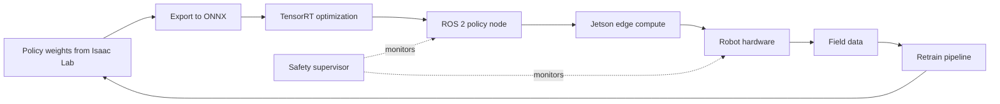
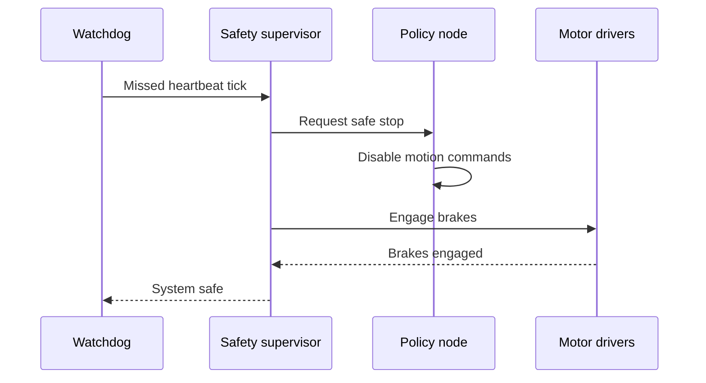

import Quiz from '@site/src/components/Educational/Quiz';

# Real-World Deployment

> **Status:** complete
>
> **Related chapters:** Builds on Chapters 19–22 — ROS 2, the software stack, simulation, and Isaac; concludes Part V.

## Why This Matters

Everything before this chapter was preparation for a moment that is easy to
underestimate: the robot stops being a simulation and starts being responsible
for a real warehouse, a real home, or a real sidewalk. Deployment is where the
sim-to-real gap, the latency budgets, the safety interlocks, and the thermal
limits stop being theory. It is also where most robot projects reveal their true
state — a policy that walks perfectly in Isaac can trip on a door threshold in a
factory, and a model that runs at 5 frames per second on a laptop may need 60
frames per second on the robot's small edge computer.

Deployment is a discipline, not a step. This chapter gives you the full path:
from exporting a trained policy, to optimizing it for edge hardware with
quantization and TensorRT, to meeting hard latency budgets, to designing safety
and fault tolerance, to validating a system before it ever moves in the world. An
engineer who masters deployment turns a promising demo into a dependable
machine.

## Learning Objectives

After this chapter you will be able to:

- Plan a deployment path from simulation to real hardware.
- Optimize models for on-robot compute — quantization and TensorRT.
- Design for safety and fault tolerance.
- Apply a validation checklist before fielding a robot.

## Core Concepts

| Concept | Definition |
| ------- | ---------- |
| Edge compute | The onboard hardware (e.g. Jetson Orin) that runs inference on the robot. |
| Inference latency | The time from input arriving to the model output being ready. |
| Quantization | Reducing model precision (fp32 → fp16/int8) to run faster on edge GPUs. |
| TensorRT | NVIDIA's optimizer that fuses and tunes a model for a specific GPU. |
| Watchdog | A timer that detects a hung process and triggers a safe stop. |
| E-stop | Emergency stop — a hardware circuit that cuts power or motion. |
| Safety interlock | A condition that must hold for motion to be enabled. |

## Technical Explanation

### From simulation to silicon: the deployment path

A trained policy in Isaac Sim is a set of tensor weights, not a robot behavior.
Deployment is the journey of that policy to silicon. The path has distinct
stages, each with its own failure mode:

1. **Export** — freeze the model into a portable format such as ONNX.
2. **Optimize** — convert and tune it for the target GPU, typically with TensorRT.
3. **Integrate** — wrap the optimized model in the ROS 2 stack as a policy node.
4. **Validate** — run it on the real hardware under a controlled, safe regime.
5. **Field** — deploy in the real environment, then iterate on the data it
   generates.

A common mistake is treating these as a linear, one-time flow. In practice the
last stage feeds the first: field data becomes more training data, the model
improves, and the cycle repeats. Deployment is a loop with the world as the
final judge.

### Edge compute and model optimization

The robot carries a small, power-bounded computer — typically an NVIDIA Jetson
class device — and the model that ran at 30 fps on a workstation may run at 4 fps
there. Optimization recovers most of that. The two big levers:

- **Quantization** shrinks the model's numbers. Full-precision fp32 weights become
  fp16 or int8. This cuts memory bandwidth and unlocks fast tensor-core
  operations, often with a negligible accuracy cost if you calibrate the int8
  ranges against real data.
- **TensorRT** is the compiler that turns your model into an engine for the
  specific GPU. It fuses layers, picks optimal kernels, and reorders operations.
  The same model converted with TensorRT routinely runs several times faster than
  the naive framework runtime.

A third, sometimes necessary lever is **architecture**: if even an optimized
model is too slow, the model itself must shrink — a smaller backbone, fewer
layers, or knowledge distillation from a larger teacher. Optimizing the runtime
first and the model second is the right order; you would be surprised how often
the runtime was the bottleneck.

### Latency budgets and real-time guarantees

A robot's intelligence is only as good as its timing. Deployment means translating
component speeds into a *latency budget*: the maximum time allowed from sensing to
acting. For a walking humanoid, the closed-loop control must run at roughly a
kilohertz; perception that informs balance must arrive within milliseconds; task
planning can take hundreds of milliseconds. The budget forces decisions:

| Stage | Typical latency budget |
| ----- | ---------------------- |
| Joint torque loop | ~1 ms |
| Balance state estimate | ~2 ms |
| Perception for avoidance | ~30–100 ms |
| Task-level planning | ~100–1000 ms |

If perception takes 200 ms but the budget is 100, nothing else can fix it — the
system must be faster or the task must tolerate the delay. Real deployments
measure these numbers continuously and alert when a budget is missed, because a
latency spike is exactly the kind of degradation that precedes a fall.

### Safety: design, redundancy, and standards

On a real robot, safety is not a feature; it is the architecture. Three layers
work together:

- **Hardware safety** — an E-stop that cuts power independent of software, force
  limits in the actuators, and mechanical stops. This layer works even if the
  computer crashes.
- **Software safety** — watchdogs that detect a hung process, interlocks that
  require conditions (robot on flat ground, safety cage closed) before motion is
  enabled, and velocity/force limits enforced in the control loop.
- **System safety** — validation and standards: risk assessments, failure-modes
  analysis, and compliance with norms like ISO 10218 for industrial robots.
  Certification is rarely exciting, but it is what makes a robot insurable,
  sellable, and legal.

The design principle: **fail safe**. Every failure should default to a safe state
— motors off, brakes on, robot stopped — never to "keep going and hope."

### Testing, validation, and regression

Before a robot touches the field, it needs a validation suite that answers one
question repeatedly: does the change I just made break something that used to
work? The robotic version of CI/CD is a **regression rig**: a controlled setup —
a physical course or a high-fidelity re-simulation — that runs a fixed battery of
scenarios and compares the robot's performance against baselines. Every model
update, every parameter change, every new sensor re-runs the rig.

Crucially, the rig must include edge cases, not just happy paths: low battery,
one camera obscured, a slippery floor patch, a dropped network connection. The
robots that fail on their first field day fail because the validation rig never
tested the case the world threw at them.

### Field evaluation and continuous improvement

Deployment continues after the robot starts working. Field evaluation measures
real metrics — task success rate, time per task, interventions per shift, energy
per task — and feeds them back. Two loops operate continuously: the **short
loop**, where operators and supervisors tune parameters and retry failures; and
the **long loop**, where accumulated field data becomes new training data and
the model is retrained and redeployed. Robots improve in the field exactly to the
extent that this feedback is automated and honest.

### Regulatory and ethical deployment

A robot that acts in the world raises questions no software-only product faces:
who is liable when it injures someone, what happens with the data it records, and
what does "supervised" mean in practice. Deployments need clear policies: a
designated responsible operator, data handling that respects privacy, and honest
documentation of the robot's known limits. The engineering and the ethics are the
same discipline — both are about being truthful about what the system can and
cannot do, and building the control structures to match.

### A deployment checklist

Every fielding should pass a checklist before the robot moves. Grouped:

- **Model**: exported, optimized, accuracy verified on a held-out set, latency
  measured on target hardware.
- **Software**: stack launches cleanly, watchdogs armed, all parameters versioned.
- **Hardware**: E-stop tested, brakes and torque limits verified, thermal behavior
  tested under sustained load.
- **Environment**: workspace surveyed, edge cases rehearsed, emergency procedures
  drilled.
- **People**: operators trained, responsible person named, escalation path defined.

A robot that cannot pass its checklist does not deploy — no matter how good the
demo looked.

## Real-World Examples

:::info Real system
NVIDIA's Jetson AGX Orin is the reference edge computer for robot deployment: a
small, ~60 W module that runs TensorRT-optimized perception and policy models
onboard. Humanoid platforms from multiple startups ship with Orin-class compute
running exactly the pipeline described here — a trained model optimized to an
engine, wrapped in ROS 2, validated on hardware.
:::

:::note Mini case study
A startup deploys a VLA-driven manipulation robot in a factory. Their first
release ran the model in fp32 on an edge GPU and achieved only 3 frames per
second of perception — too slow to react to a moving part. Converting to fp16
with TensorRT doubled throughput; calibrating int8 tripled it again, and a
quantized model passed their accuracy gate with a 2 percent drop. The takeaway:
optimization is the difference between a demo and a deployable product, and the
accuracy cost was measured, not assumed.
:::

## Architecture Diagrams

### The deployment path

From weights in a simulator to a validated behavior in the world, with field data
closing the loop back to training.



### A safe-stop sequence

When a watchdog fires, the system degrades to safety in a fixed order.



## Code Examples

### Optimizing a model with TensorRT

```bash
# Convert an ONNX model into a TensorRT engine for the Jetson GPU.
trtexec --onnx=walk_policy.onnx \
        --saveEngine=walk_policy.engine \
        --fp16 \
        --workspace=2048

# For int8, add calibration data from the real sensor distribution:
trtexec --onnx=perception.onnx \
        --saveEngine=perception.engine \
        --int8 \
        --calib=calib_images
```

### Measuring inference latency on the robot

```python
# Wrap an optimized engine and measure end-to-end latency before deploying.
import tensorrt as trt
import time

engine = trt.Runtime(trt.Logger()).deserialize_cuda_engine(
    open('walk_policy.engine', 'rb').read())

latencies = []
for _ in range(500):                      # warm up, then measure
    t0 = time.perf_counter()
    actions = engine.infer(observation)   # your runtime wrapper
    latencies.append((time.perf_counter() - t0) * 1000)

print(f'p50 = {sorted(latencies)[250]:.1f} ms  '
      f'max = {max(latencies):.1f} ms')
```

:::tip Where this runs
The `trtexec` commands run on the robot's Jetson GPU after installing TensorRT;
you must have an exported ONNX model from Isaac Lab (Chapter 22). The latency
script runs on the same device — measure on the target, not the laptop, because
the laptop's numbers are meaningless for deployment.
:::

## Common Mistakes

| Mistake | Why it happens | How to avoid it |
| ------- | -------------- | --------------- |
| Deploying the fp32 model unchanged | It works on the workstation | Quantize with fp16/int8 and validate accuracy against real data |
| Measuring latency on the laptop | Convenient, but wrong | Benchmark on the target edge device under sustained load |
| No E-stop or watchdog | Lab demos feel safe | Hardware E-stop plus software watchdog, tested at every release |
| Skipping the regression rig | Fast changes feel urgent | Re-run the scenario battery on every model or parameter change |
| Ignoring thermal throttling | Benchmarks are short | Run sustained-load tests; measure steady-state, not peak, performance |

## Summary

Real-world deployment turns a trained model into a dependable machine: export and
optimize it for edge compute with quantization and TensorRT, prove it meets a
latency budget on the actual hardware, wrap it in safety layers — E-stop,
watchdog, interlocks, fail-safe defaults — and validate against a regression rig
that includes the edge cases the world will throw at it. Deployment is a loop,
not a finish line: field data feeds retraining, the robot improves, and the
checklist is the contract between the demo and the deployed product.

**Key takeaways**

- Deployment is a pipeline — export, optimize, integrate, validate, field — that loops.
- Quantization and TensorRT often recover most of the gap between workstation and edge performance.
- Latency budgets must be measured on the target hardware, not assumed.
- Safety means hardware, software, and system layers — all designed to fail safe.
- A validation checklist is the difference between a robot that demoed and a robot that deploys.

## Exercises

1. **Easy — write the budget.** Build a latency-budget table for a robot you
   choose: list each pipeline stage and its maximum acceptable latency, then sum
   the chain to find the critical path.
2. **Medium — quantify a model.** Export a small ONNX model, run `trtexec` in
   fp32 and fp16, and record the speedup and any accuracy change on a held-out
   set. *Hint: see the TensorRT commands in the code section.*
3. **Challenge — write a deployment plan.** For a humanoid doing warehouse
   shelving, write a full deployment checklist: model gates, safety interlocks,
   validation scenarios, operator training, and a data-feedback loop for
   continuous improvement.

Check your understanding:

<Quiz
  question="Which technique most directly reduces inference latency of a vision model on the robot's edge GPU?"
  options={[
    'Adding a faster cloud inference endpoint over 5G',
    'FP16 or INT8 quantization plus TensorRT engine optimization',
    'Increasing the model size for better accuracy',
    'Running the model on the workstation instead of the robot',
  ]}
  correctAnswerIndex={1}
/>

## Further Reading

- NVIDIA, *TensorRT Developer Guide* — the authoritative reference for engine
  optimization, calibration, and the `trtexec` tool.
  [docs.nvidia.com/deeplearning/tensorrt](https://docs.nvidia.com/deeplearning/tensorrt/)
- NVIDIA, *Jetson Modules and Developer Kits* — specs and power envelopes for the
  edge compute platforms robots ship with. [developer.nvidia.com/embedded/jetson](https://developer.nvidia.com/embedded/jetson)
- ISO 10218, *Robots and Robotic Devices — Safety Requirements* — the industrial
  safety standard every deployed robot eventually meets.
- Sutton and Barto, *Reinforcement Learning: An Introduction* (MIT Press) — the
  learning theory behind the policies you deploy, especially Part II on
  prediction and control.
