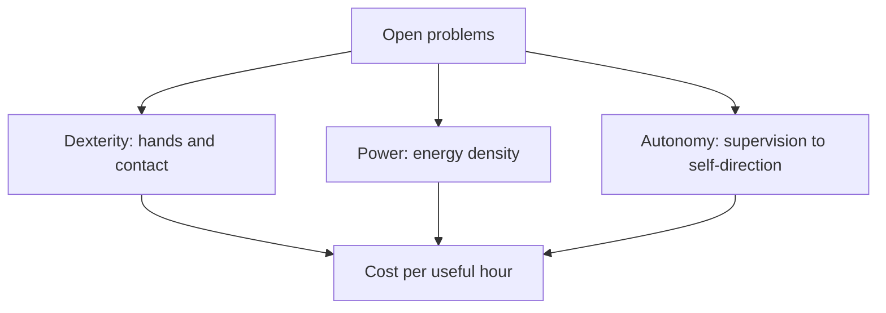

import Quiz from '@site/src/components/Educational/Quiz';

# The Future of Humanoid Robotics

> **Status:** complete
>
> **Related chapters:** Builds on the whole book — especially Chapter 1 — What Is Physical AI, Chapter 4 — Humanoid Robot Architecture, and Chapter 18 — AI Agents for Robot Control.

## Why This Matters

Humanoid robotics is the only technology that promises to operate the world we already built, without changing it. Stairs, doors, tools, and desks were designed for bodies with two legs, two arms, and two hands — so a machine shaped like a person can go anywhere a person can, and use what people use. That is the dream, and after twenty-three chapters you now know exactly how hard it is to make real.

This final chapter zooms out. It looks at the state of the art, the open problems that still define the field, the economics that will decide who deploys humanoids and where, and the safety and governance questions that will decide whether we should. It ends with the most practical topic of all: what *you* do next.

## Learning Objectives

After this chapter you will be able to:

- Summarize the state of the art in humanoid hardware and learning.
- Articulate the open problems — dexterity, power, autonomy — and why each is hard.
- Evaluate the economic case for a humanoid deployment, including payback.
- Discuss the safety, governance, and ethics questions raised by deployed humanoids.
- Identify concrete next steps for continuing your learning in physical AI.

## Core Concepts

| Concept | Definition |
| ------- | ---------- |
| State of the art | The best currently demonstrated capability of humanoid systems. |
| Dexterity | The ability of a hand to handle arbitrary objects robustly. |
| Energy density | How much energy a battery holds per unit weight — the bottleneck on runtime. |
| Autonomy | The fraction of a task performed without human supervision. |
| Total cost of ownership | Purchase price plus maintenance, power, compute, and support over the robot's life. |
| Moravec's paradox | The observation that reasoning is easy for computers, while perception and motor control are hard. |
| Alignment | Designing AI objectives that match what humans actually want. |

## Technical Explanation

### The state of the art

Where the field stands, as of writing:

- **Locomotion is largely solved at the research level.** Modern humanoids walk, climb, run, and recover from pushes using model-predictive control and reinforcement learning. Bipedal walking went from "a controlled fall" to "a learned skill that transfers to hardware" within a decade.
- **Manipulation is partially solved.** Picking a known object from a known bin works; handling arbitrary novel objects with two hands, in clutter, remains a frontier.
- **Perception is strong but not embodied.** Vision-language models can name and locate objects, but a robot's understanding of physics — that a mug will spill, that a door slides — is thin.
- **Hardware is iterating fast.** Every year brings higher torque density, better force sensing, and cheaper platforms. Unitree's G1 sells at a price a lab can afford; Boston Dynamics and Figure target industrial-grade reliability.
- **Simulation is closing the loop.** GPU-accelerated simulators (Chapter 22) let a team train a policy in hours instead of months, and the sim-to-real gap is shrinking with every improvement in contact physics.

The honest summary: humanoids today are impressive prototypes and marginal workers. The gap between "demonstration" and "dependable" is the entire remaining game. What changed in the last few years is that the gap is now a software problem, and software compounds — so the pace is accelerating.

### Open problems: dexterity, power, autonomy

Three problems define the field's near future:

**Dexterity.** The human hand has roughly 20 degrees of freedom and senses forces at every fingertip. Robots have stiff, slow hands that drop things. Dexterity is the hardest mechanical *and* learning problem remaining, because a hand must combine fast sensing, precise actuation, and soft contact in a tiny space. Moravec's paradox states it precisely: the things we find easy — gripping a cup, threading a needle — are the ones computers find hardest.

**Power.** A humanoid's battery is its biggest weight and its smallest capability. Roughly, a full-size humanoid gets one to two hours of useful walking per charge, and carrying more battery costs more torque. Energy density improves slowly; no materials breakthrough is on the near horizon. Some designs hedge with tethering, some with swappable packs, and some with the assumption that an eight-hour factory shift is enough.

**Autonomy.** Today's humanoids are teleoperated or supervised for most useful work; "autonomy" usually means "works within a very scripted, known setting." Long-horizon autonomy — decide what to do next when the plan breaks, ask the right question, recover from a dropped object — is where the gap is largest, and it is a software gap, not a hardware one.

### The economics of humanoids

For a humanoid to be deployed at scale, it must pay back its total cost of ownership:

$$TCO = \text{purchase} + \text{maintenance} + \text{power} + \text{compute} + \text{supervision}$$

compared against the cost of the human labor it replaces. A \$200,000 robot replacing a \$60,000-per-year operator pays back in roughly three years *only if* it runs near a human's hours with minimal supervision — which is exactly the autonomy gap. The economic bet of the field is that unit costs fall (Tesla's Optimus is intended to approach the cost of a car) and that autonomy rises (fewer supervisors per robot). If both happen, the payback math flips for millions of jobs. If either stalls, humanoids remain a niche.

### Humanoids in the world: homes, factories, society

Where would humanoids actually go first? The pattern so far is **structured industrial settings first, homes last**. Factories have flat floors, fixed layouts, and repetitive tasks — the best conditions for today's autonomy. Warehouses and logistics follow, then retail and hospitals, and only much later the home, where every object, surface, and task is novel.

The social questions are as large as the technical ones. Which jobs change? Which disappear? Who owns the data a robot collects in a home? A technology that can go anywhere a person can, and do anything a person does, is also a technology that changes what "work" and "privacy" mean. These questions are not afterthoughts — they will shape what gets built, because they shape what gets funded.

There is also a quieter infrastructure question: the world is not yet robot-ready. Doors open inward, plugs are not standardized, and a fallen humanoid needs a person to lift it. Some companies are designing the environment alongside the robot — robot-friendly shelves, charging docks, and layouts. The bet of the humanoid is that adapting the *robot* to the world is cheaper than adapting the world to the robot, and so far the evidence is on that side.

### Safety, governance, and ethics

A robot that can reach a person's face can also injure a person's face. Humanoids are powerful, unsteady, and increasingly autonomous, which forces safety to the center of the engineering problem:

- **Physical safety** — force limits, contact detection, emergency stops, and compliance, so that a collision bruises rather than breaks. This is largely solved engineering, but only if it is funded and tested, not assumed.
- **Reliability** — a robot that fails once in a million hours is fine; one that fails once in a thousand is dangerous. Standards such as the ISO norms for collaborative robots will be extended to humanoids.
- **Alignment and misuse** — a general-purpose body attached to a general-purpose AI can be used well or badly. Governance questions — licensing, kill-switch requirements, liability, data rights — are unresolved and urgent.
- **Economic and social impact** — the honest question is not "will humanoids take jobs" but "how will the gains and losses be distributed, and who decides."

None of this is a reason not to build. It is a reason to build with the same rigor that aerospace applies to flight safety.

### Toward general embodied intelligence

If you squint, humanoid robotics and general AI are converging on the same target: an agent that perceives a physical world, reasons about it, and acts in it. Today's pieces are all in place in prototype form — vision-language models that understand scenes, large models that plan tasks, and policies that turn plans into torque. The open question is *integration*: one system that perceives, plans, acts, and learns from its own experience for years.

That integration is a research program, not a product deadline. It will be built from the pieces this book taught you — sensors and state estimation, control and kinematics, RL and imitation learning, VLA models and agents — and it will be held together by the software stack of Part V. The field's bet is that a body helps: that embodiment will prove to be the missing ingredient for general intelligence rather than a complication of it.

One useful way to think about the horizon is through *duty cycles*: how much of the time the robot works without a person in the loop. Every capability improvement — better hands, longer batteries, stronger planners — shows up in the duty cycle, and the duty cycle shows up in the payback equation. Watch the duty cycle numbers, and you are watching the future arrive at a known, measurable pace.

### Your path into physical AI

You now have the full map. What you do with it is up to you, but the well-trodden paths are:

- **Simulate first.** Install MuJoCo (Chapter 21) and a ROS 2 stack (Chapter 19); build the two-link arm from Chapter 2 and make it reach.
- **Train a policy.** Take the reinforcement-learning material into Isaac Lab (Chapter 22) and train a simple locomotion or reaching policy.
- **Join a community.** ROS Discourse, robotics Discord servers, and university labs are where the next cohort is learning together.
- **Contribute to open source.** Most humanoid software is open: pick a repository, fix a bug, read the pull requests.
- **Build a project, not a course.** The person who deploys a robot into a real room — even a toy that picks up blocks — is ahead of the person who only reads.
- **Keep a learning loop.** Read a paper a week, reproduce one result a month, and post what broke. The field moves fast enough that a steady, small habit beats any single burst of intensity.

You do not need a humanoid to start. You need a computer, a simulator, and the discipline to finish one thing. Everything else — the skills, the network, the opportunities — compounds from there.

## Real-World Examples

:::info Real system
Boston Dynamics' *Atlas* has done backflips, parkour, and heavy lifting, but its commercial value today is as a research platform for *mobility*: proving what a body can do. The business case follows the capability, not the other way around — the same trajectory every humanoid company is trying to ride.
:::

:::note Mini case study
In recent years, Figure, Tesla, and Unitree each deployed humanoids in controlled factory pilots — Figure at BMW's Spartanburg plant, Tesla on its own production line. The pattern across all three: narrow tasks, heavy supervision, and a stated roadmap toward more autonomy. The lesson is that the *pilot* is the unit of progress in this industry, and every pilot teaches the same thing — the software gap, not the hardware, is the long pole.
:::

## Architecture Diagrams

### From today to general embodied intelligence


### The three open problems



## Code Examples

### A back-of-the-envelope deployment economics model

```python
def payback_years(robot_price, operators_replaced, annual_wage, maintenance=0.1):
    """Rough payback for replacing operators with a humanoid.

    robot_price: up-front purchase cost in dollars
    operators_replaced: how many full-time people one robot replaces
    annual_wage: fully loaded annual cost of one person
    maintenance: annual cost as a fraction of purchase price
    """
    annual_savings = operators_replaced * annual_wage
    annual_cost = maintenance * robot_price
    if annual_savings <= annual_cost:
        return float("inf")
    return robot_price / (annual_savings - annual_cost)

for price in [200_000, 50_000]:
    years = payback_years(price, operators_replaced=1.5, annual_wage=60_000)
    print(f"Robot at ${price:>7,}: payback about {years:.1f} years")
```

**What each piece does:** the function turns the chapter's economic argument into arithmetic — payback time is purchase price divided by annual savings net of maintenance. Play with the numbers and you will see why every company in the field is racing on two fronts: driving the purchase price down and the autonomy (duty cycle) up.

:::tip Where this runs
Any Python environment — no robot needed. To make it concrete, look up a real robot's price and its quoted duty cycle, plug them in, and compare against the wage of the job it claims to replace.
:::

## Common Mistakes

| Mistake | Why it happens | How to avoid it |
| ------- | -------------- | --------------- |
| Measuring progress by YouTube videos | Demos are curated; failures are cut | Ask for duty cycle, supervision ratio, and failure rate |
| Assuming hardware is the bottleneck | Robots visibly walk and grab | The long pole is autonomy software — dexterity and long-horizon decisions |
| Ignoring total cost of ownership | Purchase price is easy to find | Include maintenance, power, supervision, and replacement in any payback model |
| Believing homes come before factories | "Humanoids are for everyone" | Structured settings deploy first; the home is the last, hardest market |
| Treating safety as an afterthought | "We will add it later" | Safety is a design constraint from day one, like in aerospace |

## Summary

Humanoid robotics has solved locomotion, is solving manipulation, and is still early on autonomy — and it is the economic and ethical questions, more than the mechanical ones, that will decide the pace of deployment. The field is converging with general AI on one target: an embodied agent that perceives, plans, acts, and learns. The pieces are the ones you have studied all book, and the path forward is the same in every era of engineering: simulate, build, test, and ship.

**Key takeaways**

- Locomotion is largely solved; dexterity, power, and autonomy are the open problems.
- Deployment follows economics: payback math, not demos, decides where robots go.
- Factories and structured settings come first; the home is the last frontier.
- Safety, governance, and alignment are engineering problems, not afterthoughts.
- Your path: simulate, train a policy, build a project, and contribute to the community.

:::tip Now make one work
Enough theory — put the whole book together. The next chapter is an interactive
**[Capstone — The Robot Lab](./capstone-robot-lab)**: command a humanoid in plain English,
watch the AI turn your words into actions, and take the same control loop to runnable ROS 2 code.
:::

## Exercises

1. **Easy — Make the payback model honest.** Run the economics code with a robot price of \$150,000 and an operator wage of \$80,000. How many years of operation — at full duty — does the robot need to pay back? What single assumption most changes the answer?
2. **Medium — The autonomy audit.** Take any recent humanoid demo video you can find. List three things the video does *not* show about the robot's autonomy (supervision, failure rate, task breadth). *Hint: use the "Common Mistakes" table as a checklist.*
3. **Challenge — A first project plan.** Sketch a three-month project that gets a robot — real or simulated — doing one useful task end to end: choose the platform (Chapter 22), the task, the data, the policy, and the safety checks. Write it as a short plan with milestones.

Check your understanding:

<Quiz
  question="What is generally the single biggest bottleneck to deploying humanoids in the real world?"
  options={[
    'Joint torque and motor power',
    'Battery energy density alone',
    'Software autonomy and reliability',
    'Camera resolution',
  ]}
  correctAnswerIndex={2}
/>

## Further Reading

- Boston Dynamics, *Atlas* (company site and videos) — the state of the art in humanoid mobility, updated as new results land. [bostondynamics.com/atlas](https://bostondynamics.com/atlas)
- Hans Moravec, *Mind Children* (1988) — the original statement of Moravec's paradox, worth reading in full.
- Figure, Unitree, and Tesla robotics pages — the economics and hardware roadmaps in the companies' own words. [figure.ai](https://www.figure.ai/) · [unitree.com](https://www.unitree.com/)
- Stuart Russell, *Human Compatible* (2019) — an accessible treatment of alignment and AI safety for the general reader.
