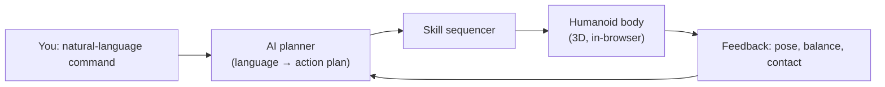

import RobotLab from '@site/src/components/RobotLab';

# Capstone — The Robot Lab

> **Status:** complete
>
> **Builds on the whole book** — especially Chapter 1 (What Is Physical AI), Chapter 4
> (Humanoid Robot Architecture), Chapter 11 (Balance and Locomotion), Chapter 12
> (Manipulation), and Chapter 18 (AI Agents for Robot Control).

## Why This Matters

Every previous chapter added one layer of an intelligent machine: perception, state
estimation, kinematics, control, learning, agents. This chapter puts them together into a
single loop you can actually drive — a **physical AI that works**.

You give a command in plain English. The book's AI turns it into a structured plan. A rigged
3D humanoid carries the plan out — walking, turning, reaching, pointing, grasping, and
balancing — right here in your browser. Then you take the exact same idea to real robot code.

## The loop you are about to close



This is the same perceive → plan → act → sense cycle from Chapter 18, only now every box is
something you have studied and can inspect.

## The Robot Lab

Give the robot a command in plain English and press **Send**. The book's AI planner turns your
words into a sequence of skills — you'll see the plan it chose — and the humanoid carries them out.
No API key configured? It still works: an offline keyword planner takes over automatically.

<RobotLab />

Try commands like:

- *"run to the cube, pick it up, and throw it"*
- *"walk to the cube and kick it"*
- *"jump, spin, then wave with both hands"*
- *"come here and give me a high five"*

The stack of crates to the robot's left is a **real physics simulation** ([rapier](https://rapier.rs/)):
run into it — *"run left"* — and the robot topples the tower; the cubes fall, tumble, and collide
under real gravity. Then open the **Balance & physics** panel and shove the robot — a spring-damper
controller keeps it upright, and a hard enough push topples it before it recovers. That is a
(deliberately simple) version of the balance problem from
[Chapter 11](../part3-control/balance-locomotion).

:::note What "works" means here
Four things are real in this demo, and they mirror the whole book:

1. **Language → action.** The [robot-planner mode](../part4-learning/ai-agents) constrains the AI
   to a fixed skill vocabulary and emits a validated JSON plan — the same pattern used to drive
   real robots safely from an LLM.
2. **A control loop.** Each skill is a small time-based controller updating joint targets every
   frame, exactly like a real motion loop — just with a simplified body.
3. **Physics.** The crates are simulated with a real physics engine (rapier) — gravity, collisions,
   and stacking — and the robot knocks them over through a collider that tracks its body.
4. **Balance & recovery.** The upright pose is held by a feedback controller, not an animation.
:::

## From the browser to real hardware

The in-browser humanoid is deliberately simple so the *control ideas* stay visible. The same loop —
**parse a command → produce a plan → run a controller** — is what you build on real hardware or in
a full physics simulator. Here is a minimal, runnable **ROS 2 + MuJoCo** version of exactly that
loop. Prepare your tools with [Appendix C — Environment Setup](../appendices/c-environment-setup),
then clone a humanoid model (e.g. Unitree H1 or the MuJoCo Menagerie) and run:

```python title="robot_lab_node.py — a ROS 2 node that maps commands to a MuJoCo humanoid"
import re
import numpy as np
import mujoco
import mujoco.viewer
import rclpy
from rclpy.node import Node
from std_msgs.msg import String

# The same skill vocabulary the in-browser lab uses.
SKILLS = {"wave", "walk_to", "turn", "point", "pick_up", "sit", "stand", "balance"}


def parse_command(text: str) -> list[dict]:
    """Offline keyword planner — swap for an LLM call returning the same JSON."""
    plan = []
    for clause in re.split(r"\bthen\b|,|\band\b", text.lower()):
        if "wave" in clause:
            plan.append({"skill": "wave"})
        elif "pick" in clause or "grab" in clause:
            plan.append({"skill": "pick_up", "params": {"target": "cube"}})
        elif "walk" in clause or "go" in clause:
            plan.append({"skill": "walk_to", "params": {"target": "cube"}})
        elif "sit" in clause:
            plan.append({"skill": "sit"})
        elif "balance" in clause:
            plan.append({"skill": "balance"})
    return plan


class RobotLab(Node):
    def __init__(self):
        super().__init__("robot_lab")
        self.model = mujoco.MjModel.from_xml_path("humanoid.xml")
        self.data = mujoco.MjData(self.model)
        self.queue: list[dict] = []
        self.create_subscription(String, "/command", self.on_command, 10)
        self.create_timer(self.model.opt.timestep, self.control_step)  # sim loop

    def on_command(self, msg: String):
        plan = parse_command(msg.data)
        self.get_logger().info(f"plan: {plan}")
        self.queue.extend(plan)

    def control_step(self):
        # Pop one skill at a time and drive joint targets with a PD controller.
        target = self.hold_pose()  # default: stay upright
        if self.queue:
            target = self.skill_target(self.queue[0])
        kp, kd = 80.0, 6.0
        self.data.ctrl[:] = kp * (target - self.data.qpos[7:]) - kd * self.data.qvel[6:]
        mujoco.mj_step(self.model, self.data)

    def hold_pose(self) -> np.ndarray:
        return np.zeros(self.model.nu)  # neutral standing keyframe

    def skill_target(self, step: dict) -> np.ndarray:
        # Map each skill to a joint-target trajectory (kinematics from Ch. 9–12).
        ...  # e.g. sinusoidal hip/knee targets for walk_to, arm raise for wave


def main():
    rclpy.init()
    node = RobotLab()
    with mujoco.viewer.launch_passive(node.model, node.data):
        rclpy.spin(node)


if __name__ == "__main__":
    main()
```

Publish a command to drive it:

```bash
ros2 topic pub --once /command std_msgs/String "{data: 'walk to the cube and wave'}"
```

The shape is identical to the browser lab: a planner produces a list of skills, and a per-step
controller turns each skill into joint targets. Everything you learned — kinematics
([Ch. 9](../part3-control/kinematics-dynamics)), motion control
([Ch. 10](../part3-control/motion-control)), balance ([Ch. 11](../part3-control/balance-locomotion)),
and agents ([Ch. 18](../part4-learning/ai-agents)) — plugs into the `skill_target` method.

See [Appendix E — Project Ideas](../appendices/e-project-ideas) for ways to extend this into a real
capstone project.

## Where to go next

You now have the whole arc: from *What is physical AI?* to a humanoid you command and a control
loop you can run. Pick a project, simulate it first, and finish one thing.
