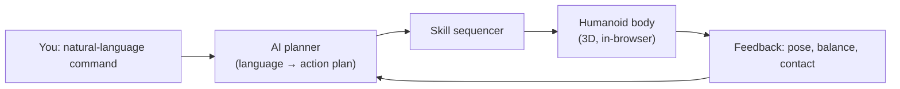

# Capstone — The Robot Lab

> **Status:** in progress
>
> **Builds on the whole book** — especially Chapter 1 (What Is Physical AI), Chapter 4
> (Humanoid Robot Architecture), Chapter 11 (Balance and Locomotion), Chapter 12
> (Manipulation), and Chapter 18 (AI Agents for Robot Control).

## Why This Matters

Every previous chapter added one layer of an intelligent machine: perception, state
estimation, kinematics, control, learning, agents. This chapter puts them together into a
single loop you can actually drive — a **physical AI that works**.

You give a command in plain English. The book's AI turns it into a structured plan. A rigged
3D humanoid carries the plan out — walking, turning, reaching, pointing, grasping, and
balancing — right here in your browser. Then you take the exact same idea to real robot code.

## The loop you are about to close

This is the same perceive → plan → act → sense cycle from Chapter 18, only now every box is
something you have studied and can inspect.

## The Robot Lab

The interactive humanoid — a command bar, manual skill buttons, and a physics/balance mode —
is embedded below. (Wired up in the capstone build step.)

{/* The <RobotLab /> interactive component is mounted here in Phase 4. */}

## From the browser to real hardware

The in-browser humanoid is deliberately simple so the *control ideas* stay visible. The final
section of this chapter carries the same loop into a runnable **ROS 2 + MuJoCo** project you
can clone and run on your own machine — see [Appendix C — Environment Setup](../appendices/c-environment-setup)
to prepare your tools and [Appendix E — Project Ideas](../appendices/e-project-ideas) to keep
building after this one.

## Where to go next

You now have the whole arc: from *What is physical AI?* to a humanoid you command and a control
loop you can run. Pick a project, simulate it first, and finish one thing.
